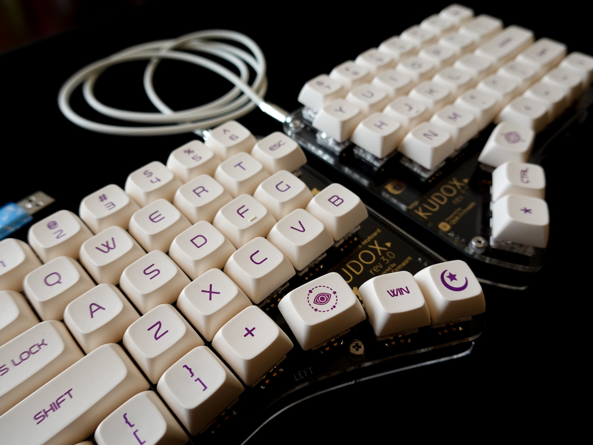

# Kudox & Kudox Game Keyboards

7x5 Row-Staggered layout keyboards.  
Powered by [QMK (Quantum Mechanical Keyboard Firmware)](https://github.com/qmk/qmk_firmware).

## Documents

### Kudox Keyboard
- [English](./kudox/README.md)
- [Japanese](./kudox/README.ja.md)

### Kudox Game Keyboard
- [English](./kudox-game/README.md)
- [Japanese](./kudox-game/README.ja.md)

### Kudox Keyboard Columner Type
- [English](./kudox-columner/README.md)
- [Japanese](./kudox-columner/README.ja.md)

# Acknowledgements

Kudox keyboard was forked from [Redox keyboard](https://github.com/mattdibi/redox-keyboard).

# License

 Kudox * Keyboards by <a xmlns:cc="http://creativecommons.org/ns#" href="https://github.com/kumaokobo" property="cc:attributionName" rel="cc:attributionURL">Kumao Kobo</a> is licensed under a <a rel="license" href="http://creativecommons.org/licenses/by-nc-sa/4.0/">Creative Commons Attribution-NonCommercial-ShareAlike 4.0 International License</a>.
