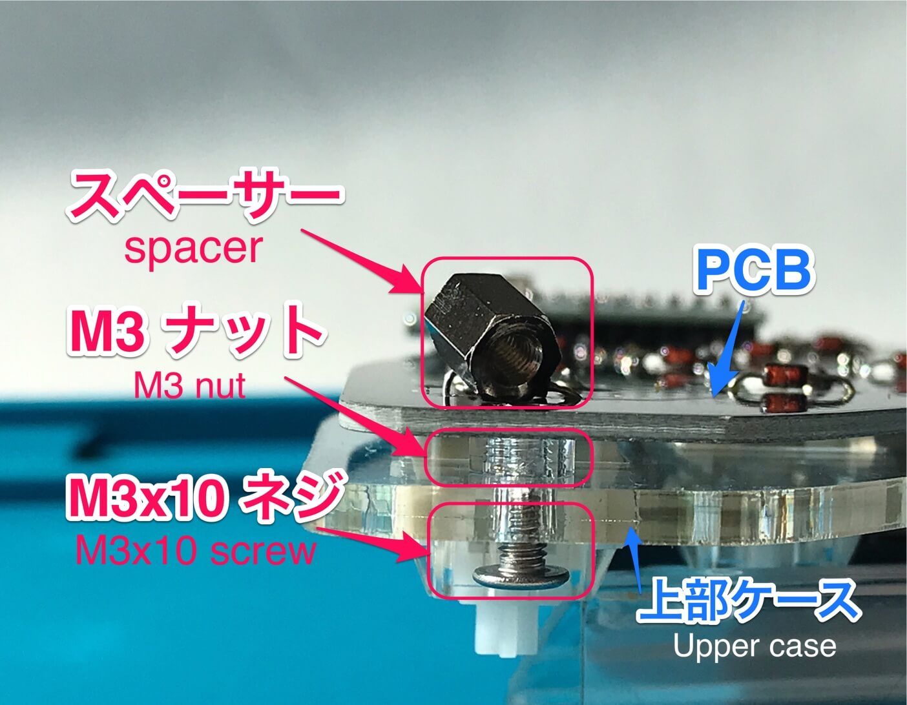

# Kudox Columner Keyboard Rev.1

Kudox Columner Rev 1.0 は 66キーのホット・スワップ分離キーボードです.  
Kudox は `Row-` staggered キー配列を採用していますが、こちらは `Column-` staggered キー配列を採用しています.  

**English Manual is [here](README.md).**

<div style="display:block;margin:50px auto;">
<p align="center">


</p>
</div>


## Summary

  - [必要な部品](#必要な部品)
  - [組み立てガイド](#組み立てガイド)
  - [ファームウェア](#ファームウェア)
    - [基本書き込みコマンド](#基本書き込みコマンド)
    - [初回書き込み時](#初回書き込み時)

## 必要な部品

| 数量 | 項目                                           | 備考                                                |
|----:|-----------------------------------------------|-----------------------------------------------------|
|   2 | Kudox Columner Rev1.0 PCB                     |                                                     |
|  66 | 1N4148 ダイオード                               | SMD ダイオードでも可.                                 |
|   2 | PJ-320A 4極 3.5mm TRRS コネクタ                 |                                                    |
|   2 | 4.7 kΩ 抵抗                                    | 片側のPCBのみにはんだ付けします.                        |
|   2 | タクトスイッチ                                  | 6mm x 6mm x 4.3mm サイズのもの.                       |
|   2 | Arduino Pro Micro                             | マイコン: ATMega32U4                                 |
|   1 | TRRS ケーブル                                  | 4極のもの. (4極じゃないと正常動作しません)                |
|   1 | USB micro ケーブル                             | 家に落ちているもので可.                                 |
|   2 | ケース                                         |                                                     |
|  10 | ネジ M3 x 10mm                                 |                                                     |
|  10 | ネジ M3 x  5mm                                 |                                                     |
|  10 | スペーサー                                      | M3 x  7mm                                           |
|  10 | ナット                                         | M3 のもの (オプション)                                 |
|  66 | [Kailh PCB Scoket](https://www.kailhswitch.com/mechanical-keyboard-switches/box-switches/mechanical-keyboard-switches-kailh-pcb-socket.html) | Cherry MX 互換タイプの方                               |
|  66 | Cherry MX 互換 スイッチ                         | お好みで...☺                                         |
|  66 | Cherry MX 互換 キーキャップ                      | 4x 1.25u, 2x 1.75u, 2x 2.25u, 48x 1u                |


キーキャップとスイッチ以外の全てを含む [Kudox Columner 基本セット](https://kumaokobo.booth.pm/items/1706475) を [BOOTH](https://kumaokobo.booth.pm/) にて販売しています.  


## 組み立てガイド

<p align="center">

</p>


- PCBに下記をはんだ付けします:
  1. 1N4148ダイオード (向きがあります. カソードが四角型の穴側にくるように差します)<br/><div></div>
  2. PJ-320Aコネクタ
  3. タクトスイッチ
  4. 4.7 kΩ 抵抗 (左右どちらかのPCBのみにはんだ付けします)
  5. ホット・スワップ・ソケット<br/>はんだごてではんだ付けする場合:<div></div>
  クリームはんだでリフローして頂いてももちろん大丈夫です.
  6. Pro Micro の ピン・ヘッダ
- パーツの足をカットします.  
  *※ 特に Pro Micro のピン・ヘッダとPJ-320Aコネクタはスイッチに干渉しやすいのでできるだけ短くカットしてください*
- `RIGHT` と書いてある側に部品を実装したPCBはチップ類がPCB側を向くように Pro Micro をはんだ付けするため, ホット・スワップ・ソケットがチップに干渉しないよう, 絶縁テープでガードします.<div>
  <span>&nbsp;</span>
  <span>&nbsp;</span>
  </div>
- Pro Micro を ピン・ヘッダにはんだ付けします.
  - `LEFT` と書いてある側: Pro Micro を表向き(チップが見えるように)にはんだ付けします.
  - `RIGHT` と書いてある側: Pro Micro を裏向き(チップ類がPCBに向くように)にはんだ付けします.<br/><div></div>
- PCB に上部ケースを取り付けます.  
  M3ネジ(10mm) → 上部ケース → M3ナット → PCB → スペーサー の順番に取り付けます.<br/><div></div>
- 下部ケースをスペーサーにネジ止めします.
- スイッチを嵌めて完成です.

### Youtube: 組み立てガイド

- [インケンch](https://www.youtube.com/channel/UCXJZdip7JmW74HQHCtfYzFw)

<p align="center">
<a href="https://www.youtube.com/watch?v=6zZAXjMQ80E"></a>
<a href="https://www.youtube.com/watch?v=HCa4KX-FlOU"></a>
</p>

動画ではちょっとしたコツなども紹介しています.  
*動画は `Kudox rev1` のものですが、ホットスワップ・ソケット以外は概ね同じです.*

## ファームウェア

<p align="center">

</p>

Kudox Columner Keyboard は [QMK Firmware](https://github.com/qmk/qmk_firmware) を利用しています.  
QMK Firmware のインストールは [こちら](https://docs.qmk.fm/#/newbs_getting_started) をご覧ください.  

### 基本書き込みコマンド

```sh
$ cd path/to/qmk_firmware
$ make kudox/columner:default:flash
```

### 初回書き込み時

初回書き込み時には、 左手・右手 両方の Pro Micro にファームを書く必要があります.  

#### 1. 左手側

[kudox/config.h](https://github.com/qmk/qmk_firmware/blob/master/keyboards/kudox/config.h) を編集して `MASTER_LEFT` を有効にします.

```cpp
/* Select hand configuration */
#define MASTER_LEFT
// #define MASTER_RIGHT
// #define EE_HANDS
```

保存したら、 **左手側** の Pro Micro と PC をUSBケーブルで接続し、 [基本書き込みコマンド](#基本書き込みコマンド) を実行します.

```sh
$ cd path/to/qmk_firmware
$ make kudox/columner:default:flash
```

#### 2. 右手側

[kudox/config.h](https://github.com/qmk/qmk_firmware/blob/master/keyboards/kudox/config.h) を編集して `MASTER_RIGHT` を有効にします.

```cpp
/* Select hand configuration */
// #define MASTER_LEFT
#define MASTER_RIGHT
// #define EE_HANDS
```

保存したら、**右手側** の Pro Micro と PC をUSBケーブルで接続し、 [基本書き込みコマンド](#基本書き込みコマンド) を実行します.


#### 3. 動作確認

一度USBケーブルを外してから、 TRRSケーブルで左右をつなぎます.  
マスター側の Pro Micro にUSBケーブルをつなぎ、左右ともに文字入力可能なことを確認します.　　

以降、キー配列を変更した場合など再びファームを書く場合は、 TRRSケーブルをつないだままマスター側の Pro Micro に書き込みを行うことで、左右に設定が反映されるようになります.　　


## レイアウト

<p align="center">

</p>
<p align="center">
<em><a href="http://www.keyboard-layout-editor.com/">http://www.keyboard-layout-editor.com/</a></em>
</p>

- [KLE Layout permalink](http://www.keyboard-layout-editor.com/##@_name=kudox-columner&author=kumaokobo%3B&@_x:3.25&f2:2%3B&=3%0AF3%0A%23&_x:8.75%3B&=8%0AF8%0A*%3B&@_y:-0.75&x:2.25%3B&=2%0AF2%0A%2F@&_x:1%3B&=4%0AF4%0A$&_x:6.75%3B&=7%0AF7%0A%2F&&_x:1%3B&=9%0AF9%0A(%3B&@_y:-0.75&w:1.25%3B&=Esc&=1%0AF1%0A!&_x:3%3B&=5%0AF5%0A%25&_x:4.75%3B&=6%0AF6%0A%5E&_x:3%3B&=0%0AF10%0A)&_w:1.25%3B&=%E2%86%90%0A%0Aback%3B&@_y:-0.5&x:3.25&f:3%3B&=E%0A~%0A%0A9&_x:8.75%3B&=I%3B&@_y:-0.75&x:2.25&f:3%3B&=W%0A'%0A%0A8&_x:1&f:3%3B&=R%0A*&_x:1&f:3&h:1.25%3B&=%7B%0AF11%0A%5B&_x:2.75&f:3&h:1.25%3B&=%7D%0AF12%0A%5D&_x:1%3B&=U&_x:1&f:3%3B&=O%0A~%3B&@_y:-0.75&w:1.25%3B&=Tab&_f:3%3B&=Q%0A%22%0A%0A7&_x:3&f:3%3B&=T%0A+&_x:4.75%3B&=Y&_x:3&f:3%3B&=P%0A%60&_f:3&w:1.25%3B&=%5C%0A%C2%A5%0A%7C%3B&@_y:-0.5&x:3.25&f:3%3B&=D%0A%60%0A%0A6&_x:8.75%3B&=K%3B&@_y:-0.75&x:2.25&f:3%3B&=S%0A%2F:%0A%0A5&_x:1&f:3%3B&=F%0A%0A%0A0&_x:6.75%3B&=J&_x:1&f:3%3B&=L%0A%22%3B&@_y:-0.75&w:1.25%3B&=Ctrl&_f:3%3B&=A%0A%2F@%0A%0A4&_x:3&f:3%3B&=G%0A-&_fa@:0&:2&=undefined%3B&h:1.25%3B&=-%0A%0A%2F_&_x:2.75&h:1.25%3B&=%2F=%0A%0A+&=H&_x:3&fa@:0&:0&=undefined%3B%3B&=%2F%3B%0A'%0A%2F:&_w:1.25%3B&=Enter%3B&@_y:-0.5&x:3.25&fa@:0&:0&=undefined&=undefined%3B%3B&=C%0A%0A%0A3&_x:8.75&f:3%3B&=,%0A%0A%3C%3B&@_y:-0.75&x:2.25&f:3%3B&=X%0A%0A%0A2&_x:1&f2=undefined%3B&=V%0A.&_x:6.75%3B&=M&_x:1%3B&=.%0A%0A%3E%3B&@_y:-0.75&w:1.25%3B&=Shift&=Z%0A%0A%0A1&_x:3%3B&=B%0A%2F%2F&_x:4.75%3B&=N&_x:3%3B&=%2F%2F%0A%0A%3F&_w:1.25%3B&=Shift%3B&@_y:-0.5&x:3.25%3B&=Del%0A%0A%0A0&_x:8.75%3B&=%E2%86%90%0A%3C%3B&@_y:-0.75&x:2.25%3B&=~%0A%0A%60%0A%C2%A5&_x:10.75%3B&=%E2%86%93%0A%2F_%3B&@_y:-0.75&w:1.25%3B&=Alt%0A%0A%0AEsc&='%0A%0A%22&_x:12.75%3B&=%E2%86%91%0A%5E&_w:1.25%3B&=%E2%86%92%0A%3E%3B&@_r:15&rx:5&y:4.5&x:0.75&fa@:2&:2%3B%3B&=LANG2%0Alayer&_fa@:2&:1%3B%3B&=GUI%0AEnter&_a:7%3B&=%3B&@_r:-15&rx:12.25&y:4.5&x:-3.75%3B&=&_a:4%3B&=GUI%0AEnter&_fa@:2&:2%3B%3B&=LANG1%0Alayer)
