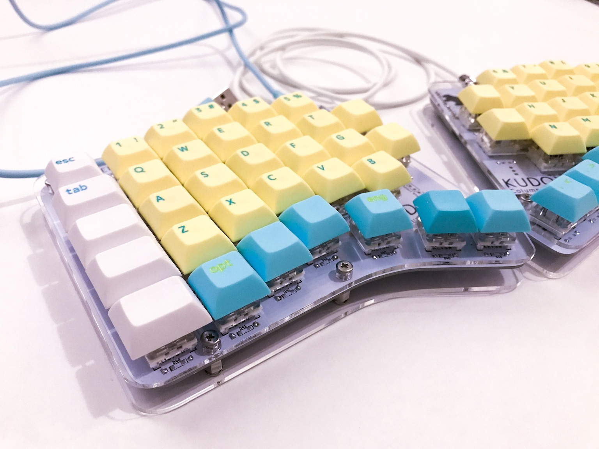

# Kudox Columner Keyboard Rev.1

Kudox Columner Keyboard Rev 1.0 is hot-swappable, column-staggered 66 key split keyboard.  
It is different from Kudox Keyboard that `Column-` staggered and `Row-` staggered, this is `Column-` staggered.  

**Japanese Manual is [here](README.ja.md).**  

## Layout

<em><a href="http://www.keyboard-layout-editor.com/">http://www.keyboard-layout-editor.com/</a></em>

- [KLE Layout permalink](http://www.keyboard-layout-editor.com/##@_name=kudox-columner&author=kumaokobo%3B&@_x:3.25&f2:2%3B&=3%0AF3%0A%23&_x:8.75%3B&=8%0AF8%0A*%3B&@_y:-0.75&x:2.25%3B&=2%0AF2%0A%2F@&_x:1%3B&=4%0AF4%0A$&_x:6.75%3B&=7%0AF7%0A%2F&&_x:1%3B&=9%0AF9%0A(%3B&@_y:-0.75&w:1.25%3B&=Esc&=1%0AF1%0A!&_x:3%3B&=5%0AF5%0A%25&_x:4.75%3B&=6%0AF6%0A%5E&_x:3%3B&=0%0AF10%0A)&_w:1.25%3B&=%E2%86%90%0A%0Aback%3B&@_y:-0.5&x:3.25&f:3%3B&=E%0A~%0A%0A9&_x:8.75%3B&=I%3B&@_y:-0.75&x:2.25&f:3%3B&=W%0A'%0A%0A8&_x:1&f:3%3B&=R%0A*&_x:1&f:3&h:1.25%3B&=%7B%0AF11%0A%5B&_x:2.75&f:3&h:1.25%3B&=%7D%0AF12%0A%5D&_x:1%3B&=U&_x:1&f:3%3B&=O%0A~%3B&@_y:-0.75&w:1.25%3B&=Tab&_f:3%3B&=Q%0A%22%0A%0A7&_x:3&f:3%3B&=T%0A+&_x:4.75%3B&=Y&_x:3&f:3%3B&=P%0A%60&_f:3&w:1.25%3B&=%5C%0A%C2%A5%0A%7C%3B&@_y:-0.5&x:3.25&f:3%3B&=D%0A%60%0A%0A6&_x:8.75%3B&=K%3B&@_y:-0.75&x:2.25&f:3%3B&=S%0A%2F:%0A%0A5&_x:1&f:3%3B&=F%0A%0A%0A0&_x:6.75%3B&=J&_x:1&f:3%3B&=L%0A%22%3B&@_y:-0.75&w:1.25%3B&=Ctrl&_f:3%3B&=A%0A%2F@%0A%0A4&_x:3&f:3%3B&=G%0A-&_fa@:0&:2&=undefined%3B&h:1.25%3B&=-%0A%0A%2F_&_x:2.75&h:1.25%3B&=%2F=%0A%0A+&=H&_x:3&fa@:0&:0&=undefined%3B%3B&=%2F%3B%0A'%0A%2F:&_w:1.25%3B&=Enter%3B&@_y:-0.5&x:3.25&fa@:0&:0&=undefined&=undefined%3B%3B&=C%0A%0A%0A3&_x:8.75&f:3%3B&=,%0A%0A%3C%3B&@_y:-0.75&x:2.25&f:3%3B&=X%0A%0A%0A2&_x:1&f2=undefined%3B&=V%0A.&_x:6.75%3B&=M&_x:1%3B&=.%0A%0A%3E%3B&@_y:-0.75&w:1.25%3B&=Shift&=Z%0A%0A%0A1&_x:3%3B&=B%0A%2F%2F&_x:4.75%3B&=N&_x:3%3B&=%2F%2F%0A%0A%3F&_w:1.25%3B&=Shift%3B&@_y:-0.5&x:3.25%3B&=Del%0A%0A%0A0&_x:8.75%3B&=%E2%86%90%0A%3C%3B&@_y:-0.75&x:2.25%3B&=~%0A%0A%60%0A%C2%A5&_x:10.75%3B&=%E2%86%93%0A%2F_%3B&@_y:-0.75&w:1.25%3B&=Alt%0A%0A%0AEsc&='%0A%0A%22&_x:12.75%3B&=%E2%86%91%0A%5E&_w:1.25%3B&=%E2%86%92%0A%3E%3B&@_r:15&rx:5&y:4.5&x:0.75&fa@:2&:2%3B%3B&=LANG2%0Alayer&_fa@:2&:1%3B%3B&=GUI%0AEnter&_a:7%3B&=%3B&@_r:-15&rx:12.25&y:4.5&x:-3.75%3B&=&_a:4%3B&=GUI%0AEnter&_fa@:2&:2%3B%3B&=LANG1%0Alayer)
