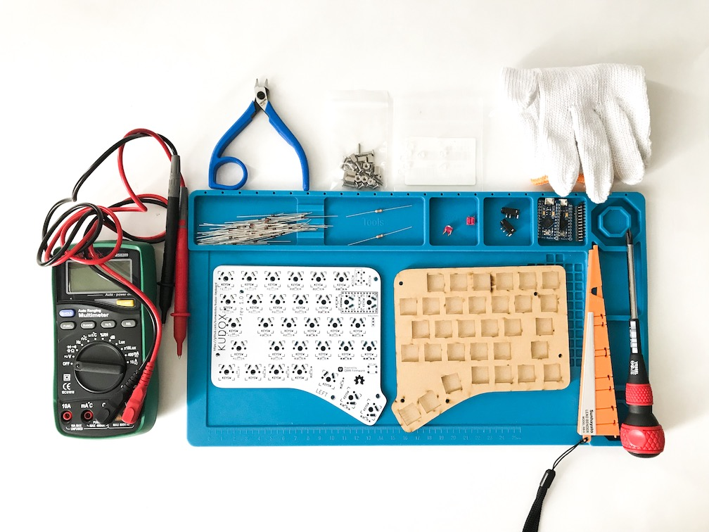
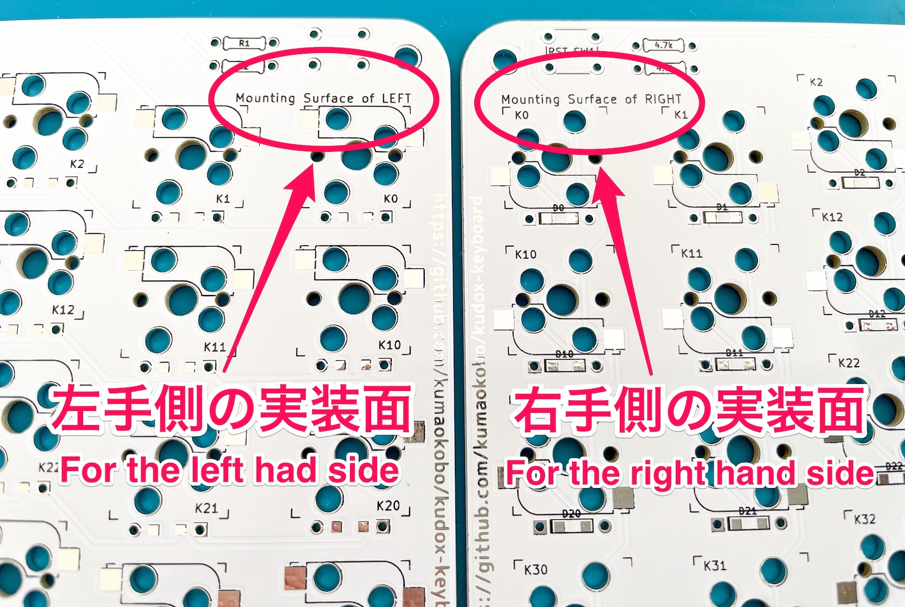
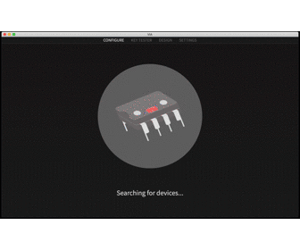
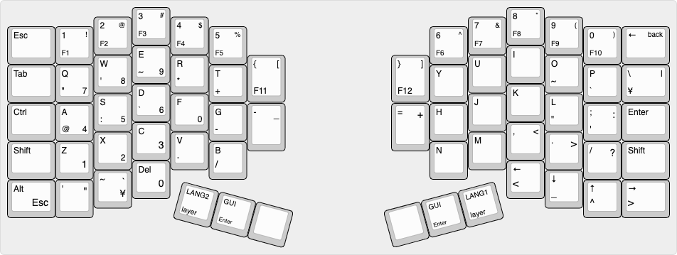

# Kudox Columner Keyboard Rev.1

Kudox Columner Keyboard Rev 1.0 is hot-swappable, column-staggered 66 key split keyboard.  
It is different from Kudox Keyboard that `Column-` staggered and `Row-` staggered, this is `Column-` staggered.  

**Japanese Manual is [here](README.ja.md).**  

<div style="display:block;margin:50px auto;">
<p align="center">


</p>
</div>


## Summary

  - [Bill of materials](#bill-of-materials)
  - [Assembly guide](#assembly-guide)
  - [Firmware](#firmware)
    - [Basic compiling and burning command](#basic-compiling-and-burning-command)
    - [First time burning](#first-time-burning)

## Bill of materials

| Qty | Item                                          | Notes                                               |
|----:|-----------------------------------------------|-----------------------------------------------------|
|   2 | Kudox Columner Rev1.0 PCBs                    |                                                     |
|  66 | 1N4148 diodes                                 | SMD diodes can also be used                         |
|   2 | PJ-320A 4 poles 3.5 mm TRRS connectors        |                                                     |
|   2 | 4.7 kΩ resistors                              | Need to be soldered on one half only                |
|   2 | Through hole momentary switch                 | Dimensions 6mm x 6mm x 4.3mm                        |
|   2 | Arduino Pro Micro                             | ATMega32U4                                          |
|   1 | TRRS cable                                    |                                                     |
|   1 | USB micro cable                               |                                                     |
|   2 | Cases                                         |                                                     |
|  10 | Screws M3 x 10mm                              | M3                                                  |
|  10 | Screws M3 x  5mm                              | M3                                                  |
|  10 | Spacers                                       | M3 x 7mm                                            |
|  10 | Wahers                                        | M3                                                  |
|  66 | [Kailh PCB Scoket](https://www.kailhswitch.com/mechanical-keyboard-switches/box-switches/mechanical-keyboard-switches-kailh-pcb-socket.html) | Cherry MX compatible type                             |
|  66 | Cherry MX compatible switches                 |                                                     |
|  66 | Cherry MX compatible keycaps                  | 4x 1.25u keycaps, 2x 1.75u keycaps, 2x 2.25u keycaps, 48x 1u keycaps  |


[Kudox Columner Basic](https://kumaokobo.booth.pm/items/1706475) is on sale at [BOOTH](https://kumaokobo.booth.pm/) (**NOT** including switches and keycaps).  


## Assembly guide

<p align="center">

</p>

### Installation steps:

- The PCB has direction.
  - `Mounting Surface of Left` : Mounting surface on the left hand side.
  - `Mounting Surface of Right` : Mounting surface on the right hand side.  <div><br/></div>

- Solder components:
  1. Solder 1N4148 diodes. Keep the diode legs for the right hand controller installation.<br/><div></div>
  2. Solder PJ-320A connectors.
  3. Solder momentary switches.
  4. Solder 4.7 kΩ resistors (Optional)  
     Unnecessary to solder this when implementing LED Underglow.  
     In case of soldering, **on one half only**.
  5. Solder PCB hot-swap sockets.
  6. Solder the Pro Micro header pins.
- Cuts legs of parts.
- Not to interfere the hot-swap socket and Pro Micro on `RIGHT` side PCB, put insulating tape on the hot-swap socket, because `RIGHT` side PCB is soldered Pro Micro face down.<div>
  <span>&nbsp;</span>
  <span>&nbsp;</span>
  </div>
- Solder Pro Micros to the header pins following the PCB labelling.
  - `LEFT` side: Solder Pro Micro face up.
  - `RIGHT` side: Solder Pro Micro face down.<br/><div></div>
- Install upper cases to PCBs.  
  M3x10 screws → upper case → M3 nuts → PCB → spacers.<br/><div></div>
- Install lower cases.
- Fit switches to the upper cases.

### Video guides

- [Inken ch](https://www.youtube.com/channel/UCXJZdip7JmW74HQHCtfYzFw) (japanese only)

<p align="center">
<a href="https://www.youtube.com/watch?v=6zZAXjMQ80E"></a>
<a href="https://www.youtube.com/watch?v=HCa4KX-FlOU"></a>
</p>


## Firmware

<p align="center">

</p>

Kudox Columner keyboard uses [QMK Firmware](https://github.com/qmk/qmk_firmware) for its firmware.  
Follow the QMK installation instructions [here](https://docs.qmk.fm/#/newbs_getting_started), then compile and burn the firmware as follows:  

### Basic compiling and burning command

```sh
$ cd path/to/qmk_firmware
$ make kudox/columner:default:flash
```

### First time burning

You need to burn the firmware both left hand and right hand.


#### 1. Left hand side

Edit [kudox/config.h](https://github.com/qmk/qmk_firmware/blob/master/keyboards/kudox/config.h) and activate `MASTER_LEFT` .

```cpp
/* Select hand configuration */
#define MASTER_LEFT
// #define MASTER_RIGHT
// #define EE_HANDS
```

Save the file, then connect Pro Micro(**left hand**) and your PC by USB cable.  
Compile and burn the firmware by running [Basic compiling and burning command](#basic-compiling-and-burning-command) as follows:  

```sh
$ cd path/to/qmk_firmware
$ make kudox/columner:default:flash
```

#### 2. Right hand side

Edit [kudox/config.h](https://github.com/qmk/qmk_firmware/blob/master/keyboards/kudox/config.h) and activate `MASTER_RIGHT` .  

```cpp
/* Select hand configuration */
// #define MASTER_LEFT
#define MASTER_RIGHT
// #define EE_HANDS
```

Save the file, then connect Pro Micro(**right hand**) and your PC by USB cable.  
Compile and burn the firmware by running [Basic compiling and burning command](#basic-compiling-and-burning-command).  

#### 3. Confirmation

Pull out the USB cable, then connect left hand and right hand by TRRS cable.  
Plug in the Pro Micro (Master) the USB cable.  


### VIA Support

- [the-via](https://caniusevia.com/): https://caniusevia.com/

Burn the firmware compatible with [VIA](https://caniusevia.com/).

```sh
$ cd path/to/qmk_firmware
$ make kudox/columner:via:flash
```

Get VIA and install it.
- [https://www.github.com/the-via/releases/releases/latest](https://www.github.com/the-via/releases/releases/latest)

Plug the keyboard in your PC, select `File` -> `Import Keymap` on VIA and load the json below:
- [kudox_columner_rev1.json](https://github.com/kumaokobo/kudox-keyboard/blob/master/kudox-columner/rev1/kudox_columner_rev1.json)

Change keymap by VIA.

<p align="center">

</p>


## Layout

<p align="center">

</p>
<p align="center">
<em><a href="http://www.keyboard-layout-editor.com/">http://www.keyboard-layout-editor.com/</a></em>
</p>

- [KLE Layout permalink](http://www.keyboard-layout-editor.com/##@_name=kudox-columner&author=kumaokobo%3B&@_x:3.25&f2:2%3B&=3%0AF3%0A%23&_x:8.75%3B&=8%0AF8%0A*%3B&@_y:-0.75&x:2.25%3B&=2%0AF2%0A%2F@&_x:1%3B&=4%0AF4%0A$&_x:6.75%3B&=7%0AF7%0A%2F&&_x:1%3B&=9%0AF9%0A(%3B&@_y:-0.75&w:1.25%3B&=Esc&=1%0AF1%0A!&_x:3%3B&=5%0AF5%0A%25&_x:4.75%3B&=6%0AF6%0A%5E&_x:3%3B&=0%0AF10%0A)&_w:1.25%3B&=%E2%86%90%0A%0Aback%3B&@_y:-0.5&x:3.25&f:3%3B&=E%0A~%0A%0A9&_x:8.75%3B&=I%3B&@_y:-0.75&x:2.25&f:3%3B&=W%0A'%0A%0A8&_x:1&f:3%3B&=R%0A*&_x:1&f:3&h:1.25%3B&=%7B%0AF11%0A%5B&_x:2.75&f:3&h:1.25%3B&=%7D%0AF12%0A%5D&_x:1%3B&=U&_x:1&f:3%3B&=O%0A~%3B&@_y:-0.75&w:1.25%3B&=Tab&_f:3%3B&=Q%0A%22%0A%0A7&_x:3&f:3%3B&=T%0A+&_x:4.75%3B&=Y&_x:3&f:3%3B&=P%0A%60&_f:3&w:1.25%3B&=%5C%0A%C2%A5%0A%7C%3B&@_y:-0.5&x:3.25&f:3%3B&=D%0A%60%0A%0A6&_x:8.75%3B&=K%3B&@_y:-0.75&x:2.25&f:3%3B&=S%0A%2F:%0A%0A5&_x:1&f:3%3B&=F%0A%0A%0A0&_x:6.75%3B&=J&_x:1&f:3%3B&=L%0A%22%3B&@_y:-0.75&w:1.25%3B&=Ctrl&_f:3%3B&=A%0A%2F@%0A%0A4&_x:3&f:3%3B&=G%0A-&_fa@:0&:2&=undefined%3B&h:1.25%3B&=-%0A%0A%2F_&_x:2.75&h:1.25%3B&=%2F=%0A%0A+&=H&_x:3&fa@:0&:0&=undefined%3B%3B&=%2F%3B%0A'%0A%2F:&_w:1.25%3B&=Enter%3B&@_y:-0.5&x:3.25&fa@:0&:0&=undefined&=undefined%3B%3B&=C%0A%0A%0A3&_x:8.75&f:3%3B&=,%0A%0A%3C%3B&@_y:-0.75&x:2.25&f:3%3B&=X%0A%0A%0A2&_x:1&f2=undefined%3B&=V%0A.&_x:6.75%3B&=M&_x:1%3B&=.%0A%0A%3E%3B&@_y:-0.75&w:1.25%3B&=Shift&=Z%0A%0A%0A1&_x:3%3B&=B%0A%2F%2F&_x:4.75%3B&=N&_x:3%3B&=%2F%2F%0A%0A%3F&_w:1.25%3B&=Shift%3B&@_y:-0.5&x:3.25%3B&=Del%0A%0A%0A0&_x:8.75%3B&=%E2%86%90%0A%3C%3B&@_y:-0.75&x:2.25%3B&=~%0A%0A%60%0A%C2%A5&_x:10.75%3B&=%E2%86%93%0A%2F_%3B&@_y:-0.75&w:1.25%3B&=Alt%0A%0A%0AEsc&='%0A%0A%22&_x:12.75%3B&=%E2%86%91%0A%5E&_w:1.25%3B&=%E2%86%92%0A%3E%3B&@_r:15&rx:5&y:4.5&x:0.75&fa@:2&:2%3B%3B&=LANG2%0Alayer&_fa@:2&:1%3B%3B&=GUI%0AEnter&_a:7%3B&=%3B&@_r:-15&rx:12.25&y:4.5&x:-3.75%3B&=&_a:4%3B&=GUI%0AEnter&_fa@:2&:2%3B%3B&=LANG1%0Alayer)


# License

<a rel="license" href="http://creativecommons.org/licenses/by-nc-sa/4.0/"></a><br /><span xmlns:dct="http://purl.org/dc/terms/" property="dct:title">Kudox Columner Keyboard</span> by <a xmlns:cc="http://creativecommons.org/ns#" href="https://github.com/kumaokobo" property="cc:attributionName" rel="cc:attributionURL">Kumao Kobo</a> is licensed under a <a rel="license" href="http://creativecommons.org/licenses/by-nc-sa/4.0/">Creative Commons Attribution-NonCommercial-ShareAlike 4.0 International License</a>.
