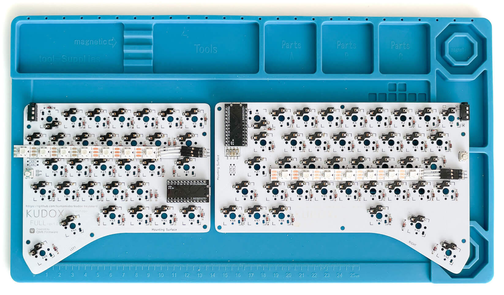

# LEDテープ (WS2812B) の取り付けガイド

**English Guide is [here](LED.md).**

## 使用部品

- WS2812B LED 7玉 x 2本
- リード線 6本 (*先がコネクタになっているとベターです*)
- L型3ピンヘッダ x2
- 絶縁テープ
- はんだ付け済みPCB

## 1. LEDテープにリード線をはんだ付けします.

2本のLED の `5V` , `DIN` , `GND` に コネクタ付きリード線3本をはんだ付けします.  

> LEDテープのメッキ部分ははんだがのりにくいことが多いので, フラックスなどを使用するとはんだ付けが少し楽になります.

*LEDは熱に弱いため長時間高熱に晒すと壊れる場合があります.*  

## 2. PCBにピンヘッダをはんだ付けします.

L型3ピンヘッダ をPCBの `RGB_Strip` の箇所にはんだ付けします.  

## 3. ピンヘッダにリード線を接続します.

対応するリード線を接続してください.

LED |    | PCBシルク表記
--- | -- | ----------
+5V | => | VCC
DIN | => | DIN
GND | => | GND

---

これで完成ですが、 LEDテープが途中で断線していたりするとキー入力もできなくなります.  
ケースをネジ止めする前に動作確認をすることをおすすめ致します.

