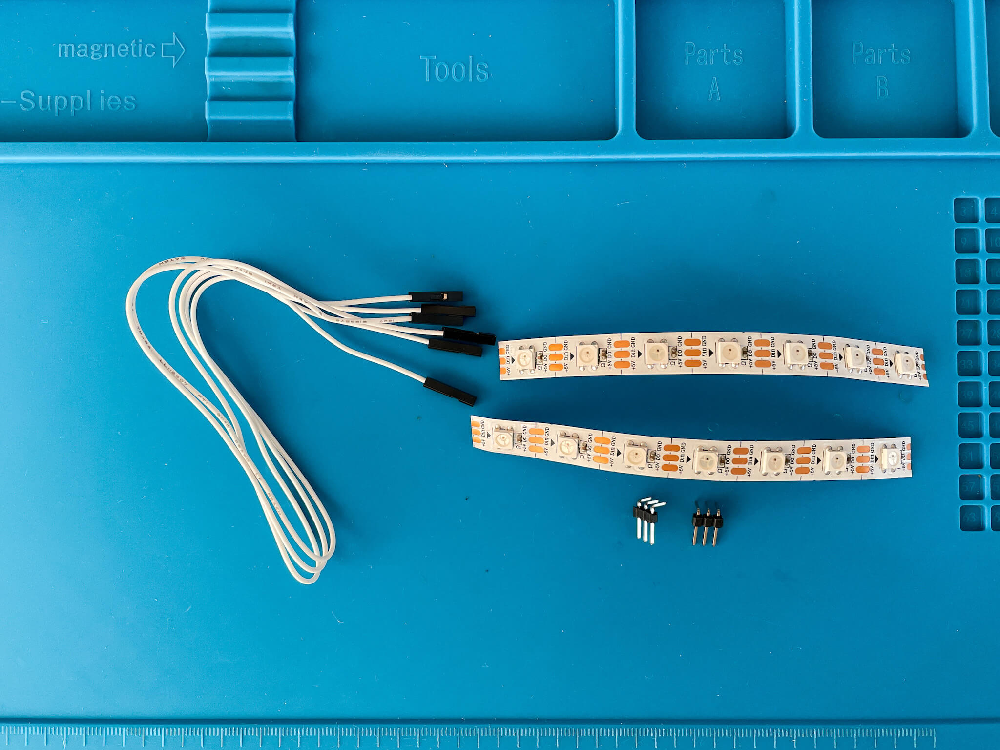
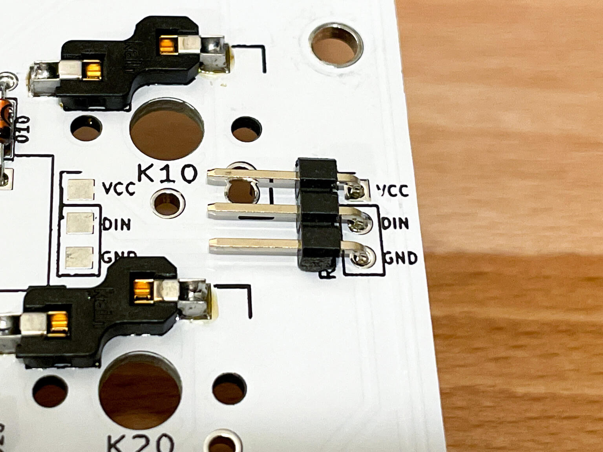

# LEDテープ (WS2812B) の取り付けガイド

**English Guide is [here](LED.md).**

## 使用部品

- WS2812B LED 7玉 x 2本
- ジャンパワイヤ メス-メス 3本
- L型3ピンヘッダ x2
- はんだ済みPCB

## 1. LEDテープにジャンパワイヤをはんだ付けします.

ジャンパワイヤを切断し, 被覆をむきます.  
2本のLED の `5V` , `DIN` , `GND` に 切断したジャンパワイヤをはんだ付けします.  

> LEDテープのメッキ部分ははんだがのりにくいことが多いので, フラックスなどを使用するとはんだ付けが少し楽になります.

**LEDは熱に弱いため長時間高熱に晒すと壊れる場合があります. ご注意ください.*  

## 2. PCBにピンヘッダをはんだ付けします.

L型3ピンヘッダ をPCBの `RGB_Strip` の箇所にはんだ付けします.  

## 3. ピンヘッダにジャンパワイヤを接続します.

対応するジャンパワイヤを接続してください.

LED |    | PCBシルク表記
--- | -- | ----------
+5V | => | VCC
DIN | => | DIN
GND | => | GND

---

これで完成ですが, LEDテープが途中で断線していたりするとキー入力もできなくなります.  
ケースをネジ止めする前に動作確認をすることをおすすめ致します.

## 備考

LEDテープはPCBに直接はんだ付けすることもできます．  
直接はんだ付けする場合は下記のパッドを使用してください.  

