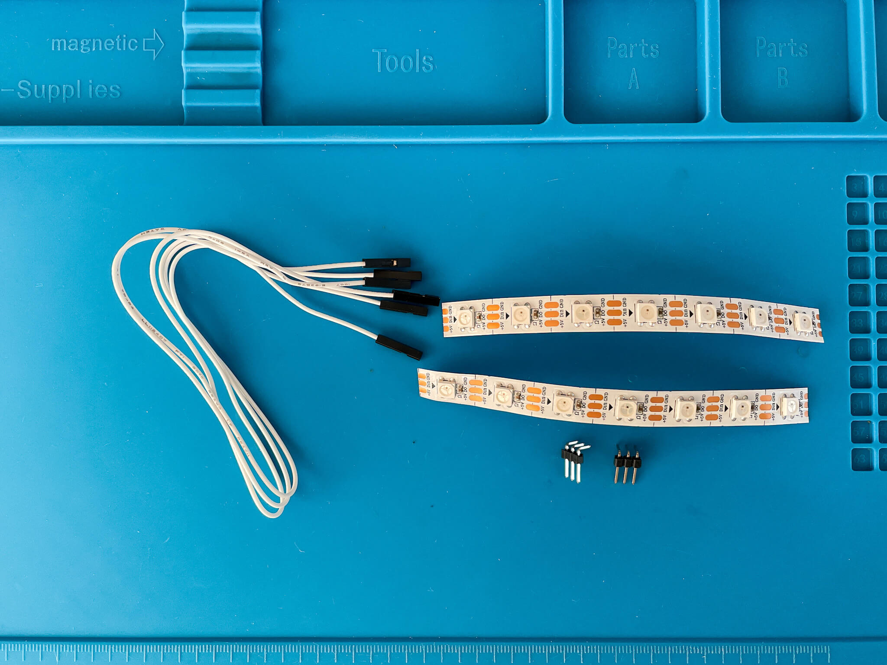
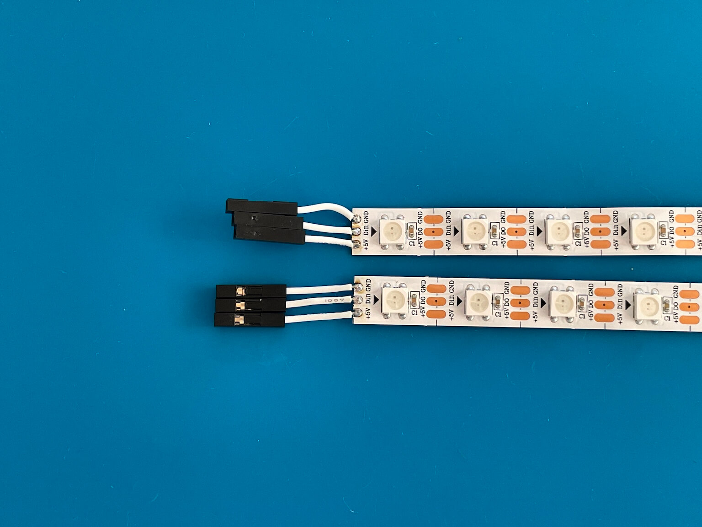
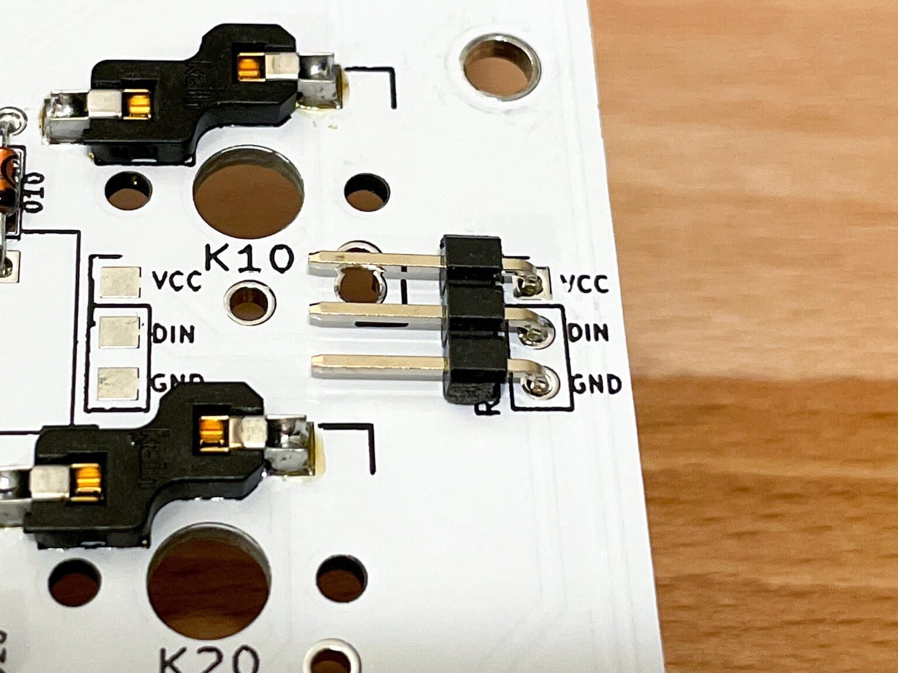
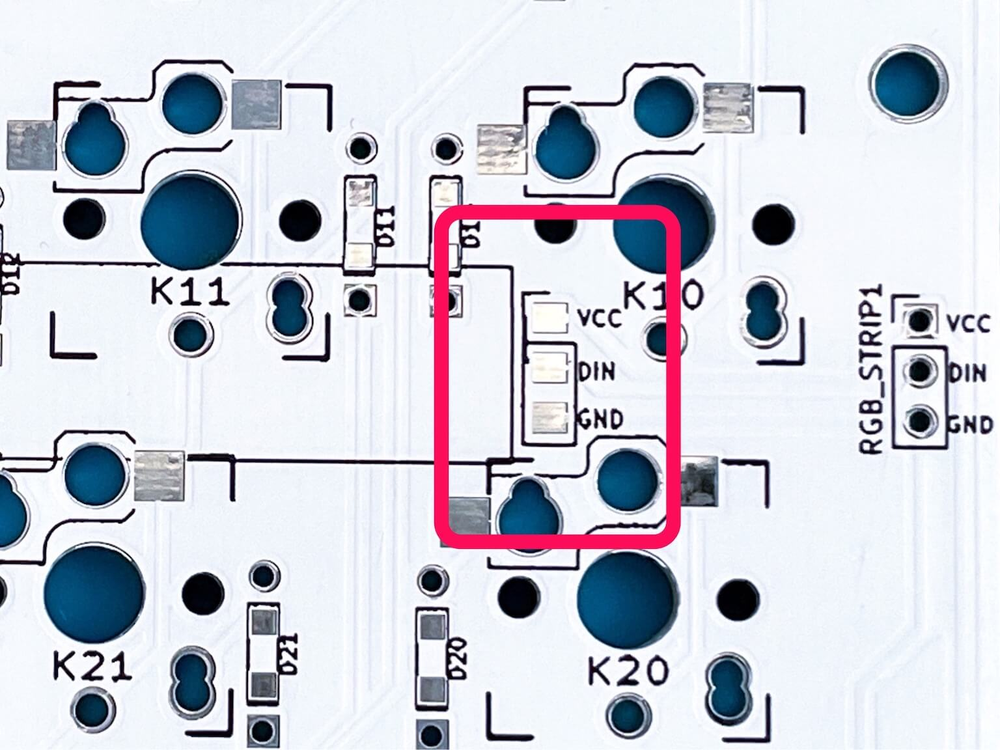

# Assembly LED strips (WS2812B)

**Japanese Guide is [here](LED.ja.md).**

## Parts

- WS2812B LEDs 7 x 2
- Jumper Wires x 3
- Angle-3 Pin Headers x 2
- Soldered PCB

## 1. Solder LED strips lead wires.

Cut jumper wires.  
Solder each `5V` , `DIN` , `GND` on LEDs with each wires.  

> Please consider using soldering flux. Often it is difficult to solder LED strip.

*LED is vulnerable to heat, so they may break if exposed to high heat for a long time.*  

## 2. Solder PCBs Pin Headers.

Solder Angle-3 Pin Headers at point of `RGB_Strpip` .  

## 3. Connect Wires to Pin Headers.

LED |    | PCB silks
--- | -- | -----------
+5V | => | VCC
DIN | => | DIN
GND | => | GND

## Remarks

LED strips can be soldered directly to the PCB.  
In this case, please use the following pads.  

