# Kudox Full Keyboard

Kudox Full Rev1.0 は ロープロファイル66%左右分離キーボードです.  
テンキーとファンクションキーをカットし, 矢印キーと親指用キーを配置しました.  
[Kailh Choc V1](http://www.kailh.com/en/Products/Ks/CS/321.html), [Kailh Choc V2](http://www.kailh.com/en/Products/Ks/CS/755.html) と Kailh Choc用 ホットスワップソケット に対応しています.  
※ Cherry MXスイッチとの互換性はありませんが, [Kailh Choc V2](http://www.kailh.com/en/Products/Ks/CS/755.html)はCherry MX用キーキャップに対応しています.  

**English Manual is [here](README.md).**

<div style="display:block;margin:50px auto;">
<p align="center">
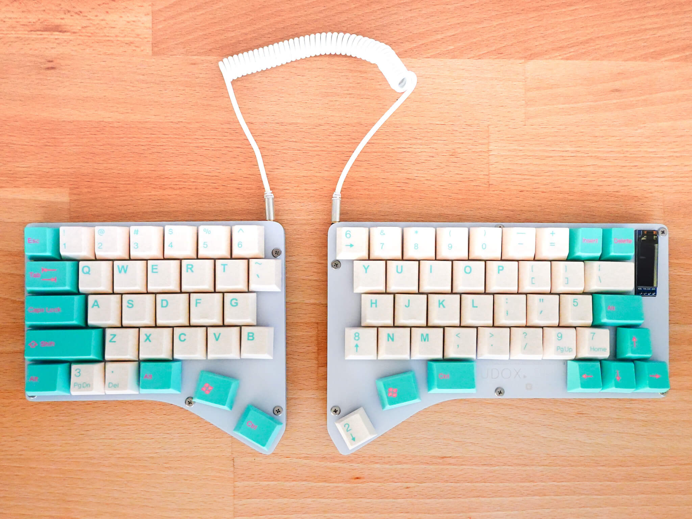
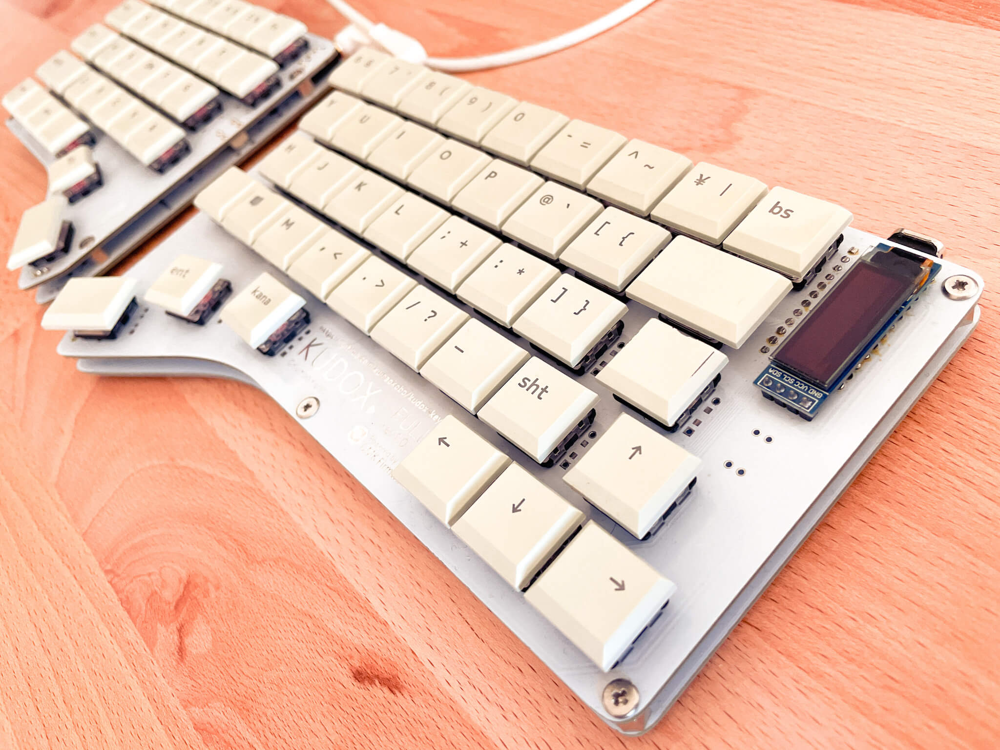
</p>
</div>


## Summary

  - [必要な部品](#必要な部品)
  - [組み立てガイド](#組み立てガイド)
  - [LED Underglowの取り付け](#LED-Underglowの取り付け)
  - [ファームウェア](#ファームウェア)
    - [基本書き込みコマンド](#基本書き込みコマンド)
    - [初回書き込み時](#初回書き込み時)
    - [JIS配列を書き込む場合](#JIS配列を書き込む場合)
    - [VIAを使ったキーマップ変更](#VIAを使ったキーマップ変更)

## 必要な部品

| 数量 | 項目                                           | 備考                                                |
|-----:|------------------------------------------------|-----------------------------------------------------|
|    2 | Kudox Full Rev1.0 PCB                          | 左x1, 右x1                                          |
|   72 | 1N4148 ダイオード                              | SMD ダイオードでも可.                               |
|    2 | MJ-4PP-9 4極 3.5mm TRRS コネクタ               |                                                     |
|    2 | タクトスイッチ                                 | 6mm x 6mm x 4.3mm サイズのもの.                     |
|    2 | Arduino Pro Micro                              | マイコン: ATMega32U4                                |
|    1 | TRRS ケーブル                                  | 3極 or 4極 (どちらでも可)                           |
|    1 | USB micro ケーブル                             | 家に落ちているもので可.                             |
|    2 | 下部カバー                                     | 左x1, 右x1                                          |
|    2 | 上部カバー                                     | ※ オプションです. 左x1, 右x1                       |
|   11 | ネジ M3 x 8mm                                  | ※ 上部カバーを使用しない場合: 5mm                  |
|   11 | ネジ M3 x 5mm                                  | M3                                                  |
|   11 | スペーサー M3 x 7mm                            | M3                                                  |
|   11 | ワッシャー                                     | M3 x 1mm                                            |
|   72 | Kailh Choc スイッチ                            | V1, V2 どちらでも可.                                |
|   71 | [Kailh Low Profile PCB Scoket](https://www.kailhswitch.com/mechanical-keyboard-switches/box-switches/mechanical-keyboard-switches-kailh-pcb-socket.html)     | ※ オプションです. PG1350互換タイプの方             |
|    2 | [ベリリウム銅ソケット](https://www.digikey.jp/product-detail/ja/mill-max-manufacturing-corp/7305-0-15-15-47-27-10-0/ED1039-ND/1765737)              | ※ オプションです.                                  |
|   72 | キーキャップ                                   | ChoocV1の場合: Kailhロープロファイル互換<br/>ChoocV2の場合: CherryMX互換<br/>3x 1.25u, 2x 1.5u, 1x 1.75u, 1x 2.25u, 65x 1u       |
|    2 | OLED SSD1306 128x32 0.91 inch                  | ※ オプションです.                                  |
|   14 | LED Underglow WS2812B                          | ※ オプションです. 7 LEDs x 2                       |
|    7 | ジャンパワイヤ                                 | ※ オプションです. LED を取り付ける場合に使います.  |
|    2 | L型3ピンヘッダ                                 | ※ オプションです. LED を取り付ける場合に使います.  |

キーキャップとスイッチ以外の全てを含む基本セットを [BOOTH](https://kumaokobo.booth.pm/) にて販売しています.
- [Kudox Full rev1 基本セット(白)](https://kumaokobo.booth.pm/items/3406954)

## 組み立てガイド

<p align="center">
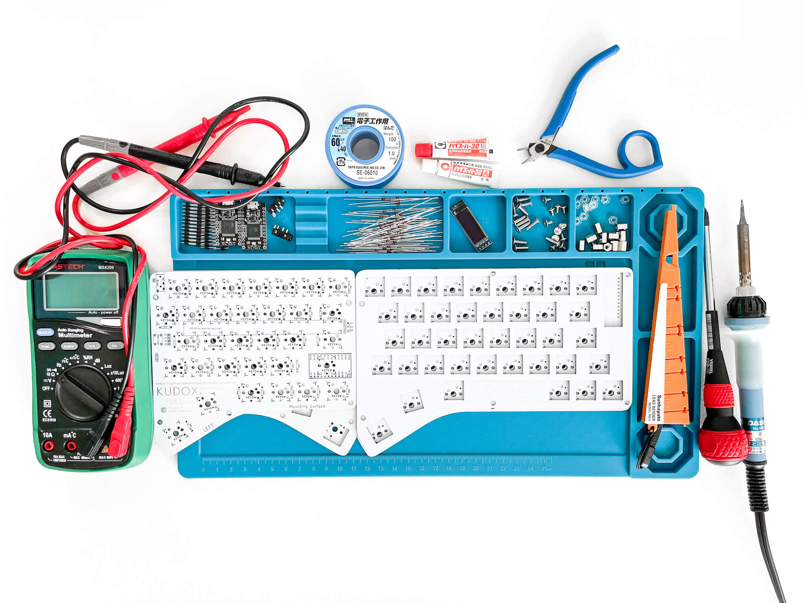
</p>


- PCB の `Mounting Surface` と記載のある面に下記パーツをはんだ付けします:  
  (ホットスワップソケットを使用しない場合はⅳ, ⅴを読み飛ばしてください)  
  <span>&nbsp;</span>
  1. 1N4148ダイオード (向きがあります. カソードが四角型の穴側にくるように差します)<br/><div></div>
  *ダイオードのカソードには線などのマークが入っています*
  2. MJ-4PP-9 TRRSコネクタ
  3. タクトスイッチ
  4. ホットスワップ・ソケット (オプション)<br/>Kailh用ホットスワップ・ソケットには向きがあります.<br/>シルクの形状とソケットの形状を合わせてはんだ付けしてください.<div>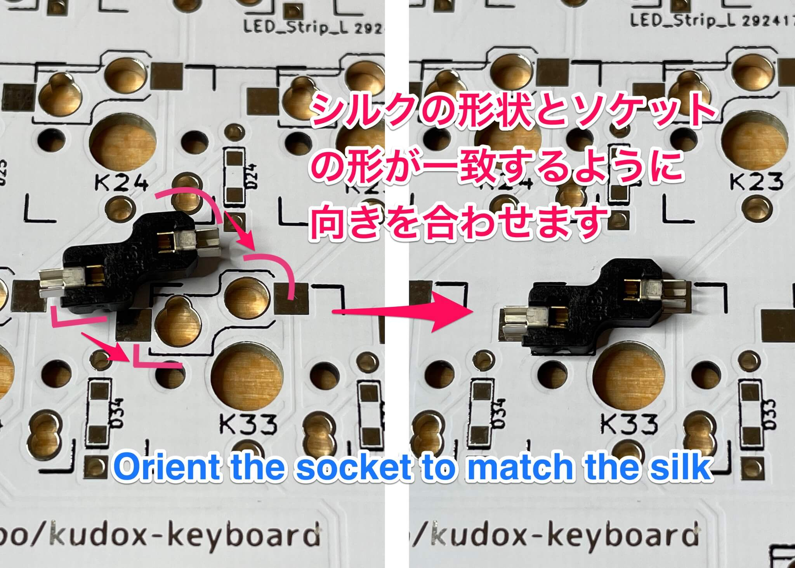</div>はんだ付けのやり方: <br/><div></div>下記の動画で取り付け方を詳しく紹介しています: <br/><div><a href="https://www.youtube.com/watch?v=uHqkW0cQ80I"></a></div>[[YouTube] インケンch: ホットスワップソケットの付け方](https://www.youtube.com/watch?v=uHqkW0cQ80I)
  5. 左手のSHIFTキー位置のスイッチはPro Microのピンヘッダと干渉するため, ホットスワップ・ソケットではなく[ベリリウム銅ソケット](https://www.digikey.jp/product-detail/ja/mill-max-manufacturing-corp/7305-0-15-15-47-27-10-0/ED1039-ND/1765737)を取り付けます (オプション)<br/><div>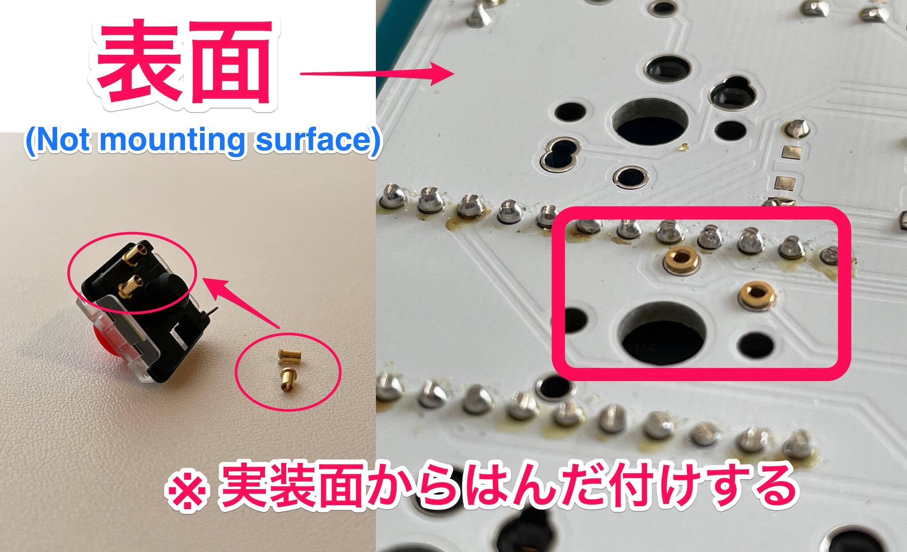</div>スイッチにベリリウム銅ソケットをはめ, PCBの表面からスイッチを差して実装面にはんだ付けします.
  6. Pro Micro の ピンヘッダ (**Pro Micro 自身のはんだ付けはまだしません**)  
  *Pro Micro のピンヘッダをはんだ付けする際には Pro Microを使って位置合わせをすると楽にはんだ付けできます.*  
  7. こんな感じになります:<div>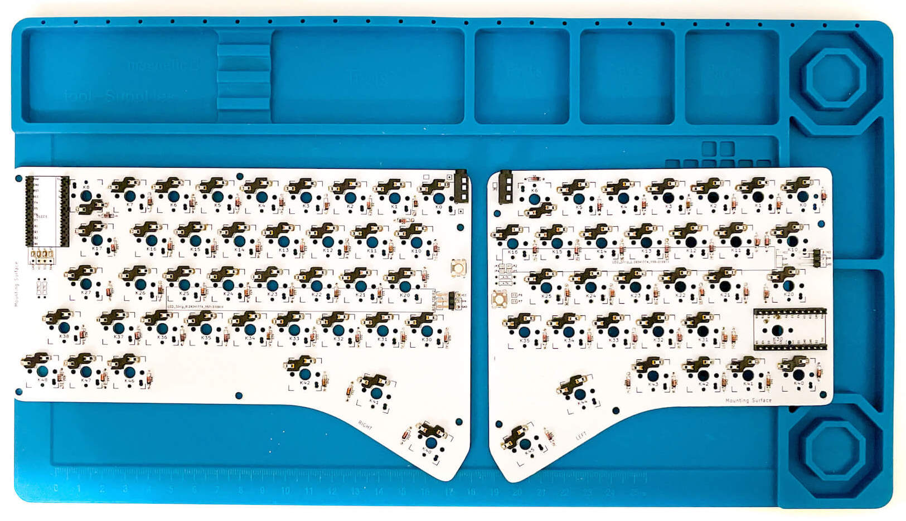</div>
- パーツの足をカットします.  
- **OLEDを使用する場合:*  
  右手側には0.91インチのOLEDを取り付けることができます.  
  OLEDを使用する場合は, この時点で取り付けを行ってください.  
  1. 右手側 Pro Micro フットプリントの近くにある4つのJPをはんだでジャンパします.<br/><div>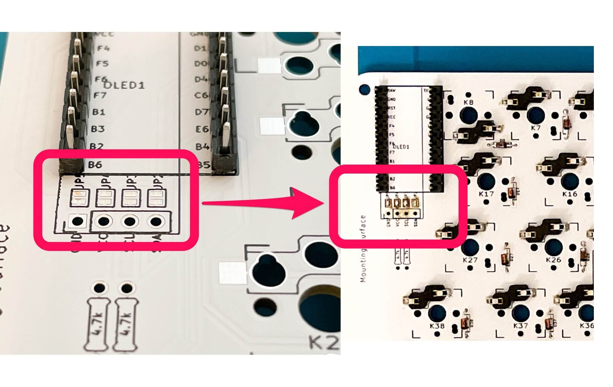</div>
  2. 表面からOLEDを差し, 実装面にはんだ付けします.<br/><div>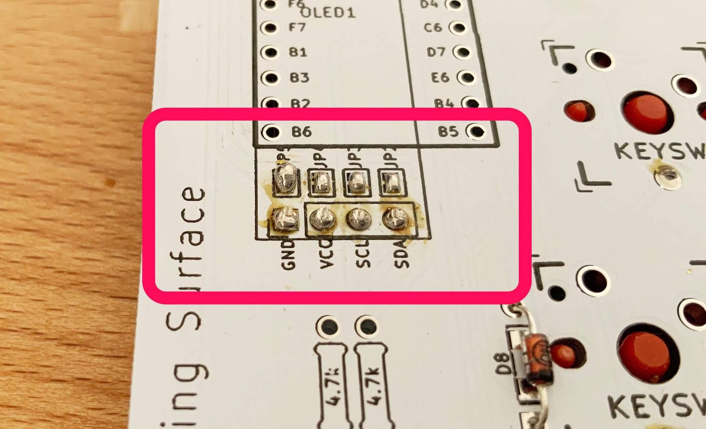</div>
- Pro Micro を ピンヘッダにはんだ付けします.  
  左右とも **裏向き(チップが隠れるように)** にはんだ付けします.<div>&nbsp;&nbsp;&nbsp;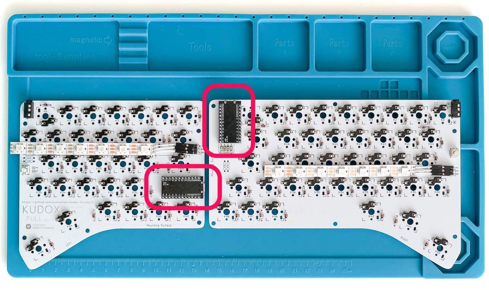</div>
- **上部ケースを取り付ける場合:*  
  1. PCB に上部ケースを取り付けます.  
  2. M3ネジ(8mm) → 上部ケース → ワッシャー → PCB → スペーサー の順番に取り付けます.<br/><div>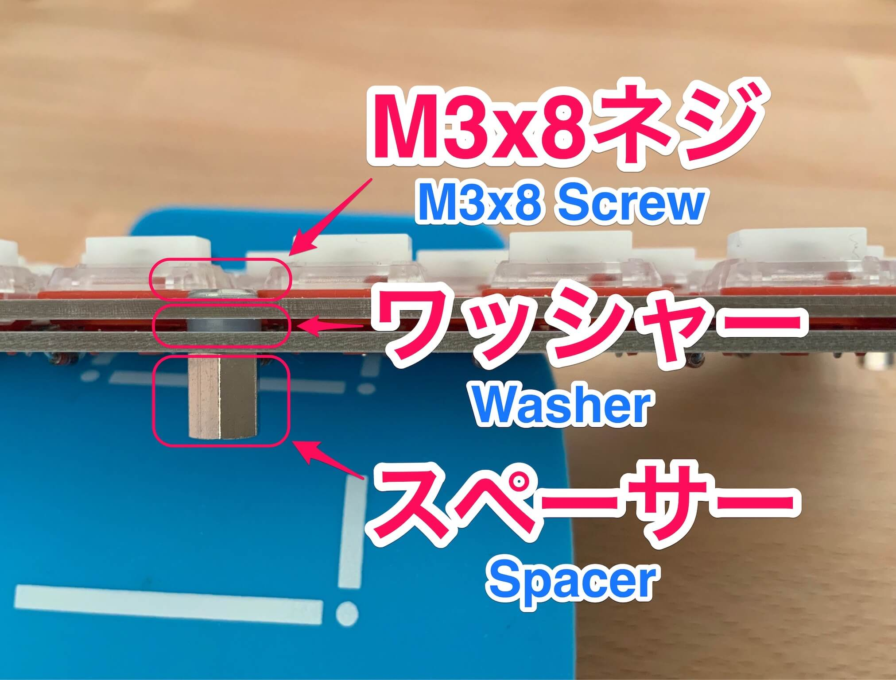</div>
  *上部ケースを取り付ける場合コンスルー(スプリング・ピンヘッダ)を用いてのPro Micro取り付けができません.(コンスルーのピンがケースに干渉します)*
- **スイッチの取り付け**
  - *スイッチを直付する場合*: スイッチを嵌め, PCBにはんだ付けします.<br/><em>(小さいピン・ホールに足が刺さるようにします)</em><div>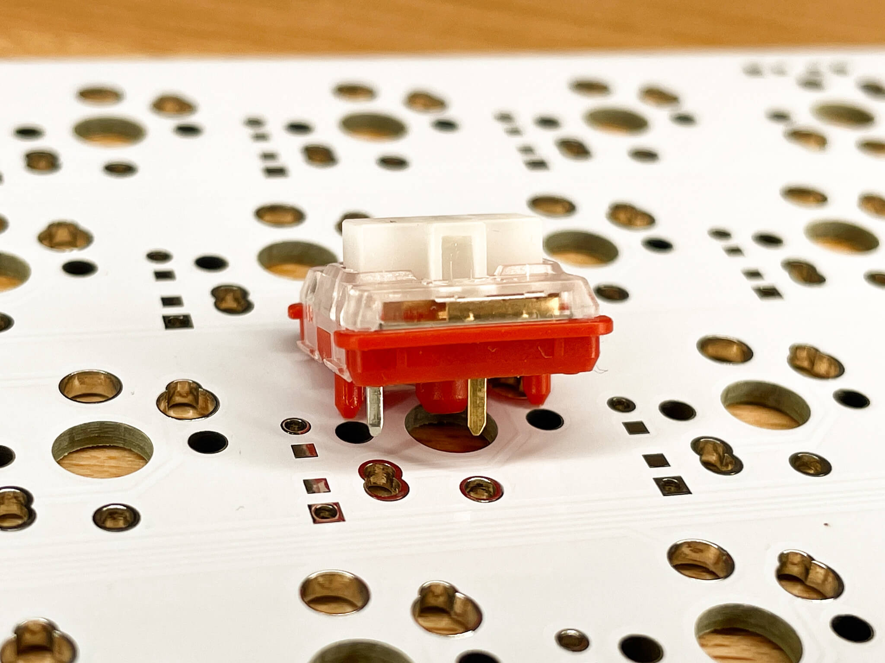</div>
  - *ホットスワップ・ソケットの場合*: スイッチをホットスワップ・ソケットに差し込みます.<br/><div>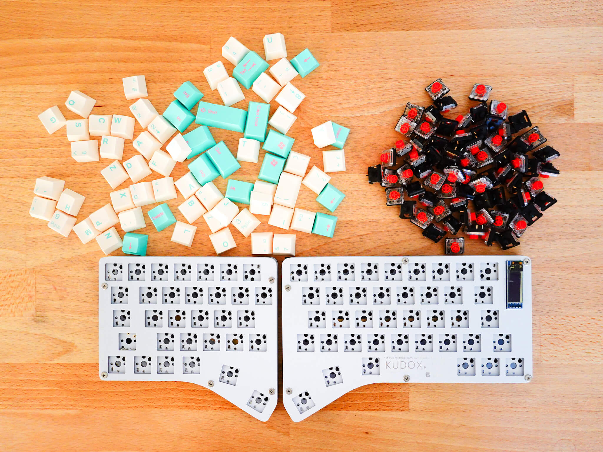&nbsp;&nbsp;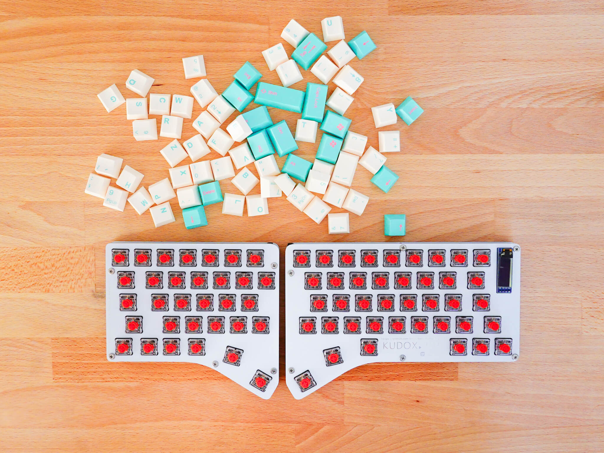</div><span style="font-size:80%;"><em>※ [Kailh Choc V2](http://www.kailh.com/en/Products/Ks/CS/755.html)をご利用になる場合, 3番目の足(LED穴側の足)がスルーホールに接触しないようお気をつけください. 足がスルーホールに接触してしまうと, 1キー押下時に複数キーが入力される現象などが発生します.</em></span>
- 下部ケースをスペーサーにネジ止めします.
- 完成です.<br/><div>&nbsp;&nbsp;&nbsp;&nbsp;&nbsp;</div>

## LED Underglowの取り付け

▶ [こちら](LED.ja.md)をご覧ください.

## ファームウェア

<p align="center">

</p>

Kudox Full Keyboard は [QMK Firmware](https://github.com/qmk/qmk_firmware) を利用しています.  
**QMK Firmware のインストールは [こちら](https://docs.qmk.fm/#/newbs_getting_started)** をご覧ください.  

### 基本書き込みコマンド

```sh
$ cd path/to/qmk_firmware
$ make kudox_full/rev1:default:flash
```

### 初回書き込み時

初回書き込み時には, 左手・右手 両方の Pro Micro にファームを書く必要があります.  

#### 1. 左手側

[qmk_firmware/keyboards/kudox_full/config.h](https://github.com/qmk/qmk_firmware/blob/master/keyboards/kudox_full/config.h) を編集して `MASTER_LEFT` を有効にします.

```cpp
/* Select hand configuration */
#define MASTER_LEFT
// #define MASTER_RIGHT
```

[qmk_firmware/keyboards/kudox_full/rev1/rules.mk](https://github.com/qmk/qmk_firmware/blob/master/keyboards/kudox_full/rev1/rules.mk) を編集して `OLED_ENABLE = no` にします.  
(左手にはOLEDを搭載していないので)

```cpp
OLED_ENABLE = no
```

保存したら, **左手側** の Pro Micro と PC をUSBケーブルで接続し, [基本書き込みコマンド](#基本書き込みコマンド) を実行します.

```sh
$ cd path/to/qmk_firmware
$ make kudox_full/rev1:default:flash
```

#### 2. 右手側

[qmk_firmware/keyboards/kudox_full/config.h](https://github.com/qmk/qmk_firmware/blob/master/keyboards/kudox_full/config.h) を編集して `MASTER_RIGHT` を有効にします.

```cpp
/* Select hand configuration */
// #define MASTER_LEFT
#define MASTER_RIGHT
// #define EE_HANDS
```

[qmk_firmware/keyboards/kudox_full/rev1/rules.mk](https://github.com/qmk/qmk_firmware/blob/master/keyboards/kudox_full/rev1/rules.mk) を編集して `OLED_ENABLE = yes` にします.  

```cpp
OLED_ENABLE = yes
```

保存したら, **右手側** の Pro Micro と PC をUSBケーブルで接続し, [基本書き込みコマンド](#基本書き込みコマンド) を実行します.

```sh
$ cd path/to/qmk_firmware
$ make kudox_full/rev1:default:flash
```

#### 3. 動作確認

一度USBケーブルを外してから, TRRSケーブルで左右をつなぎます.  
マスター側の Pro Micro にUSBケーブルをつなぎ, 左右ともに文字入力可能なことを確認します.  

以降, キー配列を変更した場合など再びファームを書く場合は, TRRSケーブルをつないだままマスター側の Pro Micro に書き込みを行うことで, 左右に設定が反映されるようになります.  

> 但し LED Underglow のカラー設定変更は例外で, 変更するたびに左右のProMicroに書き込みを行う必要があります.

### JIS配列を書き込む場合

[qmk_firmware/keyboards/kudox_full/rev1/keymaps/jis](https://github.com/qmk/qmk_firmware/blob/master/keyboards/kudox_full/rev1/keymaps/jis/keymap.c) に JIS配列を置いていますが, [Qmk Firmware](https://github.com/qmk/qmk_firmware) の [keycodes](https://github.com/qmk/qmk_firmware/blob/master/docs/keycodes.md) を参考にご自身の使いやすいレイアウトに変更してお使いになられると良いかもしれません.  

```sh
$ cd path/to/qmk_firmware
$ make kudox_full/rev1:jis:flash
```


### VIAを使ったキーマップ変更

<p align="center">
</br>
<a href="https://caniusevia.com/">the-via: https://caniusevia.com/</a>
</p>

#### 1. VIA 対応ファームの書き込み

VIA に対応したファームウェアを書き込みます.  
書き込み時のファイルの設定の仕方は [初回書き込み時](#初回書き込み時) をご覧ください.

```sh
$ cd path/to/qmk_firmware
$ make kudox_full/rev1:via:flash
```

#### 2. VIA のインストール

下記からVIAをダウンロードしてインストールします.
- [https://www.github.com/the-via/releases/releases/latest](https://www.github.com/the-via/releases/releases/latest)


#### 3. キーボード設定ファイルの読み込み

キーボードを PC 接続した状態で, VIA の `File` -> `Import Keymap` から 下記のjsonを読み込みます.
- [kudox_full_rev1.json](https://github.com/kumaokobo/kudox-keyboard/blob/master/kudox-full/rev1/kudox_full_rev1.json)


#### 4. キーマップの変更

VIA上でキーマップを変更します.

<p align="center">

</p>

> - VIA上でキーを選択したりLED設定を変えたりすると即座に変更が反映されます. 保存して反映, という手順は必要ありません.  
> - LED Underglow のカラー設定変更を行う場合, 左右片方づつUSBケーブルを接続して設定変更を行う必要があります.


## レイアウト

### VIAデフォルト

<p align="center">
<em>(キーボードをUS配列で設定した場合のキーマップです)</em><br/>
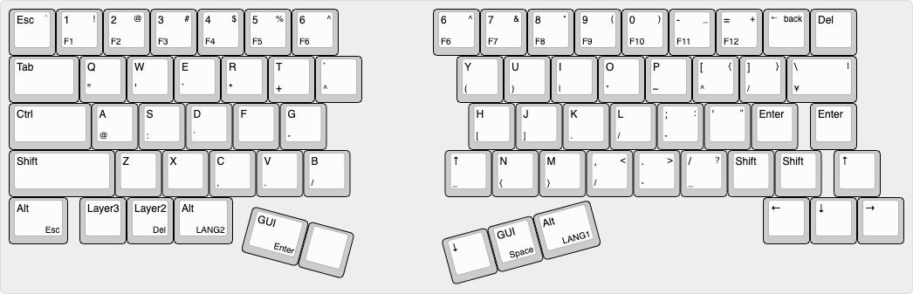
</p>
<p align="right">
<em><a href="http://www.keyboard-layout-editor.com/">http://www.keyboard-layout-editor.com/</a></em>
</p>

- [KLE Layout permalink](http://www.keyboard-layout-editor.com/##@_name=Kudox%20Full%20Keyboard&author=Kumao%20Kobo%3Ckumaokobo%2F@gmail.com%3E%3B&@_fa@:0&:0&:2%3B%3B&=Esc%0A%0A%60&_f2:2%3B&=1%0AF1%0A!&=2%0AF2%0A%2F@&=3%0AF3%0A%23&=4%0AF4%0A$&=5%0AF5%0A%25&=6%0AF6%0A%5E&_x:2%3B&=6%0AF6%0A%5E&=7%0AF7%0A%2F&&=8%0AF8%0A*&=9%0AF9%0A(&=0%0AF10%0A)&=-%0AF11%0A%2F_&=%2F=%0AF12%0A+&_fa@:1&:2&:2%3B%3B&=%E2%86%90%0A%0Aback&_f:3%3B&=Del%3B&@_f:3&w:1.5%3B&=Tab&_f:3%3B&=Q%0A%22&_f:3%3B&=W%0A'&_f:3%3B&=E%0A%60&_f:3%3B&=R%0A*&_f:3%3B&=T%0A+&_f2:2%3B&=%60%0A%5E&_x:2%3B&=Y%0A(&=U%0A)&=I%0A%7C&=O%0A*&=P%0A~&=%5B%0A%5E%0A%7B&=%5D%0A%2F%2F%0A%7D&_w:1.5%3B&=%5C%0A%C2%A5%0A%7C%3B&@_w:1.75%3B&=Ctrl&=A%0A%2F@&=S%0A%2F:&=D%0A%60&=F&=G%0A-&_x:3%3B&=H%0A%5B&=J%0A%5D&=K%0A.&=L%0A%2F%2F&=%2F%3B%0A-%0A%2F:&='%0A%0A%22&=Enter&_x:0.25%3B&=Enter%3B&@_w:2.25%3B&=Shift&=Z&=X&=C%0A,&=V%0A.&=B%0A%2F%2F&_x:2%3B&=%E2%86%91%0A%2F_&=N%0A%7B&=M%0A%7D&=,%0A%2F%2F%0A%3C&=.%0A-%0A%3E&=%2F%2F%0A%2F_%0A%3F&=Shift&=Shift&_x:0.25%3B&=%E2%86%91%3B&@_w:1.25%3B&=Alt%0A%0A%0AEsc&_x:0.25%3B&=Layer3&=Layer2%0A%0A%0ADel&_w:1.25%3B&=Alt%0A%0A%0ALANG2&_x:11.25%3B&=%E2%86%90&=%E2%86%93&=%E2%86%92%3B&@_r:15&rx:5&y:4&x:1.25&w:1.25%3B&=GUI%0A%0A%0AEnter&_a:7%3B&=%3B&@_r:-15&rx:12&y:4&x:-4&a:4%3B&=%E2%86%93&=GUI%0A%0A%0ASpace&_w:1.25%3B&=Alt%0A%0A%0ALANG1)

### JIS 配列

<p align="center">
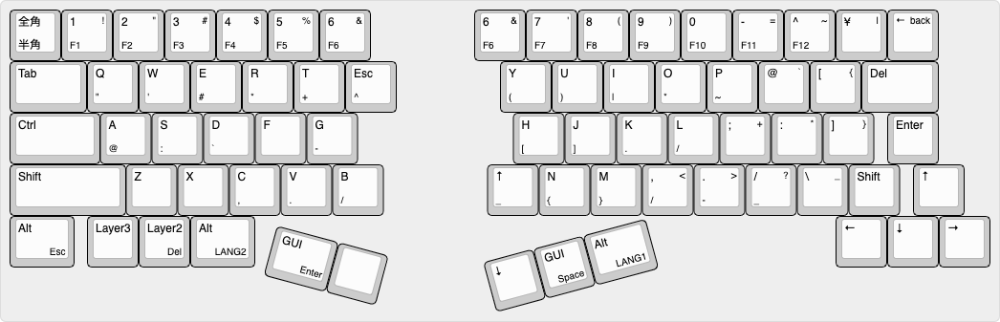
</p>
<p align="right">
<em><a href="http://www.keyboard-layout-editor.com/">http://www.keyboard-layout-editor.com/</a></em>
</p>

- [KLE Layout permalink](http://www.keyboard-layout-editor.com/##@@_f1:3&f2:3%3B&=%E5%85%A8%E8%A7%92%0A%E5%8D%8A%E8%A7%92&_f1:3&f2:2%3B&=1%0AF1%0A!&=2%0AF2%0A%22&=3%0AF3%0A%23&=4%0AF4%0A$&=5%0AF5%0A%25&=6%0AF6%0A%2F&&_x:2%3B&=6%0AF6%0A%2F&&=7%0AF7%0A'&=8%0AF8%0A(&=9%0AF9%0A)&=0%0AF10&=-%0AF11%0A%2F=&=%5E%0AF12%0A~&=%C2%A5%0A%0A%7C&_fa@:2&:2&:2%3B%3B&=%E2%86%90%0A%0Aback%3B&@_f:3&w:1.5%3B&=Tab&_f1:3&f2:2%3B&=Q%0A%22&=W%0A'&=E%0A%23&=R%0A*&=T%0A+&=Esc%0A%5E&_x:2%3B&=Y%0A(&=U%0A)&=I%0A%7C&=O%0A*&=P%0A~&=%2F@%0A%0A%60&=%5B%0A%0A%7B&_w:1.5%3B&=Del%3B&@_w:1.75%3B&=Ctrl&=A%0A%2F@&=S%0A%2F:&=D%0A%60&=F&=G%0A-&_x:3%3B&=H%0A%5B&=J%0A%5D&=K%0A.&=L%0A%2F%2F&=%2F%3B%0A%0A+&=%2F:%0A%0A*&=%5D%0A%0A%7D&_x:0.25%3B&=Enter%3B&@_f1:3&f2:2&w:2.25%3B&=Shift&=Z&=X&=C%0A,&=V%0A.&=B%0A%2F%2F&_x:2%3B&=%E2%86%91%0A%2F_&=N%0A%7B&=M%0A%7D&=,%0A%2F%2F%0A%3C&=.%0A-%0A%3E&=%2F%2F%0A%2F_%0A%3F&=%5C%0A%0A%2F_&=Shift&_x:0.25%3B&=%E2%86%91%3B&@_f1:3&f2:2&w:1.25%3B&=Alt%0A%0A%0AEsc&_x:0.25%3B&=Layer3&_f1:3&f2:2%3B&=Layer2%0A%0A%0ADel&_f1:3&f2:2&w:1.25%3B&=Alt%0A%0A%0ALANG2&_x:11.25%3B&=%E2%86%90&=%E2%86%93&=%E2%86%92%3B&@_r:15&rx:5&y:4&x:1.25&w:1.25%3B&=GUI%0A%0A%0AEnter&_a:7%3B&=%3B&@_r:-15&rx:12&y:4&x:-4&a:4%3B&=%E2%86%93&_f1:3&f2:2%3B&=GUI%0A%0A%0ASpace&_f1:3&f2:2&w:1.25%3B&=Alt%0A%0A%0ALANG1)


## VIAでのJIS配列について

<a href="https://caniusevia.com/">VIA</a> はUS配列を前提としているため, <a href="https://caniusevia.com/">VIA</a> でキーマップを設定したキーボードをJIS配列キーボードとして使うと, 設定したはずのキーと異なるキーが入力されます.  
例えば, 上記の VIAデフォルト・レイアウトはJIS配列キーボードとしてOSに認識させると下記のようなキー配列になります.  
(`OSに認識させると` と書いていますが, Windowsを日本語設定で使用している場合などは自動的にJIS配列キーボードとして認識されます)

<p align="center">
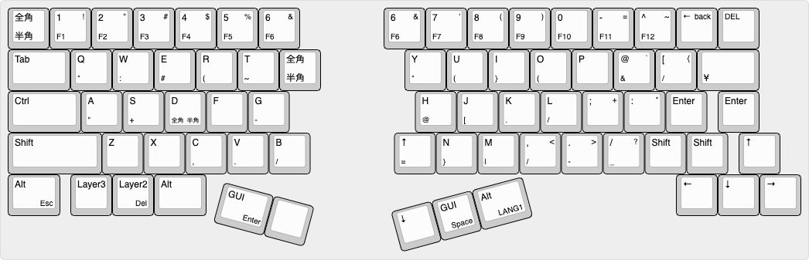
</p>

記号がぐちゃぐちゃになります💦  
JIS配列キーボードとしてまともに使おうと思ったら, いくつかの記号を読み替えて設定する必要があります.  

### VIAでの表記(US配列でのキー) を JIS配列用に読み替えるための表

VIAカテゴリ | VIAでの表記 | JISのキー | USとJISで 同じ or 異なる
|:----------|:-----------:|:---------:|:-----:|
BASIC       | _<br/>-     | =<br/>-   | 異なる
BASIC       | +<br/>=     | ~<br/>^   | 異なる
BASIC       | ~<br/>`     | 全角<br/>半角 | 異なる
BASIC       | {<br/>[     | `<br/>@   | 異なる
BASIC       | }<br/>]     | {<br/>[   | 異なる
BASIC       | \\<br/>\|   | }<br/>]   | 異なる
BASIC       | "<br/>'     | *<br/>:   | 異なる
BASIC       | <<br/>,     | <<br/>,   | 同じ
BASIC       | ><br/>.     | ><br/>.   | 同じ
BASIC       | ?<br/>/     | ?<br/>/   | 同じ
SPECIAL     | !           | !         | 同じ
SPECIAL     | @           | "         | 異なる
SPECIAL     | #           | #         | 同じ
SPECIAL     | $           | $         | 同じ
SPECIAL     | %           | %         | 同じ
SPECIAL     | ^           | &         | 異なる
SPECIAL     | *           | (         | 異なる
SPECIAL     | (           | )         | 異なる
SPECIAL     | )           | なし      | 異なる
SPECIAL     | _           | =         | 異なる
SPECIAL     | +           | ~         | 異なる
SPECIAL     | {           | `         | 異なる
SPECIAL     | }           | {         | 異なる
SPECIAL     | <           | <         | 同じ
SPECIAL     | >           | >         | 同じ
SPECIAL     | :           | +         | 異なる
SPECIAL     | \|          | }         | 異なる
SPECIAL     | ?           | ?         | 同じ
SPECIAL     | "           | *         | 異なる
SPECIAL     | Ro          | \         | 異なる
SPECIAL     | ¥           | ¥         | 同じ
SPECIAL     | 無変換      | 無変換(Win) | 同じ
SPECIAL     | 変換        | 変換(Win)   | 同じ
SPECIAL     | かな        | かな(Win)   | 同じ
SPECIAL     | 漢字        | 英数(Mac)   | 異なる
SPECIAL     | ハングル文字のキー | かな(Mac) | 異なる

<br/>

上表の `USとJISで 同じ or 異なるキー` に気をつけてください.

