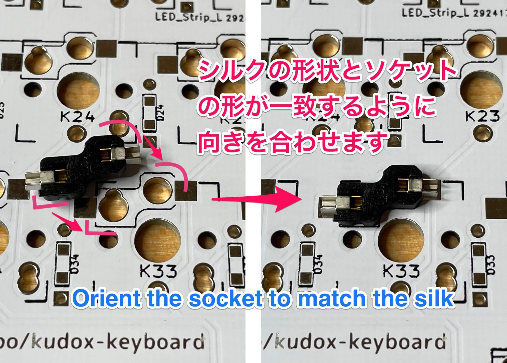
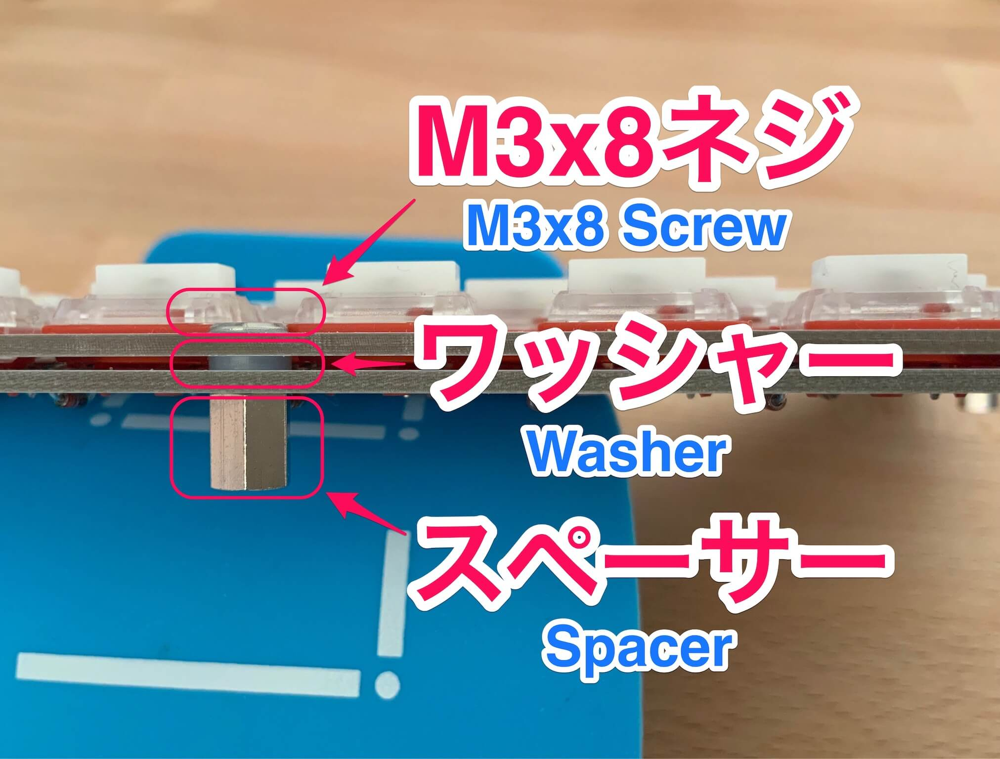
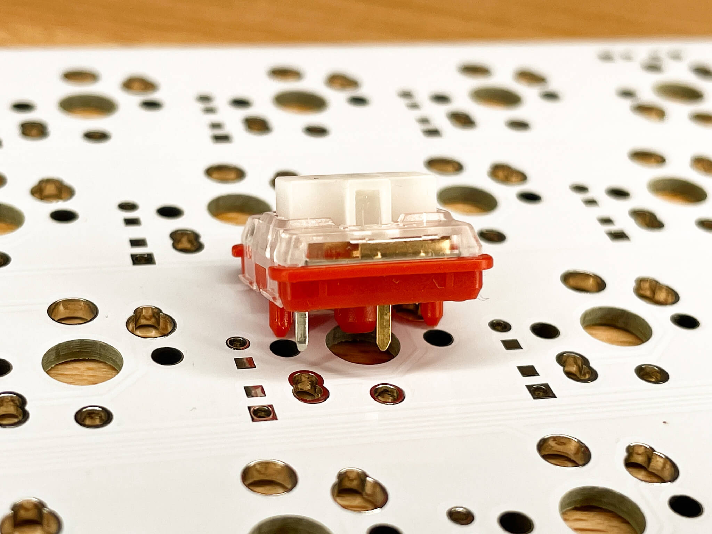
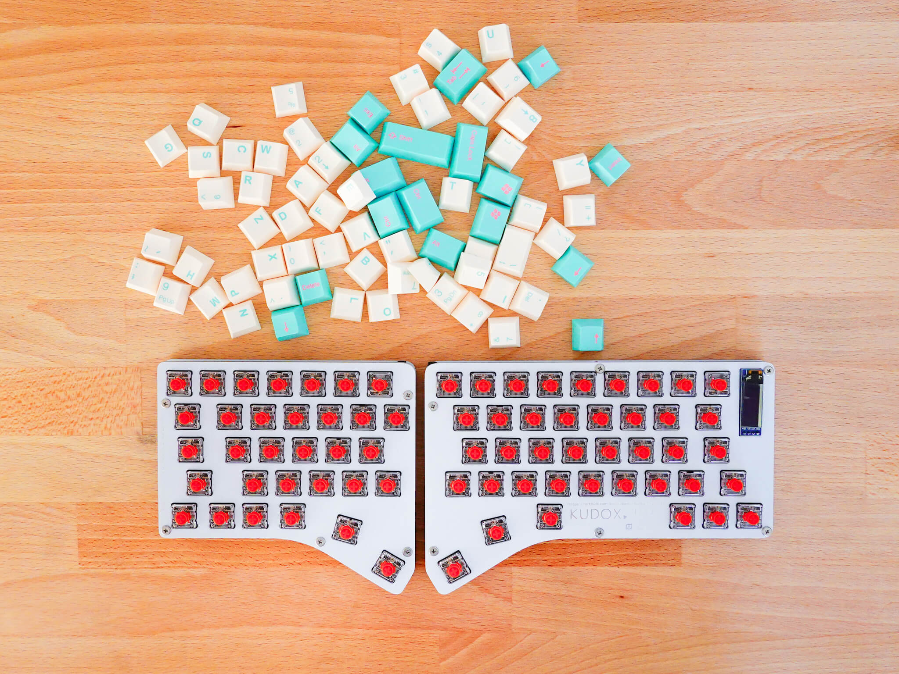

# Kudox Full Keyboard

Kudox Full Rev1.0 is a low-profile 66% split keyboard.  
This does not include numpad and function keys, but has arrow keys and thumb keys.  
Compatible with [Kailh Choc V1](http://www.kailh.com/en/Products/Ks/CS/321.html), [Kailh Choc V2](http://www.kailh.com/en/Products/Ks/CS/755.html) and hotswapping sockets for Kailh Choc.  
* Although it is not Cherry MX compatible, [Kailh Choc V2](http://www.kailh.com/en/Products/Ks/CS/755.html) is compatible with Cherry MX keycaps.  

**Japanese Manual is [here](README.ja.md).**

<div style="display:block;margin:50px auto;">
<p align="center">


</p>
</div>

## Summary

  - [Bill of materials](#bill-of-materials)
  - [Assembly guide](#assembly-guide)
  - [Assembly LED strips](#assembly-led-strips)
  - [Firmware](#firmware)
    - [Basic compiling and burning command](#basic-compiling-and-burning-command)
    - [First time burning](#first-time-burning)
    - [VIA Support](#via-support)

## Bill of materials

| Qty | Item                                          | Notes                                               |
|----:|-----------------------------------------------|-----------------------------------------------------|
|   2 | Kudox Full Rev1.0 PCB                         | Left x 1, Right x 1                                 |
|  72 | 1N4148 diodes                                 | SMD diodes can also be used                         |
|   2 | MJ-4PP-9 4 poles 3.5 mm TRRS connectors       |                                                     |
|   2 | Through hole momentary switch                 | Dimensions 6mm x 6mm x 4.3mm                        |
|   2 | Arduino Pro Micro microcontrollers            | ATMega32U4                                          |
|   1 | TRRS cable                                    | 3 poles or 4 poles                                  |
|   1 | USB micro cable                               |                                                     |
|   2 | Under cover                                   | Left x 1, Right x 1                                 |
|   2 | Upper cover                                   | Left x 1, Right x 1                                 |
|  11 | Screws M3 x 8mm                               | If you do not use upper covers, may use 5mm         |
|  11 | Screws M3 x 5mm                               | M3                                                  |
|  11 | Spacers                                       | M3 x 7mm                                            |
|  11 | Washers                                       | M3 x 1mm                                            |
|  72 | Kailh Choc switches                           | V1 or V2                                            |
|  71 | [Kailh Low Profile PCB Scoket](https://www.kailhswitch.com/mechanical-keyboard-switches/box-switches/mechanical-keyboard-switches-kailh-pcb-socket.html)   | Optional. The type compatible with PG1350           |
|   2 | [Pin Socket Connector](https://www.digikey.jp/product-detail/ja/mill-max-manufacturing-corp/7305-0-15-15-47-27-10-0/ED1039-ND/1765737)            | Optional.                                           |
|  72 | Keycaps                                       | Case ChoocV1: Kailh Low Profile compatible<br/>Case ChoocV2: CherryMX compatible<br/>3x 1.25u, 2x 1.5u, 1x 1.75u, 1x 2.25u, 65x 1u       |
|   2 | OLED SSD1306 128x32 0.91 inch                 | Optional.                                           |
|  14 | LED Underglow WS2812B                         | Optional. 7 LEDs x 2                                |
|   7 | 24 AWG (or smaller) stranded wire             | Optional. Only in case of using LEDs.               |
|   2 | Right angle 3 pin headers                     | Optional. Only in case of using LEDs.               |


- [Kudox Full rev1 Basic White](https://kumaokobo.booth.pm/items/3406954)

are on sale at [BOOTH](https://kumaokobo.booth.pm/) (**NOT** including switches and keycaps).


## Assembly guide

<p align="center">

</p>

### Installation steps:

- Solder components on the side of `Mounting Surface`:
  1. Solder 1N4148 diodes. Put the cathode in the square hole.<br/><div></div>
  *Cathode side is marked like a line.*
  2. Solder MJ-4PP-9 connectors.
  3. Solder momentary switches.
  4. Solder PCB hot-swap sockets (**Optional**).<br/>Orient the socket to match the silk.<div></div>How to solder hot-swap sockets:<br/><div></div>Video guide: <br/><div><a href="https://www.youtube.com/watch?v=uHqkW0cQ80I"></a></div>[YouTube:Inken ch:How to solder hot-swap sockets](https://www.youtube.com/watch?v=uHqkW0cQ80I)
  5. Because the shift key of left side interferes with the pin header, need to use [Pin Socket Connector](https://www.digikey.jp/product-detail/ja/mill-max-manufacturing-corp/7305-0-15-15-47-27-10-0/ED1039-ND/1765737) (**Optional**).<br/><div></div>Fit the switch with a pin socket conn, insert the switch from the surface of the PCB and solder it to the mounting surface.
  6. Solder the Pro Micro header pins (**do not solder the Pro Micro controllers yet**).  
  *We recommend to adjust the positions of Pin Headers using Pro Micro when soldering.*  
  7. Current state:<div></div>
- Cuts legs of parts.
- **In case of using OLED:*  
  You can use OLED SSD1306 128x32 0.91 inch on the right side.  
  If you use OLED, solder it now.  
  1. Solder jumper the four JPs near the right hand side Pro Micro footprint.<br/><div></div>
  2. Solder OLED pins on the mounting surface.<br/><div></div>
- Solder Pro Micros controllers to the header pins.  
  Pro Micro **face down** on both of sides.<div></div>
- Install upper cases to PCBs.  
  M3x8 screws → upper case → M3 washers → PCB → spacers.<br/><div></div>


- **Install switches**
  - *In case of directry soldering switches*: Solder switces.<em>(fit the legs of the switch to small holes)</em><div></div>
  - *In case of hot-swap sockets*: Insert switches to hot-swap sockets.<br/><div>&nbsp;&nbsp;</div><span style="font-size:80%;"><em>In case of using [Kailh Choc V2](http://www.kailh.com/en/Products/Ks/CS/755.html), take care not touch the through hole and it's 3rd leg.<br/>Touching the leg ands the hole causes multiple
  inputs when press a key.</em></span>
- Install lower cases.<br/><div>&nbsp;&nbsp;&nbsp;&nbsp;&nbsp;</div>

## Assembly LED strips

▶ The guide is [here](LED.md).

## Firmware

<p align="center">

</p>


Kudox keyboard uses [QMK Firmware](https://github.com/qmk/qmk_firmware) for its firmware.  
Follow the QMK installation instructions [here](https://docs.qmk.fm/#/newbs_getting_started), then compile and burn the firmware as follows:  

### Basic compiling and burning command

```sh
$ cd path/to/qmk_firmware
$ make kudox_full/rev1:default:flash
```

### First time burning

You need to burn the firmware both left hand and right hand.


#### 1. Left hand side

Edit [qmk_firmware/keyboards/kudox_full/config.h](https://github.com/qmk/qmk_firmware/blob/master/keyboards/kudox_full/config.h) and activate `MASTER_LEFT` .

```cpp
/* Select hand configuration */
#define MASTER_LEFT
// #define MASTER_RIGHT
// #define EE_HANDS
```

Edit [qmk_firmware/keyboards/kudox_full/rev1/rules.mk](https://github.com/qmk/qmk_firmware/blob/master/keyboards/kudox_full/rev1/rules.mk) and chane `OLED_ENABLE = no` .  

```cpp
OLED_ENABLE = no
```

Save the files, then connect Pro Micro(**left hand**) and your PC by USB cable.  
Compile and burn the firmware by running [Basic compiling and burning command](#basic-compiling-and-burning-command) as follows:  

```sh
$ cd path/to/qmk_firmware
$ make kudox_full/rev1:default:flash
```

#### 2. Right hand side

Edit [qmk_firmware/keyboards/kudox_full/config.h](https://github.com/qmk/qmk_firmware/blob/master/keyboards/kudox_full/config.h) and activate `MASTER_RIGHT` .  

```cpp
/* Select hand configuration */
// #define MASTER_LEFT
#define MASTER_RIGHT
// #define EE_HANDS
```

Edit [qmk_firmware/keyboards/kudox_full/rev1/rules.mk](https://github.com/qmk/qmk_firmware/blob/master/keyboards/kudox_full/rev1/rules.mk) and change `OLED_ENABLE = yes`.  

```cpp
OLED_ENABLE = yes
```

Save the files, then connect Pro Micro(**right hand**) and your PC by USB cable.  
Compile and burn the firmware by running [Basic compiling and burning command](#basic-compiling-and-burning-command).  

```sh
$ cd path/to/qmk_firmware
$ make kudox_full/rev1:default:flash
```

#### 3. Confirmation

Pull out the USB cable, then connect left hand and right hand by TRRS cable.  
Plug in the Pro Micro (Master) the USB cable.  


### VIA Support

<p align="center">
</br>
<a href="https://caniusevia.com/">the-via: https://caniusevia.com/</a>
</p>

#### 1. Burn VIA compatible firmware

Burn the firmware compatible with [VIA](https://caniusevia.com/).

```sh
$ cd path/to/qmk_firmware
$ make kudox_full/rev1:via:flash
```

#### 2. Install VIA

Get VIA and install it.
- [https://www.github.com/the-via/releases/releases/latest](https://www.github.com/the-via/releases/releases/latest)

#### 3. Load keyboard specific json

Plug the keyboard in your PC, select `File` -> `Import Keymap` on VIA and load the json below:
- [kudox_full_rev1.json](https://github.com/kumaokobo/kudox-keyboard/blob/master/kudox-full/rev1/kudox_full_rev1.json)

#### 4. Change keymap on VIA

Change keymap by VIA.

<p align="center">

</p>


## Layout

<p align="center">

</p>
<p align="center">
<em><a href="http://www.keyboard-layout-editor.com/">http://www.keyboard-layout-editor.com/</a></em>
</p>

- [KLE Layout permalink](http://www.keyboard-layout-editor.com/##@_name=Kudox%20Full%20Keyboard&author=Kumao%20Kobo%3Ckumaokobo%2F@gmail.com%3E%3B&@_fa@:0&:0&:2%3B%3B&=Esc%0A%0A%60&_f2:2%3B&=1%0AF1%0A!&=2%0AF2%0A%2F@&=3%0AF3%0A%23&=4%0AF4%0A$&=5%0AF5%0A%25&=6%0AF6%0A%5E&_x:2%3B&=6%0AF6%0A%5E&=7%0AF7%0A%2F&&=8%0AF8%0A*&=9%0AF9%0A(&=0%0AF10%0A)&=-%0AF11%0A%2F_&=%2F=%0AF12%0A+&_fa@:1&:2&:2%3B%3B&=%E2%86%90%0A%0Aback&_f:3%3B&=Del%3B&@_f:3&w:1.5%3B&=Tab&_f:3%3B&=Q%0A%22&_f:3%3B&=W%0A'&_f:3%3B&=E%0A%60&_f:3%3B&=R%0A*&_f:3%3B&=T%0A+&_f2:2%3B&=%60%0A%5E&_x:2%3B&=Y%0A(&=U%0A)&=I%0A%7C&=O%0A*&=P%0A~&=%5B%0A%5E%0A%7B&=%5D%0A%2F%2F%0A%7D&_w:1.5%3B&=%5C%0A%C2%A5%0A%7C%3B&@_w:1.75%3B&=Ctrl&=A%0A%2F@&=S%0A%2F:&=D%0A%60&=F&=G%0A-&_x:3%3B&=H%0A%5B&=J%0A%5D&=K%0A.&=L%0A%2F%2F&=%2F%3B%0A-%0A%2F:&='%0A%0A%22&=Enter&_x:0.25%3B&=Enter%3B&@_w:2.25%3B&=Shift&=Z&=X&=C%0A,&=V%0A.&=B%0A%2F%2F&_x:2%3B&=%E2%86%91%0A%2F_&=N%0A%7B&=M%0A%7D&=,%0A%2F%2F%0A%3C&=.%0A-%0A%3E&=%2F%2F%0A%2F_%0A%3F&=Shift&=Shift&_x:0.25%3B&=%E2%86%91%3B&@_w:1.25%3B&=Alt%0A%0A%0AEsc&_x:0.25%3B&=Layer3&=Layer2%0A%0A%0ADel&_w:1.25%3B&=Alt%0A%0A%0ALANG2&_x:11.25%3B&=%E2%86%90&=%E2%86%93&=%E2%86%92%3B&@_r:15&rx:5&y:4&x:1.25&w:1.25%3B&=GUI%0A%0A%0AEnter&_a:7%3B&=%3B&@_r:-15&rx:12&y:4&x:-4&a:4%3B&=%E2%86%93&=GUI%0A%0A%0ASpace&_w:1.25%3B&=Alt%0A%0A%0ALANG1)
