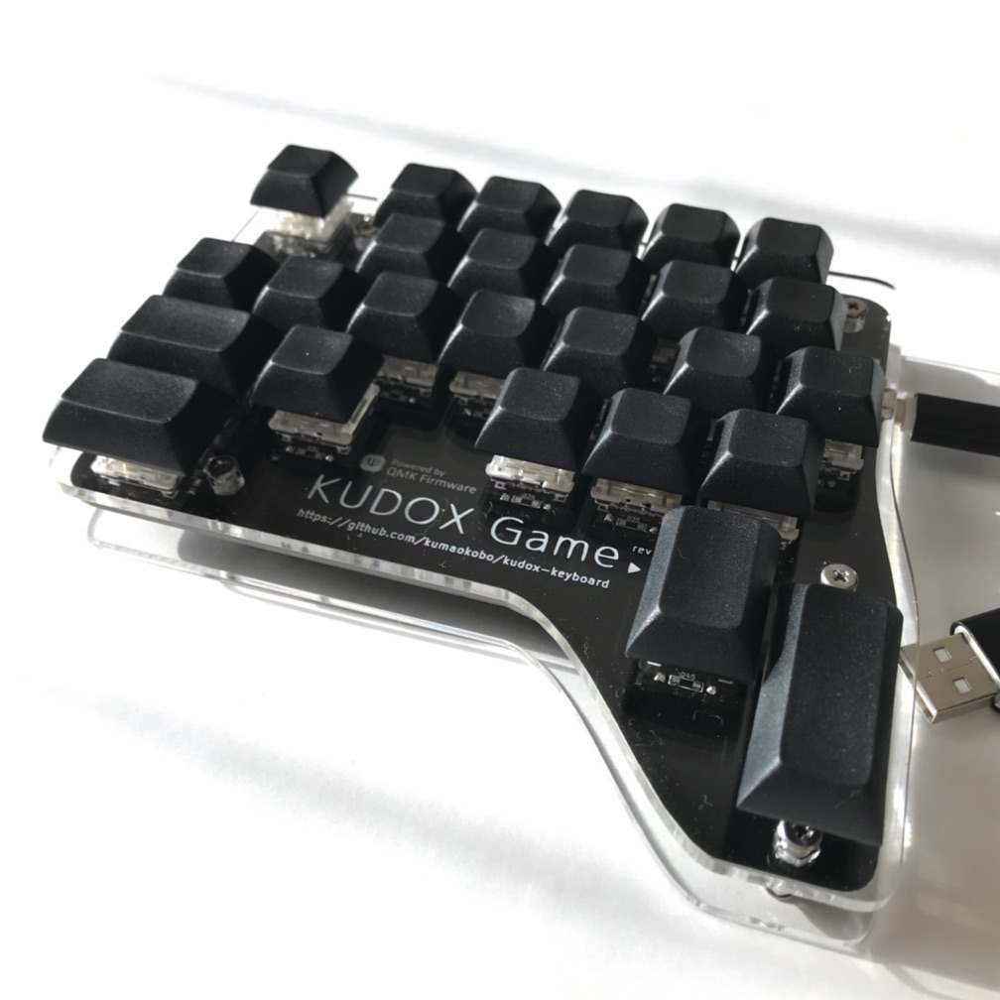

# Kudox Game Keyboard

Kudox Game Keyboard は ゲーム・プレイに特化した片手用キーボードです.  
キー・コードを自由にレイアウトできる [QMK Firmware](https://github.com/qmk/qmk_firmware) を利用しているので, `Ctrl-C` や `Ctrl-V` などの合成キーを1キーに割り当てられるようになっています.  

**English Manual is [here](README.md).**

## Rev 1.0

Rev 1.0 は スイッチをPCBに直付けする仕様になっています.  

- [Rev1.0の組み立てマニュアル](./rev1/README.ja.md)

### Youtube: 組み立てガイド & プレイ動画

- [インケンch](https://www.youtube.com/channel/UCXJZdip7JmW74HQHCtfYzFw)

動画ではちょっとしたコツなども紹介しています.

## Rev 2.0

Rev 2.0 では スイッチ・ホットスワップを採用し, スイッチの入れ替えを容易にすることで, キー毎に反応のし易さや打鍵感を調整できるようにしました.  
ホットスワップ・ソケットのはんだ付けが必要なため、 Rev 1.0 に比べてやや組み立て難易度が上がります.  

- [Rev2.0の組み立てマニュアル](./rev2/README.ja.md)

# License

 Kudox Game Keyboard by <a xmlns:cc="http://creativecommons.org/ns#" href="https://github.com/kumaokobo" property="cc:attributionName" rel="cc:attributionURL">Kumao Kobo</a> is licensed under a <a rel="license" href="http://creativecommons.org/licenses/by-nc-sa/4.0/">Creative Commons Attribution-NonCommercial-ShareAlike 4.0 International License</a>.
