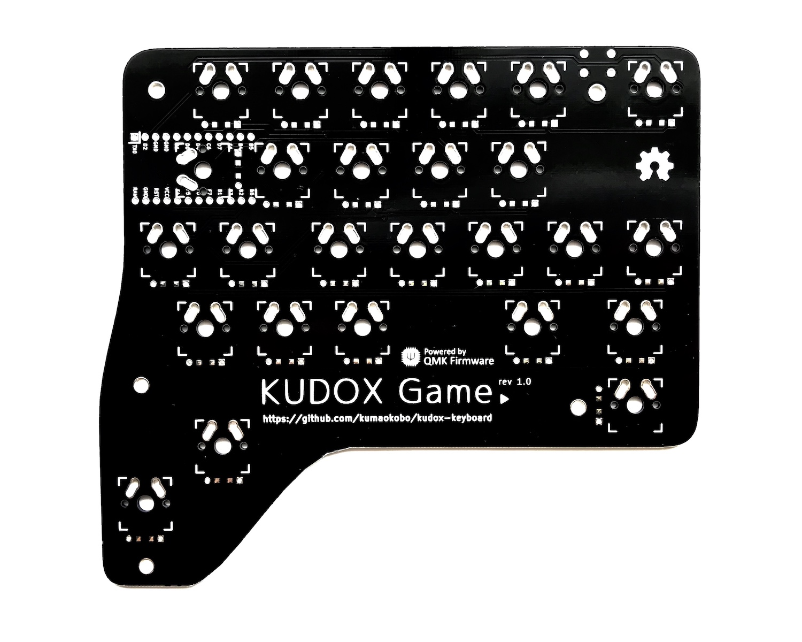

# Kudox Game Keyboard rev.1

Kudox rev.1 は Row-Staggered な分離キーボードです.  
**English Manual is [here](README.md).**

<p align="center">

</p>

## Summary

  - [必要な部品](#必要な部品)
  - [組み立てガイド](#組み立てガイド)
  - [ファームウェア](#ファームウェア)

## 必要な部品

| 数量 | 項目                                           | 備考                                                |
|----:|-----------------------------------------------|-----------------------------------------------------|
|  26 | Cherry MX 互換スイッチ                          | x1は [Cherry Speed Silver](https://www.cherrymx.de/en/mx-original/mx-speed-silver.html)が好きです.|
|   1 | Kudox Game                                    |                                                     |
|  26 | 1N4148 ダイオード                               | SMD ダイオードでも可.                                  |
|   1 | タクトスイッチ                                  | 6mm x 6mm x 4.3mm サイズのもの.                       |
|   1 | Arduino Pro Micro (互換品可)                   | マイコン: ATMega32U4                                  |
|   1 | USB micro ケーブル                             | 家に落ちているもので可.                                 |
|  26 | Cherry MX 互換 キーキャップ                     | 4x 1.25u, 2x 1.75u, 2x 2.25u, 46x 1u                |
|   1 | ケース                                         |                                                     |
|   5 | ネジ                                           | M3                                                  |
|   5 | スペーサー                                      | M3                                                  |


## 組み立てガイド

<p align="center">

</p>


- PCBに下記をはんだ付けします:
  1. 1N4148ダイオード (向きがあります. カソードが四角型の穴側にくるように差します)
  
  2. タクトスイッチ
  3. Pro Micro の ヘッダ・ピン (**Pro Micro 自身のはんだ付けはまだしません**).
- PCB を裏返します.
- スイッチをはんだ付けします.
- もう一度 PCB を裏返します. (最初の向きに戻します)
- Pro Micro を ヘッダ・ピンにはんだ付けします.
  - Pro Micro は裏向き(チップが見えないように)にはんだ付けします.


### 動画でも組み立て方を紹介しています

- [インケンch](https://www.youtube.com/channel/UCXJZdip7JmW74HQHCtfYzFw)

<p align="center">
<a href="https://www.youtube.com/watch?v=f3dFaBmC-ak"></a>
</p>

動画ではちょっとしたコツなども紹介しています。


## ファームウェア

<p align="center">

</p>

Kudox Game Keyboard は [QMK Firmware](https://github.com/qmk/qmk_firmware) を利用しています.  
QMK Firmware のインストールは [こちら](https://docs.qmk.fm/#/newbs_getting_started) をご覧ください.  

### コンパイル＆書き込みコマンド

Pro Micro と PC をUSBケーブルで接続し、下記コマンド を実行します.

```sh
$ cd path/to/qmk_firmware
$ make kudox_game/rev1:default:avrdude
```

文字入力可能なことを確認します.


## レイアウト

<p align="center">

</p>

[KLE Layout permalink](http://www.keyboard-layout-editor.com/##@_name=Kudox%20Game%20keyboard&author=Kumao%20Kobo%20(https%2F:%2F%2F%2F%2Fgithub.com%2F%2Fkumaokobo)%3B&@_x:-9.5&w:14&h:5&d:true%3B&=4%0A%0A$&_x:-4.5%3B&=Esc&_x:0.5%3B&=1%0A6%0A!&=2%0A7%0A%22&=3%0A8%0A%23&=4%0A9%0A$&=5%0A0%0A%25%3B&@_x:1.75%3B&=Q&=W%0A%E2%86%91&=E&=R&=T%3B&@=GUI&=Alt&=A%0A%E2%86%90&=S%0A%E2%86%93&=D%0A%E2%86%92&_x:0.25%3B&=F&=G%3B&@_w:1.5%3B&=Shift&=Z&_x:1.25%3B&=X&=C&=V%3B&@_w:1.5%3B&=Ctrl%3B&@_y:-0.75&x:5.5&h:1.5%3B&=Layer%3B&@_y:-0.5&x:6.5&a:7&h:2%3B&=)
