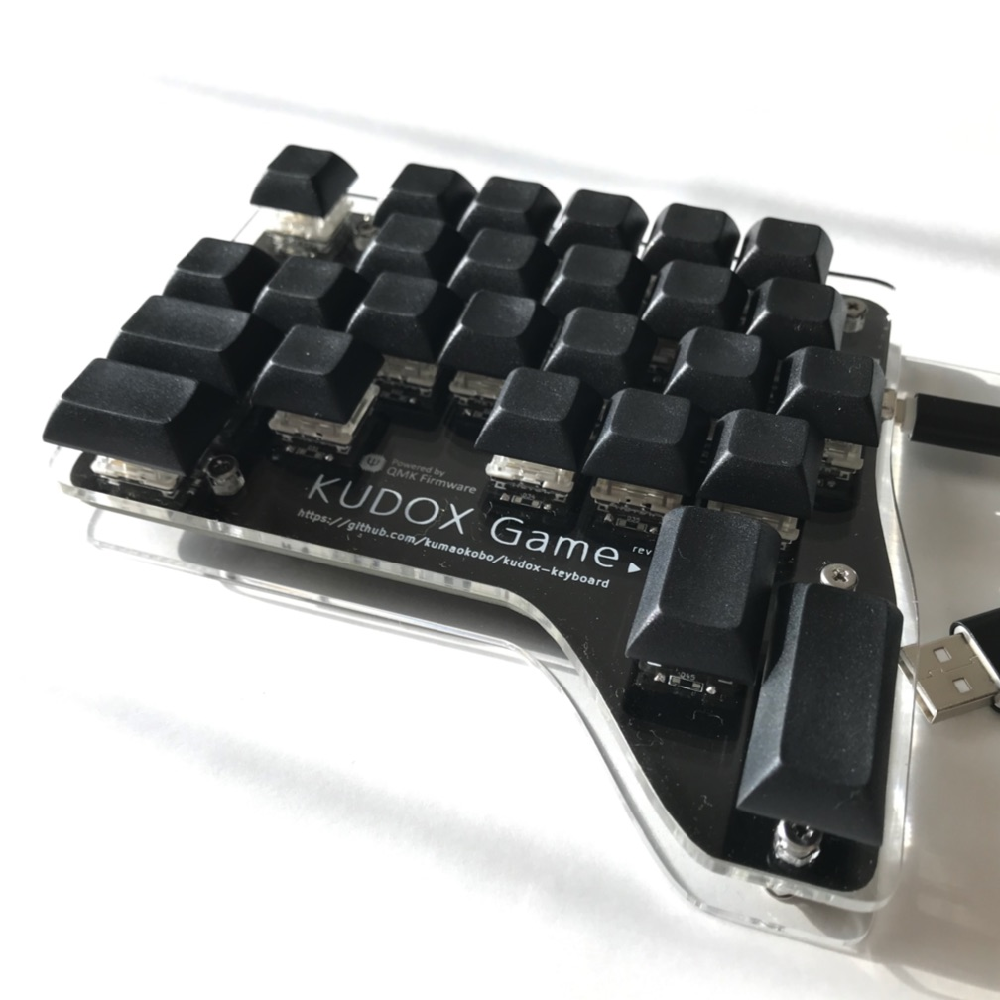
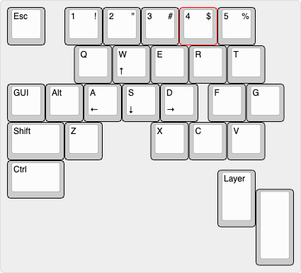

# Kudox Game Keyboard rev.1

The Kudox Game rev.1 is the first commercially available version of the Kudox Game keyboard.  
**Japanese Manual is [here](README.ja.md).**

## Summary

  - [Bill of materials](#bill-of-materials)
  - [Assembly guide](#assembly-guide)
  - [Firmware](#firmware)

## Bill of materials

| Qty | Item                                          | Notes                                               |
|----:|-----------------------------------------------|-----------------------------------------------------|
|  26 | Cherry MX compatible switches                 |                                                     |
|   1 | Kudox Game PCB                                    | |
|  26 | 1N4148 diodes                                 | SMD diodes can also be used                         |
|   2 | Through hole momentary switch                 | Dimensions 6mm x 6mm x 4.3mm                        |
|   2 | Arduino Pro Micro compatible microcontroller  | ATMega32U4 |
|   1 | USB micro cable                               |                                                     |
|  26 | Cherry MX compatible keycaps                  | 3x 1.5u keycaps, 1x 2u keycap, 22x 1u keycaps  |


## Assembly guide

<p align="center">

</p>

### Installation steps:

- Solder components:
  1. Solder 1N4148 diodes. Keep the diode legs for the right hand controller installation.
  2. Solder a momentary switch.
  3. Solder the Pro Micro header pins (**do not solder the Pro Micro controllers yet**).
- Flip the PCB.
- Solder switches to the PCB.
- Flip the PCB again.
- Solder Pro Micro to the header pins.


## Firmware

<p align="center">

</p>

Kuedox-keyboard uses QMK for its firmware, follow the QMK installation instructions [here](hthttps://docs.qmk.fm/#/newbs_getting_started), then compile and burn the firmware as follows:

```sh
$ cd path/to/qmk_firmware
$ make kudox-game/rev1:default:avrdude
```


## Layout

<p align="center">

</p>

[KLE Layout permalink](http://www.keyboard-layout-editor.com/##@_name=Kudox%20Game%20keyboard&author=Kumao%20Kobo%20(https%2F:%2F%2F%2F%2Fgithub.com%2F%2Fkumaokobo)%3B&@_x:-9.5&w:14&h:5&d:true%3B&=4%0A%0A$&_x:-4.5%3B&=Esc&_x:0.5%3B&=1%0A6%0A!&=2%0A7%0A%22&=3%0A8%0A%23&=4%0A9%0A$&=5%0A0%0A%25%3B&@_x:1.75%3B&=Q&=W%0A%E2%86%91&=E&=R&=T%3B&@=GUI&=Alt&=A%0A%E2%86%90&=S%0A%E2%86%93&=D%0A%E2%86%92&_x:0.25%3B&=F&=G%3B&@_w:1.5%3B&=Shift&=Z&_x:1.25%3B&=X&=C&=V%3B&@_w:1.5%3B&=Ctrl%3B&@_y:-0.75&x:5.5&h:1.5%3B&=Layer%3B&@_y:-0.5&x:6.5&a:7&h:2%3B&=)
