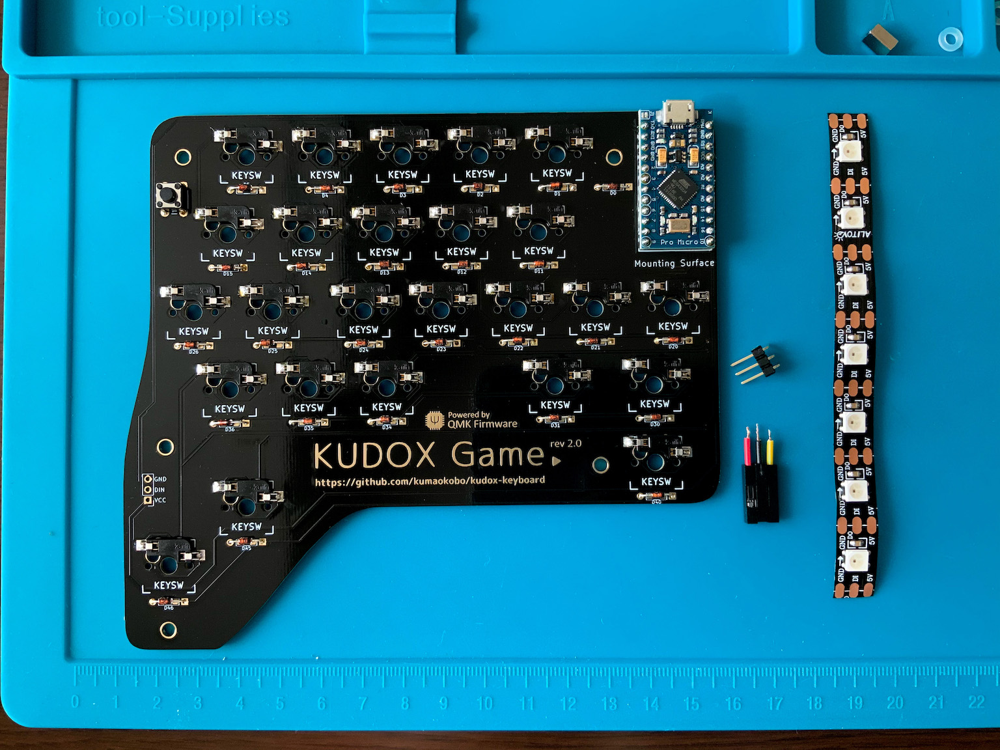
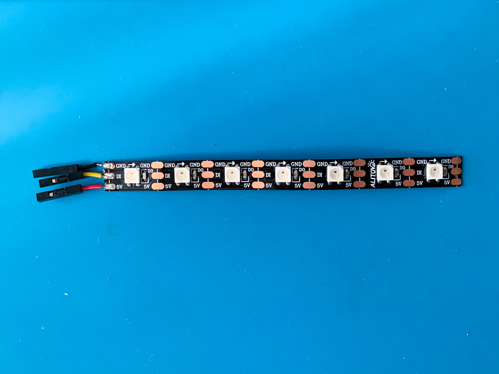
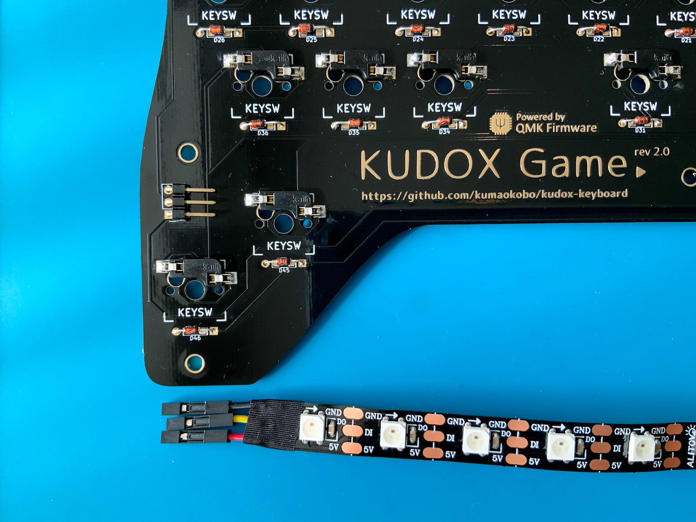
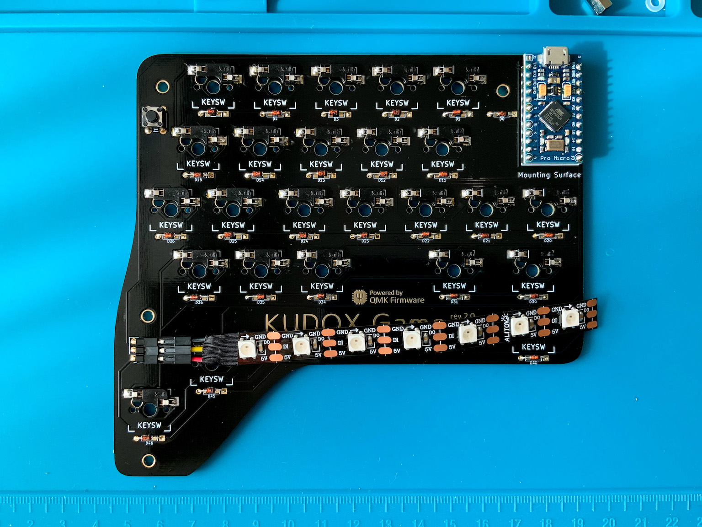
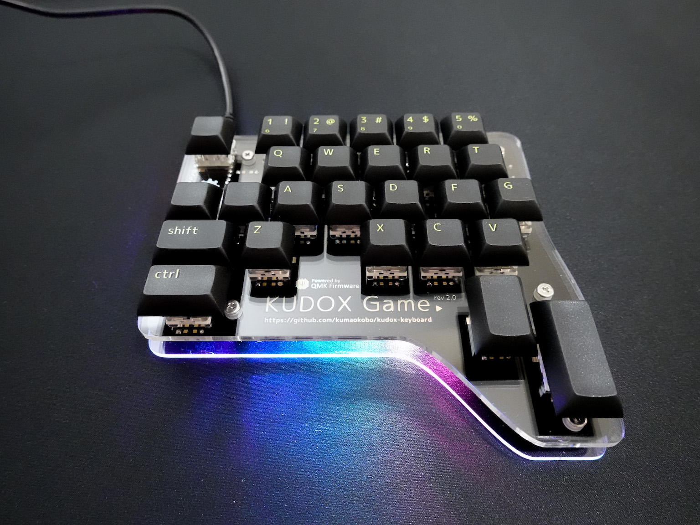

# LEDテープ (WS2812B) の取り付けガイド

**English Guide is [here](LED.md).**

<div>

</div>

## 使用部品

<div>

</div>

- WS2812B LED 7玉 x 1本
- リード線 3本  
*先がコネクタになっているとベター*
- L型3ピンヘッダ x1
- 絶縁テープ
- はんだ付け済みPCB


このガイドでは下記のようにリード線を色分けして使っています.
```
VCC: 赤
GND: 黒
DIN: 黄
```

## 1. LEDテープにリード線をはんだ付けします.

<div></div>

`5V` , `DIN` , `GND` に コネクタ付きリード線3本をはんだ付けします.  

> LEDテープのメッキ部分ははんだがのりにくいことが多いので, フラックスなどを使用するとはんだ付けが少し楽になります.

*LEDは熱に弱いため長時間高熱に晒すと壊れる場合があります.*  

## 2. はんだ付けした箇所を絶縁します.

絶縁テープ(ビニールテープ)や熱収縮チューブなどではんだ付けした部分を絶縁します.  

## 3. PCBにピンヘッダをはんだ付けします.

<div></div>

L型3ピンヘッダ をPCBの `RGB` の箇所にはんだ付けします.  

## 4. ピンヘッダにリード線を接続します.

<div></div>

`RGB` ピンヘッダは、上から下記のように並んでいます.

```
GND
Data-IN
VCC
```

対応するリード線を接続してください.

---

これで完成ですが、 ケースを組み立てる前に動作確認をすることをおすすめ致します.

<div>

</div>
