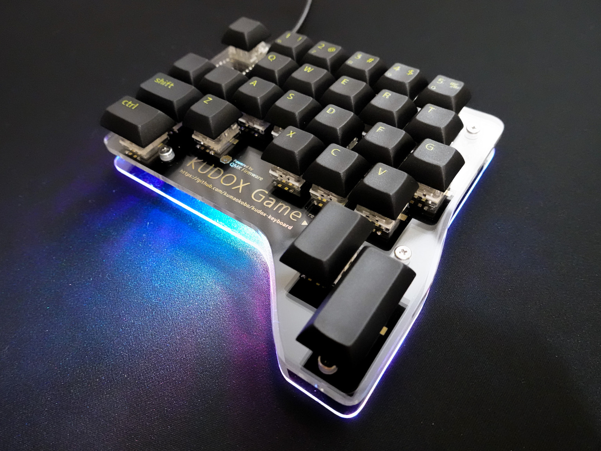
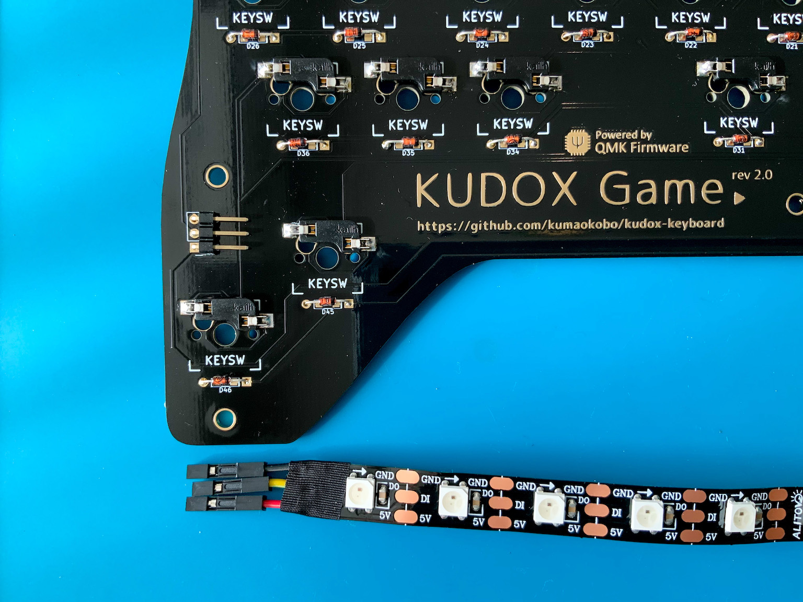

# Assembly LED strips (WS2812B)

**Japanese Guide is [here](LED.ja.md).**

<div>

</div>

## Parts

<div>

</div>

- WS2812B LEDs 7 x 1
- Lead Wires x 3  
*Recommend: The lead wires attached with connector*
- Angle-3 Pin Headers x 1
- Insulation tape
- Soldered PCB

The guide indicate Colors below:
```
VCC: red
GND: black
DIN: yellow
```

## 1. Solder LED strips lead wires.

<div></div>

Solder each `5V` , `DIN` , `GND` on LED lead wires.  

> Please consider using soldering flux. Often it is difficult to solder LED strip.

*LED is vulnerable to heat, so they may break if exposed to high heat for a long time.*  

## 2. Insulate LED.

Insulate the soldered points using tape or tube.  

## 3. Solder PCBs Pin Headers.

<div></div>

Solder Angle-3 Pin Headers at point of `RGB` .  

## 4. Connect Lead Wires to Pin Headers.

<div></div>

`RGB` Pin Header is below:

```
GND
Data-IN
VCC
```

