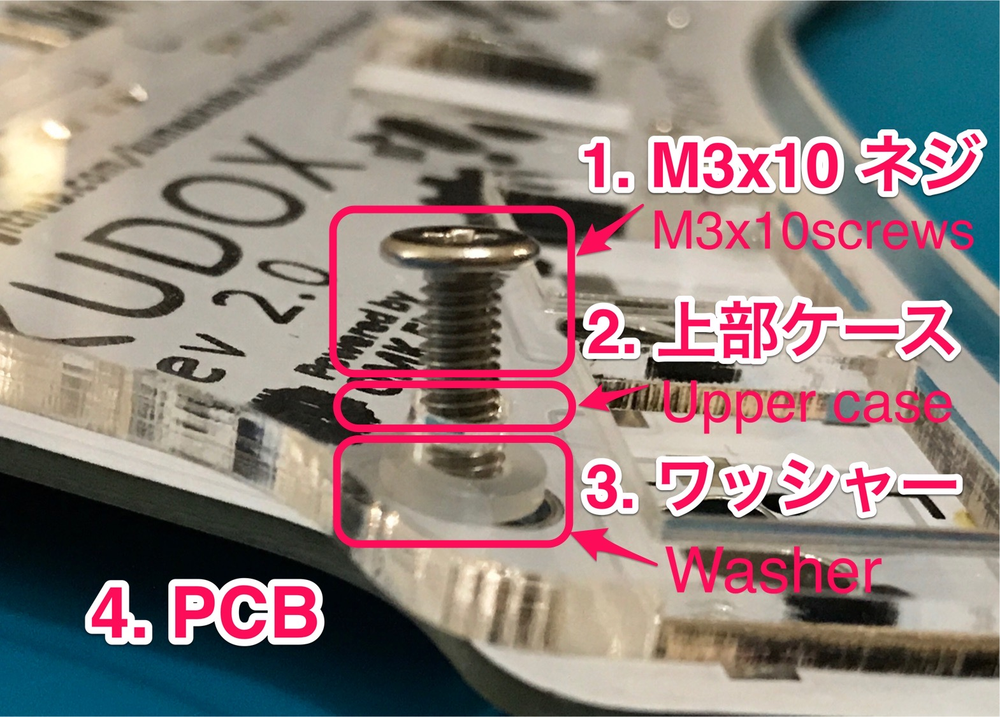

# Kudox Game Keyboard Rev2.0

Kudox Game Rev2.0 は ゲーム・プレイに特化した片手用キーボードです.  
スイッチ・ホットスワップを採用し, スイッチの入れ替えを容易にすることで, キー毎に反応のし易さや打鍵感を調整できるようにしました.  
また キー・コードを自由にレイアウトできる [QMK Firmware](https://github.com/qmk/qmk_firmware) を利用しているので, `Ctrl-C` や `Ctrl-V` などの合成キーを1キーに割り当てられるようになっています.  

**English Manual is [here](README.md).**

<p align="center">
&nbsp;

</p>

## Summary

  - [必要な部品](#必要な部品)
  - [組み立てガイド](#組み立てガイド)
  - [LEDテープの取り付け](#LEDテープの取り付け)
  - [ファームウェア](#ファームウェア)
    - [コンパイル＆書き込みコマンド](#コンパイル＆書き込みコマンド)

## 必要な部品

| 数量 | 項目                                           | 備考                                                |
|----:|-----------------------------------------------|-----------------------------------------------------|
|   1 | Kudox Game Rev2                               |                                                     |
|  26 | 1N4148 ダイオード                               | SMD ダイオードでも可.                                  |
|  26 | [Kailh PCB Scoket](https://www.kailhswitch.com/mechanical-keyboard-switches/box-switches/mechanical-keyboard-switches-kailh-pcb-socket.html) | Cherry MX 互換タイプの方                               |
|   1 | タクトスイッチ                                   | 6mm x 6mm x 4.3mm サイズのもの.                       |
|   1 | Arduino ProMicro                             | マイコン: ATMega32U4                                  |
|   1 | USB micro ケーブル                             | 家に落ちているもので可.                                 |
|   1 | ケース                                         |                                                     |
|   5 | ネジ M3 x 10mm                              | M3                                                  |
|   5 | ネジ M3 x  5mm                              | M3                                                  |
|   5 | スペーサー                                      | M3                                                  |
|   5 | ワッシャー                                      | M3                                                  |
|  26 | Cherry MX 互換スイッチ                          | お好みで...💕                                        |
|  26 | Cherry MX 互換 キーキャップ                      | 3x 1.5u, 1x 2u, 22x 1u                              |


キーキャップとスイッチ以外の全てを含む [Kudox Game Rev2 基本セット](https://manage.booth.pm/items/1917685) を [BOOTH](https://kumaokobo.booth.pm/) にて販売しています.  


## 組み立てガイド

<p align="center">

</p>


- PCB の `Mounting Surface` と記載のある側に電子部品をはんだ付けします:
  1. 1N4148ダイオード (向きがあります. カソードが四角い穴側にくるように差します)<br/><div></div>*多くのダイオードではカソード側に線などが入っています*
  2. タクトスイッチ
  3. ホットスワップ・ソケット<div></div>下記の動画で詳しく紹介しています: <br/><div><a href="https://www.youtube.com/watch?v=uHqkW0cQ80I"></a></div>[[YouTube] インケンch: ホットスワップソケットの付け方](https://www.youtube.com/watch?v=uHqkW0cQ80I)<br/>クリームはんだでリフローして頂いてももちろん大丈夫です.
  4. ProMicro の ピン・ヘッダ
- パーツの足をカットします.  
  *※ 特に ProMicro のピン・ヘッダはスイッチに干渉しやすいのでできるだけ短くカットしてください*
- ProMicro を ピン・ヘッダにはんだ付けします.  
  <span><em>※ ProMicro は表向き(チップが見えるように)に実装します. (rev1と逆になります)</em></span>
  <div></div>
- PCB に上部ケースを取り付けます.  
  M3ネジ(10mm) → 上部ケース → M3ワッシャー → PCB → スペーサー の順番に取り付けます.<br/><div></div>
- M3ネジ(5mm)で下部ケースとスペーサーを止めます.
- スイッチを嵌めて完成です.<div>
  <span>&nbsp;&nbsp;</span>
  
</div>


### Youtube: 組み立てガイド & プレイ動画

- [インケンch](https://www.youtube.com/channel/UCXJZdip7JmW74HQHCtfYzFw)

<p align="center">
<a href="https://www.youtube.com/watch?v=f3dFaBmC-ak"></a>
<a href="https://www.youtube.com/watch?v=HCa4KX-FlOU"></a>
<a href="https://www.youtube.com/watch?v=UFQ--JORdnw"></a>
</p>

動画ではちょっとしたコツなども紹介しています.  
*動画は `rev1` のものですが、ホットスワップ・ソケットと ProMicro 向き以外は概ね同じです.*

## LEDテープの取り付け

▶ [こちら](LED.ja.md)をご覧ください.

## ファームウェア

<p align="center">

</p>

Kudox Game Keyboard は [QMK Firmware](https://github.com/qmk/qmk_firmware) を利用しています.  
QMK Firmware のインストールは [こちら](https://docs.qmk.fm/#/newbs_getting_started) をご覧ください.  

### コンパイル＆書き込みコマンド

ProMicro と PC をUSBケーブルで接続し、下記コマンド を実行します.

```sh
$ cd path/to/qmk_firmware
$ make kudox_game/rev2:default:flash
```

文字入力可能なことを確認します.  

キー・コードを変更する場合は [kudox_game/keymaps/default/keymap.c](https://github.com/qmk/qmk_firmware/blob/master/keyboards/kudox_game/keymaps/default/keymap.c) を変更し, 再度書き込みをおこないます.  
キー・コード設定は [Qmk Firmware](https://github.com/qmk/qmk_firmware) の [keycodes](https://github.com/qmk/qmk_firmware/blob/master/docs/keycodes.md) をご参照くださいませ.  


### VIA を使ったキーマップ変更

- [the-via](https://caniusevia.com/): https://caniusevia.com/

VIA に対応したファームウェアを書き込みます.

```sh
$ cd path/to/qmk_firmware
$ make kudox_game/rev2:via:flash
```

下記からVIAをダウンロードしてインストールします.
- [https://www.github.com/the-via/releases/releases/latest](https://www.github.com/the-via/releases/releases/latest)

キーボードを PC 接続した状態で, VIA の `File` -> `Import Keymap` から 下記のjsonを読み込みます.
- [kudox_game_rev2.json](https://github.com/kumaokobo/kudox-keyboard/blob/master/kudox-game/rev2/kudox_game_rev2.json)

VIA上でキーマップを変更します.

<p align="center">

</p>


### オンラインGUIのファームウェア生成ツール

[Qmk Firmware](https://github.com/qmk/qmk_firmware) はオンラインでQMKのファームウェアを生成することができる [QMK Configurator](https://config.qmk.fm/) というツールを公開しています.  

<p align="center">

</p>

*QMK Configuratorの詳細な使い方はいろいろなサイトで詳しく解説されているので, そちらをご参照くださいませ.*  
*残念ながらJIS配列の生成はできないようです.*  


## レイアウト

<p align="center">

</p>
<p align="center">
<em><a href="http://www.keyboard-layout-editor.com/">http://www.keyboard-layout-editor.com/</a></em>
</p>

- [KLE Layout permalink](http://www.keyboard-layout-editor.com/##@_name=Kudox%20Game%20keyboard&author=Kumao%20Kobo%20(https%2F:%2F%2F%2F%2Fgithub.com%2F%2Fkumaokobo)%3B&@_x:-9.5&w:14&h:5&d:true%3B&=4%0A%0A$&_x:-4.5%3B&=Esc&_x:0.5%3B&=1%0A6%0A!&=2%0A7%0A%2F@&=3%0A8%0A%23&=4%0A9%0A$&=5%0A0%0A%25%3B&@_x:1.75%3B&=Q&=W%0A%E2%86%91&=E&=R&=T%3B&@=Ctrl-C&=Ctrl+V&=A%0A%E2%86%90&=S%0A%E2%86%93&=D%0A%E2%86%92&_x:0.25%3B&=F&=G%3B&@_w:1.5%3B&=Shift&=Z&_x:1.25%3B&=X&=C&=V%3B&@_w:1.5%3B&=Ctrl%3B&@_y:-0.75&x:5.5&h:1.5%3B&=Layer%3B&@_y:-0.5&x:6.5&a:7&h:2%3B&=)
