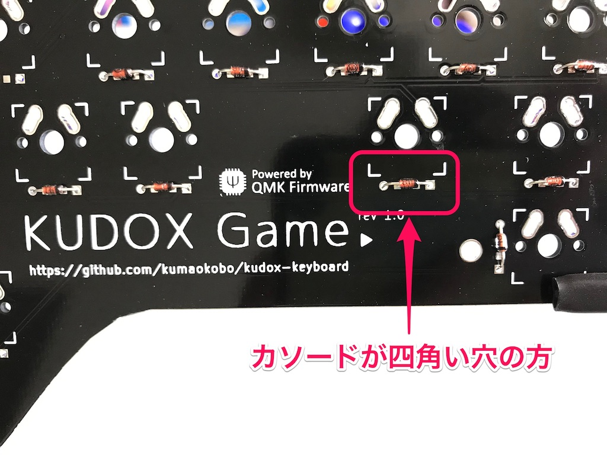
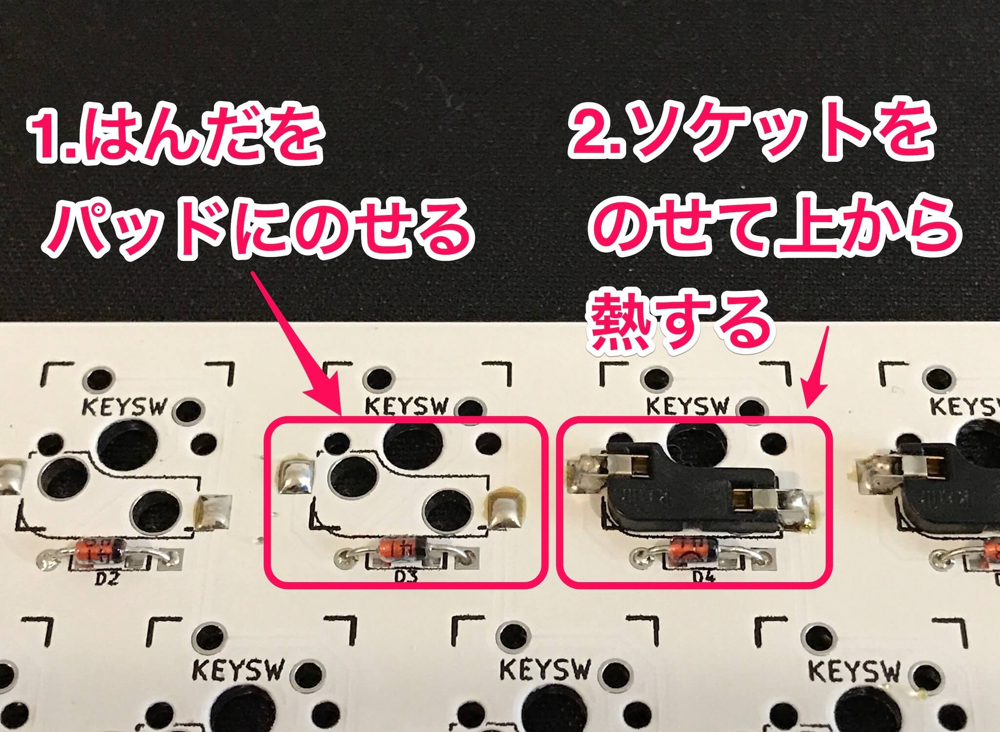
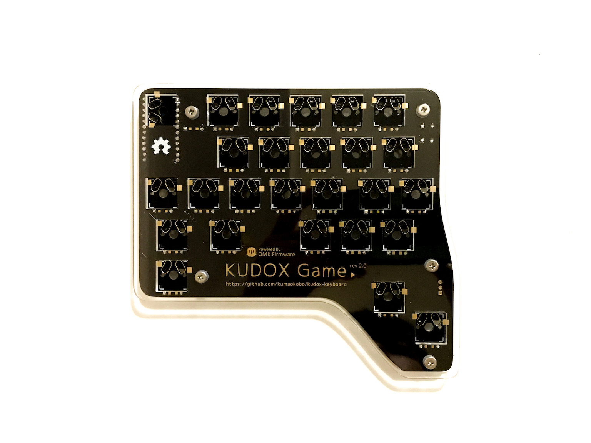

# Kudox Game Keyboard Rev2.0

The Kudox Game Rev2.0 is a keyboard specialized for playing game.  
Because it is compatible with switch hot-swapping, users can change easily switches and adjust responsibility per keys.  
Also it uses [QMK Firmware](https://github.com/qmk/qmk_firmware) and can be assigned `Ctrl-C`, `Ctrl-V` and so on to one key.  

**Japanese Manual is [here](README.ja.md).**

<p align="center">

</p>

## Summary

  - [Bill of materials](#bill-of-materials)
  - [Assembly guide](#assembly-guide)
  - [Assembly LED strips](#assembly-led-strips)
  - [Firmware](#firmware)

## Bill of materials

| Qty | Item                                          | Notes                                               |
|----:|-----------------------------------------------|-----------------------------------------------------|
|   1 | Kudox Game PCB                                |                                                     |
|  26 | 1N4148 diodes                                 | SMD diodes can also be used                         |
|  26 | [Kailh PCB Scoket](https://www.kailhswitch.com/mechanical-keyboard-switches/box-switches/mechanical-keyboard-switches-kailh-pcb-socket.html) | Cherry MX compatible                                |
|   1 | Through hole momentary switch                 | Dimensions 6mm x 6mm x 4.3mm                        |
|   1 | Arduino Pro Micro                             | ATMega32U4                                          |
|   1 | USB micro cable                               |                                                     |
|   1 | Case                                          |                                                     |
|   5 | Screws M3 x 10mm                              | M3                                                  |
|   5 | Screws M3 x  5mm                              | M3                                                  |
|   5 | Spacers                                       | M3 x 7mm                                            |
|   5 | Washers                                       | M3                                                  |
|  26 | Cherry MX compatible switches                 |                                                     |
|  26 | Cherry MX compatible keycaps                  | 3x 1.5u keycaps, 1x 2u keycap, 22x 1u keycaps       |


[Kudox Game Rev2 Basic](https://manage.booth.pm/items/1917685) is on sale at [BOOTH](https://kumaokobo.booth.pm/) (**NOT** including switches and keycaps).  


## Assembly guide

<p align="center">
&nbsp;

</p>

### Installation steps:

- Solder components:
  1. Solder 1N4148 diodes. Put the cathode in the square hole.<br/><div></div>
  2. Solder a momentary switch.
  3. Solder PCB hot-swap sockets.<div></div>How to solder hot-swap sockets: <br/><div><a href="https://www.youtube.com/watch?v=uHqkW0cQ80I"></a></div>[YouTube:Inken ch:How to solder hot-swap sockets](https://www.youtube.com/watch?v=uHqkW0cQ80I)
  4. Solder the Pro Micro header pins.
- Cuts legs of parts.  
  *Specially, pin-headers of Pro Micro needs to be cut as short as possible.*<div></div>
- Solder Pro Micros to the header pins **face up**.<div></div>
- Install upper cases to PCBs.  
  M3x10 screws → upper case → M3 washers → PCB → spacers.<br/><div></div>
- Install lower cases.
- Fit switches to the upper cases.<div>
  <span>&nbsp;&nbsp;</span>
  
</div>


### Video guides

- [Inken ch](https://www.youtube.com/channel/UCXJZdip7JmW74HQHCtfYzFw) (japanese only)

<p align="center">
<a href="https://www.youtube.com/watch?v=f3dFaBmC-ak"></a>
<a href="https://www.youtube.com/watch?v=HCa4KX-FlOU"></a>
<a href="https://www.youtube.com/watch?v=UFQ--JORdnw"></a>
</p>

## Assembly LED strips

▶ The guide is [here](LED.md).

## Firmware

<p align="center">

</p>

Kudox Game keyboard uses [QMK Firmware](https://github.com/qmk/qmk_firmware) for its firmware.  
Follow the QMK installation instructions [here](https://docs.qmk.fm/#/newbs_getting_started), then compile and burn the firmware as follows:  

```sh
$ cd path/to/qmk_firmware
$ make kudox_game/rev1:default:avrdude
```

**Firmware version is `rev1` .**  

Confirm to be able to input chars.  

In case of changing the keymap, modify [kudox_game/keymaps/default/keymap.c](https://github.com/qmk/qmk_firmware/blob/master/keyboards/kudox_game/keymaps/default/keymap.c) and re-write firmware.  
You can see keycodes at [keycodes](https://github.com/qmk/qmk_firmware/blob/master/docs/keycodes.md) on [Qmk Firmware](https://github.com/qmk/qmk_firmware).  

## Layout

<p align="center">

</p>
<p align="center">
<em><a href="http://www.keyboard-layout-editor.com/">http://www.keyboard-layout-editor.com/</a></em>
</p>

- [KLE Layout permalink](http://www.keyboard-layout-editor.com/##@_name=Kudox%20Game%20keyboard&author=Kumao%20Kobo%20(https%2F:%2F%2F%2F%2Fgithub.com%2F%2Fkumaokobo)%3B&@_x:-9.5&w:14&h:5&d:true%3B&=4%0A%0A$&_x:-4.5%3B&=Esc&_x:0.5%3B&=1%0A6%0A!&=2%0A7%0A%22&=3%0A8%0A%23&=4%0A9%0A$&=5%0A0%0A%25%3B&@_x:1.75%3B&=Q&=W%0A%E2%86%91&=E&=R&=T%3B&@=GUI&=Alt&=A%0A%E2%86%90&=S%0A%E2%86%93&=D%0A%E2%86%92&_x:0.25%3B&=F&=G%3B&@_w:1.5%3B&=Shift&=Z&_x:1.25%3B&=X&=C&=V%3B&@_w:1.5%3B&=Ctrl%3B&@_y:-0.75&x:5.5&h:1.5%3B&=Layer%3B&@_y:-0.5&x:6.5&a:7&h:2%3B&=)
