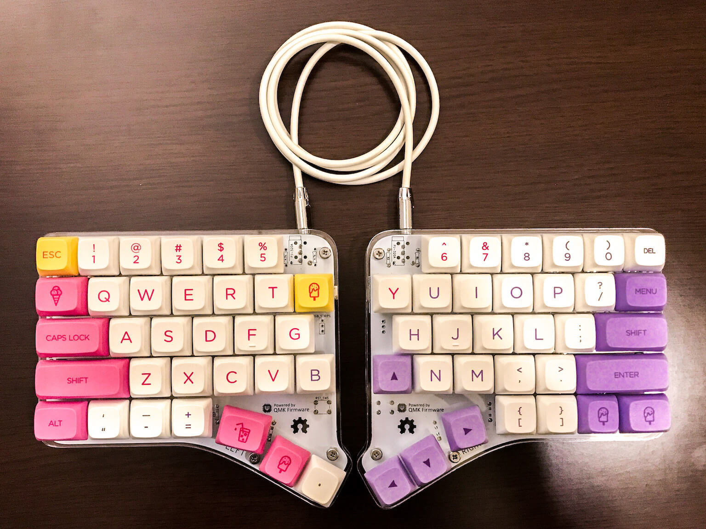

# Kudox Keyboard

Kudox は Row-Staggered 配列の左右分離キーボードです.  
**English Manual is [here](README.md).**

## Rev 1.0

Rev 1.0 は 64キーのスタンダードなRow-Staggered な分離キーボードです.  

- [Rev1.0の組み立てマニュアル](./rev1/README.ja.md)

## Rev 2.0

Rev 2.0 では スイッチの フットプリント に スイッチホットスワップ を採用しました.  
また キー数が2つ増え 66キーになりました.  
ホットスワップ・ソケットのはんだ付けが必要なため、 Rev 1.0 に比べてやや組み立て難易度が上がります.  

- [Rev2.0の組み立てマニュアル](./rev2/README.ja.md)

## Rev 3.0

Rev 3.0 から ホットスワップ・ソケット / スイッチ直付けの両方に対応たフットプリントを採用しました.  
また, 右手用と左手用で基板設計を分け, キーのずれ方を *Normal staggerrd* に寄せました.  

- [Rev3.0の組み立てマニュアル](./rev3/README.ja.md)

## 組み立て方を動画で紹介

- [インケンch](https://www.youtube.com/channel/UCXJZdip7JmW74HQHCtfYzFw)

動画ではちょっとしたコツなども紹介しています.
