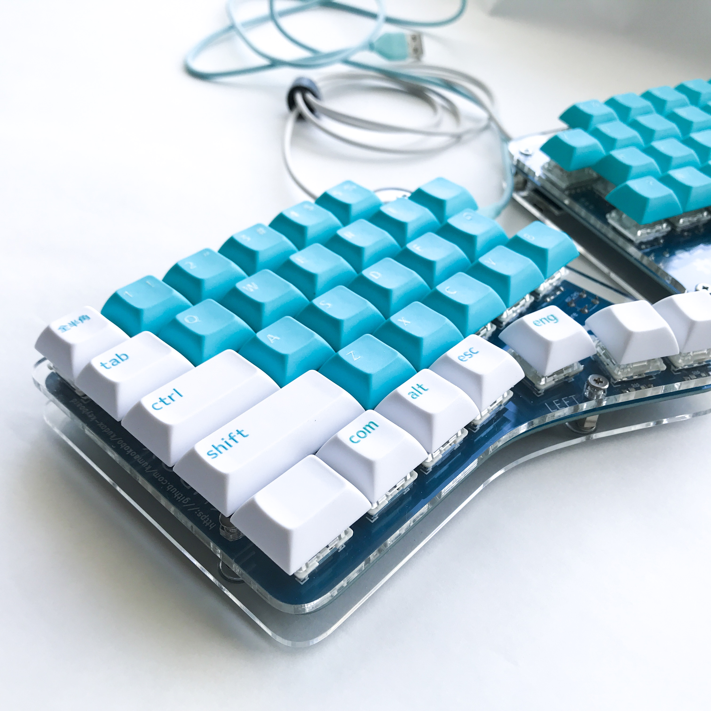
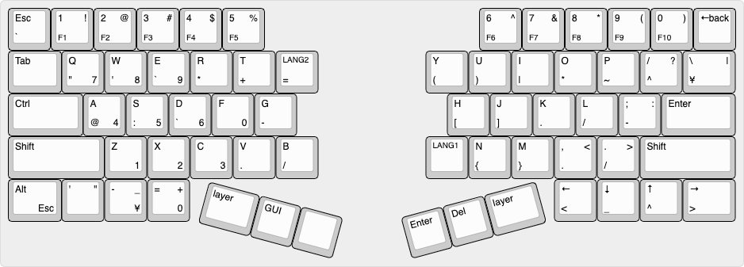

# Kudox Keyboard rev.1

The Kudox rev.1 is the first Row-Staggered split keyboard.  
**Japanese Manual is [here](README.ja.md).**

## Summary

  - [Bill of materials](#bill-of-materials)
  - [Assembly guide](#assembly-guide)
  - [Firmware](#firmware)

## Bill of materials

| Qty | Item                                          | Notes                                               |
|----:|-----------------------------------------------|-----------------------------------------------------|
|  64 | Cherry MX compatible switches                 |                                                     |
|   2 | Kudox PCBs                                    | |
|  64 | 1N4148 diodes                                 | SMD diodes can also be used                         |
|   2 | PJ-320A 4 poles 3.5 mm TRRS connectors        |                                                     |
|   2 | 4.7 kΩ resistors                              | Need to be soldered on one half only                |
|   2 | Through hole momentary switch                 | Dimensions 6mm x 6mm x 4.3mm                        |
|   2 | Arduino Pro Micro compatible microcontrollers | ATMega32U4 |
|   1 | TRRS cable                                    |                                                     |
|   1 | USB micro cable                               |                                                     |
|  64 | Cherry MX compatible keycaps                  | 4x 1.25u keycaps, 2x 1.75u keycaps, 2x 2.25u keycaps, 46x 1u keycaps  |


## Assembly guide

<p align="center">

</p>

### Installation steps:

- Solder components:
  1. Solder 1N4148 diodes. Keep the diode legs for the right hand controller installation.
  2. Solder PJ-320A connectors.
  3. Solder momentary switches.
  4. Solder 4.7 kΩ resistors **on one half only**.
  5. Solder the Pro Micro header pins (**do not solder the Pro Micro controllers yet**).
- Flip the PCBs.
- Solder switches to the PCB.
- Flip the PCBs again.
- Solder Pro Micros to the header pins following the PCB labelling.
  - `LEFT` side: Solder Pro Micro face up.
  - `RIGHT` side: Solder Pro Micro face down.


## Firmware

<p align="center">

</p>

Kudox keyboard uses [QMK Firmware](https://github.com/qmk/qmk_firmware) for its firmware.  
Follow the QMK installation instructions [here](https://docs.qmk.fm/#/newbs_getting_started), then compile and burn the firmware as follows:  

### Basic compiling and burning command

```sh
$ cd path/to/qmk_firmware
$ make kudox/rev1:default:avrdude
```

### First time burning

You need to burn the firmware both left hand and right hand.


#### 1. Left hand side

Edit [config.h](https://github.com/qmk/qmk_firmware/blob/add-kudox-game/keyboards/kudox_game/keymaps/default/config.h) and activate `MASTER_LEFT` .

```cpp
/* Select hand configuration */
#define MASTER_LEFT
// #define MASTER_RIGHT
// #define EE_HANDS
```

Save the file, then connect Pro Micro(**left hand**) and your PC by USB cable.  
Compile and burn the firmware by running [Basic compiling and burning command](#basic-compiling-and-burning-command) as follows:  

```sh
$ cd path/to/qmk_firmware
$ make kudox/rev1:default:avrdude
```

#### 2. Right hand side

Edit [config.h](https://github.com/qmk/qmk_firmware/blob/add-kudox-game/keyboards/kudox_game/keymaps/default/config.h) and activate `MASTER_RIGHT` .  

```cpp
/* Select hand configuration */
// #define MASTER_LEFT
#define MASTER_RIGHT
// #define EE_HANDS
```

Save the file, then connect Pro Micro(**right hand**) and your PC by USB cable.  
Compile and burn the firmware by running [Basic compiling and burning command](#basic-compiling-and-burning-command).  


#### 3. In the case of using Master Left

In the case of using Master Left, burn Pro Micro(**left hand**) the firmware again.  
※ In the case of using Master Right, skip the following process and go to next.  

Edit [config.h](https://github.com/qmk/qmk_firmware/blob/add-kudox-game/keyboards/kudox_game/keymaps/default/config.h) and activate `MASTER_LEFT` .  

```cpp
/* Select hand configuration */
#define MASTER_LEFT
// #define MASTER_RIGHT
// #define EE_HANDS
```

Save the file, then connect Pro Micro(**left hand**) and your PC by USB cable.  
Compile and burn the firmware by running [Basic compiling and burning command](#basic-compiling-and-burning-command).  

#### 4. Confirmation

Pull out the USB cable, then connect left hand and right hand by TRRS cable.  
Plug in the Pro Micro (Master) the USB cable.  

## Layout

<p align="center">

</p>

[KLE Layout permalink](http://www.keyboard-layout-editor.com/##@@=Esc%0A%60&_f2:2%3B&=1%0AF1%0A!&_f2:2%3B&=2%0AF2%0A%2F@&_f2:2%3B&=3%0AF3%0A%23&_f2:2%3B&=4%0AF4%0A$&_f2:2%3B&=5%0AF5%0A%25&_x:5&f2:2%3B&=6%0AF6%0A%5E&_f2:2%3B&=7%0AF7%0A%2F&&_f2:2%3B&=8%0AF8%0A*&_f2:2%3B&=9%0AF9%0A(&_f2:2%3B&=0%0AF10%0A)&_fa@:0&:2&:0&:2&:2&:2&:2&:2&:2&:2&:2%3B%3B&=%E2%86%90%0A%0Aback%3B&@_w:1.25%3B&=Tab&_f:3%3B&=Q%0A%22%0A%0A7&_f:3%3B&=W%0A'%0A%0A8&_f:3%3B&=E%0A%60%0A%0A9&_f:3%3B&=R%0A*&_f:3%3B&=T%0A+&_fa@:2%3B%3B&=LANG2%0A%2F=&_x:2.5&f:3%3B&=Y%0A(&_f:3%3B&=U%0A)&_f:3%3B&=I%0A%7C&_f:3%3B&=O%0A*&_f:3%3B&=P%0A~&_f:3%3B&=%2F%2F%0A%5E%0A%3F&_f:3&w:1.25%3B&=%5C%0A%C2%A5%0A%7C%3B&@_f:3&w:1.75%3B&=Ctrl&_f:3%3B&=A%0A%2F@%0A%0A4&_f:3%3B&=S%0A%2F:%0A%0A5&_f:3%3B&=D%0A%60%0A%0A6&_f:3%3B&=F%0A%0A%0A0&_f:3%3B&=G%0A-&_x:3.5&f:3%3B&=H%0A%5B&_f:3%3B&=J%0A%5D&_f:3%3B&=K%0A.&_f:3%3B&=L%0A%2F%2F&_f:3%3B&=%2F%3B%0A-%0A%2F:&_f:3&w:1.75%3B&=Enter%3B&@_f:3&w:2.25%3B&=Shift&_f:3%3B&=Z%0A%0A%0A1&_f:3%3B&=X%0A%0A%0A2&_f:3%3B&=C%0A%0A%0A3&_f:3%3B&=V%0A.&_f:3%3B&=B%0A%2F%2F&_x:2.5%3B&=LANG1&_f:3%3B&=N%0A%7B&_f:3%3B&=M%0A%7D&_f:3%3B&=,%0A.%0A%3C&_f:3%3B&=.%0A%2F%2F%0A%3E&_f:3&w:2.25%3B&=Shift%3B&@_f:3&w:1.25%3B&=Alt%0A%0A%0AEsc&_f:3%3B&='%0A%0A%22&_f:3%3B&=-%0A%0A%2F_%0A%C2%A5&_f:3%3B&=%2F=%0A%0A+%0A0&_x:8.5&f:3%3B&=%E2%86%90%0A%3C&_f:3%3B&=%E2%86%93%0A%2F_&_f:3%3B&=%E2%86%91%0A%5E&_f:3&w:1.25%3B&=%E2%86%92%0A%3E%3B&@_r:15&rx:5&y:4&x:0.75&f:3&w:1.25%3B&=layer&_f:3%3B&=GUI&_a:7%3B&=%3B&@_r:-15&rx:12&y:4&x:-4&a:4&f:3%3B&=Enter&_f2:0%3B&=Del&_w:1.25%3B&=layer)
