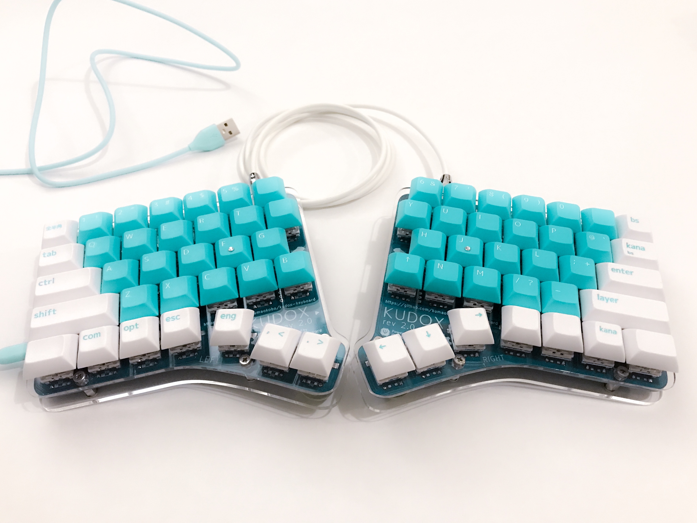

# Kudox Keyboard

The Kudox is the Row-Staggered split keyboard.  
**Japanese Manual is [here](README.ja.md).**

## Rev 1.0

Rev 1.0 is standard 64 key Row-Staggered split keyboard.  

- [Rev1.0 Assembly Guide](./rev1/README.md)

## Rev 2.0

Rev 2.0 is hot-swappable 66 key split keyboard.  
As hot-swap sockets need to be soldered, it is slightly more difficult to assemble than Rev 1.0.  

- [Rev2.0 Assembly Guide](./rev2/README.md)

## Rev 3.0

Rev 3.0 supports both hot swap sockets and direct switch mounting.  
Also, we divided the board design for right hand and left hand.  
For this reason, the key columns become more normal row-staggered.  

- [Rev3.0 Assembly Guide](./rev3/README.md)

### Video guides

- [Inken ch](https://www.youtube.com/channel/UCXJZdip7JmW74HQHCtfYzFw) (japanese only)

# License

 Kudox * Keyboards by <a xmlns:cc="http://creativecommons.org/ns#" href="https://github.com/kumaokobo" property="cc:attributionName" rel="cc:attributionURL">Kumao Kobo</a> is licensed under a <a rel="license" href="http://creativecommons.org/licenses/by-nc-sa/4.0/">Creative Commons Attribution-NonCommercial-ShareAlike 4.0 International License</a>.
