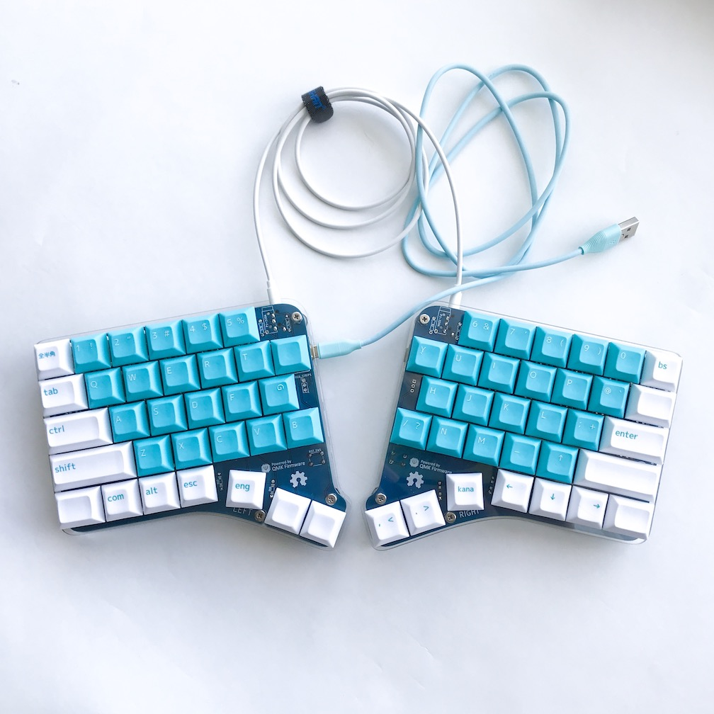
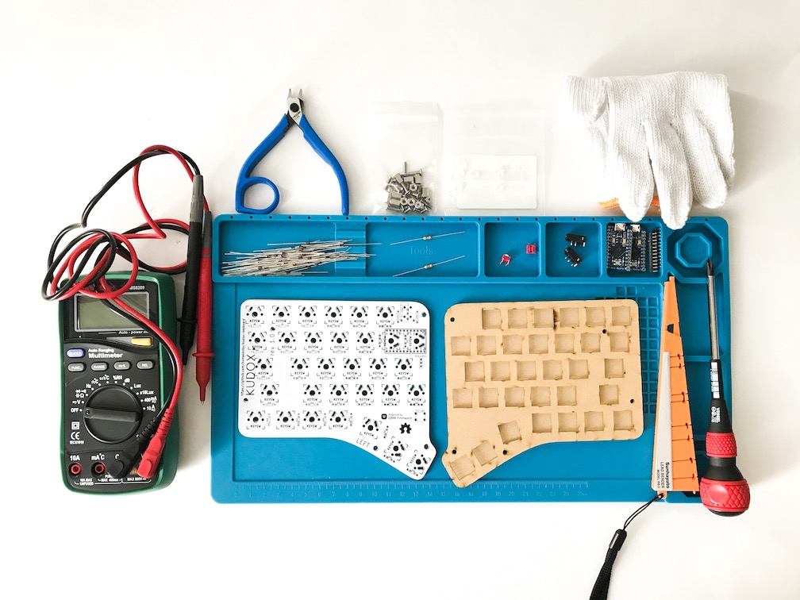
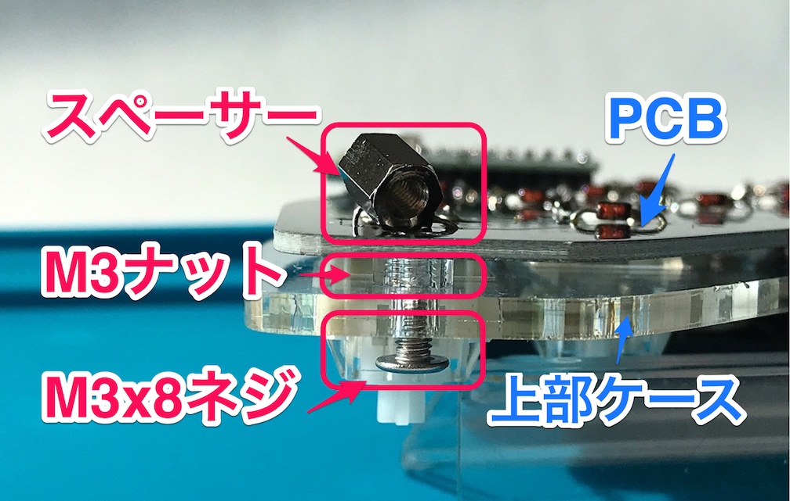
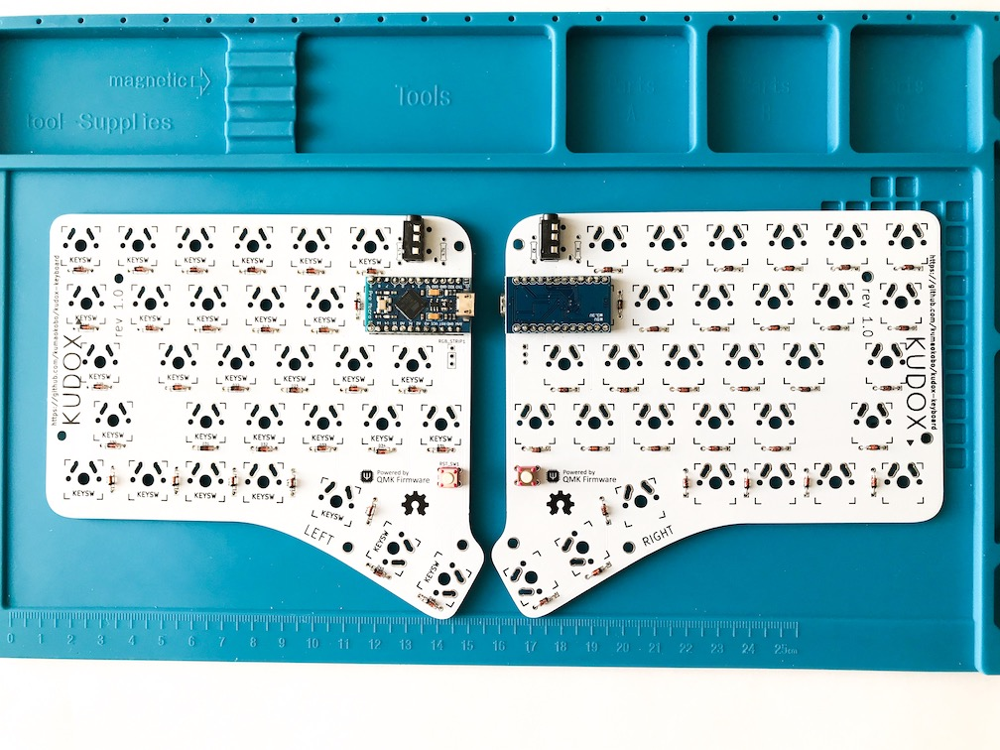
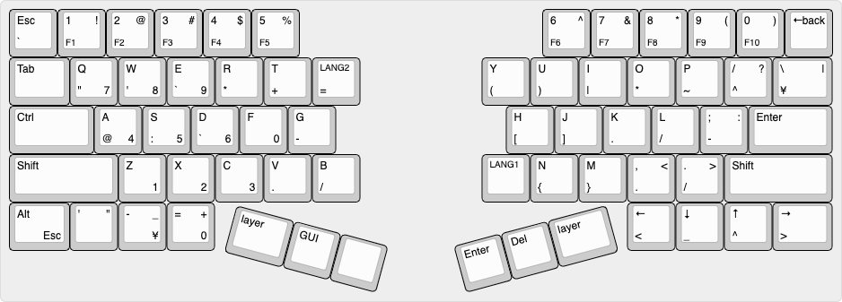
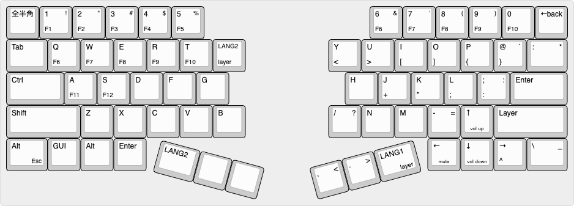

# Kudox Keyboard Rev.1

Kudox Rev 1.0 は 64キーの、スタンダードな Row-Staggered 分離キーボードです.  
**English Manual is [here](README.md).**

<p align="center">


</p>


## Summary

  - [必要な部品](#必要な部品)
  - [組み立てガイド](#組み立てガイド)
  - [ファームウェア](#ファームウェア)
    - [基本書き込みコマンド](#基本書き込みコマンド)
    - [初回書き込み時](#初回書き込み時)
    - [JIS配列を書き込む場合](#JIS配列を書き込む場合)

## 必要な部品

| 数量 | 項目                                          | 備考                                                |
|----:|-----------------------------------------------|----------------------------------------------------|
|   2 | Kudox Rev1.0 PCB                              |                                                    |
|  64 | 1N4148 ダイオード                              | SMD ダイオードでも可.                                  |
|   2 | PJ-320A 4極 3.5mm TRRS コネクタ                |                                                     |
|   2 | 4.7 kΩ 抵抗                                   | 片側のPCBのみにはんだ付けします.                         |
|   2 | タクトスイッチ                                  | 6mm x 6mm x 4.3mm サイズのもの.                       |
|   2 | Arduino Pro Micro                            | マイコン: ATMega32U4                                  |
|   1 | TRRS ケーブル                                  | 4極のもの. (4極じゃないと正常動作しません)                |
|   1 | USB micro ケーブル                             | 家に落ちているもので可.                                |
|   2 | ケース                                        |                                                     |
|  10 | ネジ                                          | M3 のもの                                            |
|  10 | スペーサー                                     | M3 のもの                                            |
|  10 | ナット                                         | M3 のもの (オプション)                                |
|  64 | Cherry MX 互換 スイッチ                         | x1は [Cherry Speed Silver](https://www.cherrymx.de/en/mx-original/mx-speed-silver.html)が好きです.|
|  64 | Cherry MX 互換 キーキャップ                     | 4x 1.25u, 2x 1.75u, 2x 2.25u, 46x 1u                |


キーキャップとスイッチ以外の全てを含む [Kudox Rev1 基本セット](https://kumaokobo.booth.pm/items/1500278) を [BOOTH](https://kumaokobo.booth.pm/) にて販売しています.  


## 組み立てガイド

<p align="center">

</p>


- PCBに下記をはんだ付けします:
  1. 1N4148ダイオード (向きがあります. カソードが四角型の穴側にくるように差します)<br/><div></div>
  2. PJ-320Aコネクタ
  3. タクトスイッチ
  4. 4.7 kΩ 抵抗 (左右どちらかのPCBのみにはんだ付けします)
  5. Pro Micro の ヘッダ・ピン (**Pro Micro 自身のはんだ付けはまだしません**).
- PCB に上部ケースを取り付けます.
  * M3ネジ(8mm) → 上部ケース → M3ナット → PCB → スペーサー の順番に取り付けます.<br/><div></div>
- スイッチを嵌めてはんだ付けします.
- Pro Micro を ヘッダ・ピンにはんだ付けします.
  - `LEFT` と書いてある側: Pro Micro を表向き(チップが見えるように)にはんだ付けします.
  - `RIGHT` と書いてある側: Pro Micro を裏向き(チップ類がPCBに向くように)にはんだ付けします.<br/><div></div>


### Youtube: 組み立てガイド

- [インケンch](https://www.youtube.com/channel/UCXJZdip7JmW74HQHCtfYzFw)

<p align="center">
<a href="https://www.youtube.com/watch?v=6zZAXjMQ80E"></a>
<a href="https://www.youtube.com/watch?v=HCa4KX-FlOU"></a>
</p>

動画ではちょっとしたコツなども紹介しています.

## ファームウェア

<p align="center">

</p>

Kudox Keyboard は [QMK Firmware](https://github.com/qmk/qmk_firmware) を利用しています.  
QMK Firmware のインストールは [こちら](https://docs.qmk.fm/#/newbs_getting_started) をご覧ください.  

### 基本書き込みコマンド

```sh
$ cd path/to/qmk_firmware
$ make kudox/rev1:default:flash
```

### 初回書き込み時

初回書き込み時には、 左手・右手 両方の Pro Micro にファームを書く必要があります.  

#### 1. 左手側

[kudox/config.h](https://github.com/qmk/qmk_firmware/blob/master/keyboards/kudox/config.h) を編集して `MASTER_LEFT` を有効にします.

```cpp
/* Select hand configuration */
#define MASTER_LEFT
// #define MASTER_RIGHT
// #define EE_HANDS
```

保存したら、 **左手側** の Pro Micro と PC をUSBケーブルで接続し、 [基本書き込みコマンド](#基本書き込みコマンド) を実行します.

```sh
$ cd path/to/qmk_firmware
$ make kudox/rev1:default:flash
```

#### 2. 右手側

[kudox/config.h](https://github.com/qmk/qmk_firmware/blob/master/keyboards/kudox/config.h) を編集して `MASTER_RIGHT` を有効にします.

```cpp
/* Select hand configuration */
// #define MASTER_LEFT
#define MASTER_RIGHT
// #define EE_HANDS
```

保存したら、**右手側** の Pro Micro と PC をUSBケーブルで接続し、 [基本書き込みコマンド](#基本書き込みコマンド) を実行します.


#### 3. 動作確認

一度USBケーブルを外してから、 TRRSケーブルで左右をつなぎます.  
マスター側の Pro Micro にUSBケーブルをつなぎ、左右ともに文字入力可能なことを確認します.　　

以降、キー配列を変更した場合など再びファームを書く場合は、 TRRSケーブルをつないだままマスター側の Pro Micro に書き込みを行うことで、左右に設定が反映されるようになります.　　


### JIS配列を書き込む場合

[qmk_firmware/keyboards/kudox/rev1/keymaps/jis](https://github.com/qmk/qmk_firmware/blob/master/keyboards/kudox/rev1/keymaps/jis/keymap.c) に JIS-like配列を置いていますが、[Qmk Firmware](https://github.com/qmk/qmk_firmware) の [keycodes](https://github.com/qmk/qmk_firmware/blob/master/docs/keycodes.md) を参考にご自身の使いやすいレイアウトに変更してお使いになられると良いかもしれません.  

```sh
$ cd path/to/qmk_firmware
$ make kudox/rev1:jis:flash
```


## レイアウト

### デフォルト

<p align="center">

</p>
<p align="center">
<em><a href="http://www.keyboard-layout-editor.com/">http://www.keyboard-layout-editor.com/</a></em>
</p>

- [KLE Layout permalink](http://www.keyboard-layout-editor.com/##@@=Esc%0A%60&_f2:2%3B&=1%0AF1%0A!&_f2:2%3B&=2%0AF2%0A%2F@&_f2:2%3B&=3%0AF3%0A%23&_f2:2%3B&=4%0AF4%0A$&_f2:2%3B&=5%0AF5%0A%25&_x:5&f2:2%3B&=6%0AF6%0A%5E&_f2:2%3B&=7%0AF7%0A%2F&&_f2:2%3B&=8%0AF8%0A*&_f2:2%3B&=9%0AF9%0A(&_f2:2%3B&=0%0AF10%0A)&_fa@:0&:2&:0&:2&:2&:2&:2&:2&:2&:2&:2%3B%3B&=%E2%86%90%0A%0Aback%3B&@_w:1.25%3B&=Tab&_f:3%3B&=Q%0A%22%0A%0A7&_f:3%3B&=W%0A'%0A%0A8&_f:3%3B&=E%0A%60%0A%0A9&_f:3%3B&=R%0A*&_f:3%3B&=T%0A+&_fa@:2%3B%3B&=LANG2%0A%2F=&_x:2.5&f:3%3B&=Y%0A(&_f:3%3B&=U%0A)&_f:3%3B&=I%0A%7C&_f:3%3B&=O%0A*&_f:3%3B&=P%0A~&_f:3%3B&=%2F%2F%0A%5E%0A%3F&_f:3&w:1.25%3B&=%5C%0A%C2%A5%0A%7C%3B&@_f:3&w:1.75%3B&=Ctrl&_f:3%3B&=A%0A%2F@%0A%0A4&_f:3%3B&=S%0A%2F:%0A%0A5&_f:3%3B&=D%0A%60%0A%0A6&_f:3%3B&=F%0A%0A%0A0&_f:3%3B&=G%0A-&_x:3.5&f:3%3B&=H%0A%5B&_f:3%3B&=J%0A%5D&_f:3%3B&=K%0A.&_f:3%3B&=L%0A%2F%2F&_f:3%3B&=%2F%3B%0A-%0A%2F:&_f:3&w:1.75%3B&=Enter%3B&@_f:3&w:2.25%3B&=Shift&_f:3%3B&=Z%0A%0A%0A1&_f:3%3B&=X%0A%0A%0A2&_f:3%3B&=C%0A%0A%0A3&_f:3%3B&=V%0A.&_f:3%3B&=B%0A%2F%2F&_x:2.5%3B&=LANG1&_f:3%3B&=N%0A%7B&_f:3%3B&=M%0A%7D&_f:3%3B&=,%0A.%0A%3C&_f:3%3B&=.%0A%2F%2F%0A%3E&_f:3&w:2.25%3B&=Shift%3B&@_f:3&w:1.25%3B&=Alt%0A%0A%0AEsc&_f:3%3B&='%0A%0A%22&_f:3%3B&=-%0A%0A%2F_%0A%C2%A5&_f:3%3B&=%2F=%0A%0A+%0A0&_x:8.5&f:3%3B&=%E2%86%90%0A%3C&_f:3%3B&=%E2%86%93%0A%2F_&_f:3%3B&=%E2%86%91%0A%5E&_f:3&w:1.25%3B&=%E2%86%92%0A%3E%3B&@_r:15&rx:5&y:4&x:0.75&f:3&w:1.25%3B&=layer&_f:3%3B&=GUI&_a:7%3B&=%3B&@_r:-15&rx:12&y:4&x:-4&a:4&f:3%3B&=Enter&_f2:0%3B&=Del&_w:1.25%3B&=layer)

### JIS-like 配列

<p align="center">

</p>
<p align="center">
<em><a href="http://www.keyboard-layout-editor.com/">http://www.keyboard-layout-editor.com/</a></em>
</p>

- [KLE Layout permalink](http://www.keyboard-layout-editor.com/##@_name=kudox-jis%3B&@=%E5%85%A8%E5%8D%8A%E8%A7%92&_f2:2%3B&=1%0AF1%0A!&=2%0AF2%0A%22&=3%0AF3%0A%23&=4%0AF4%0A$&=5%0AF5%0A%25&_x:5%3B&=6%0AF6%0A%2F&&=7%0AF7%0A'&=8%0AF8%0A(&=9%0AF9%0A)&=0%0AF10&_f:3%3B&=%E2%86%90%0A%0Aback%3B&@_w:1.25%3B&=Tab&=Q%0AF6&=W%0AF7&=E%0AF8&=R%0AF9&=T%0AF10&_fa@:2&:2%3B%3B&=LANG2%0Alayer&_x:2.5&f:3%3B&=Y%0A%3C&_f:3%3B&=U%0A%3E&_f:3%3B&=I%0A%5B&_f:3%3B&=O%0A%5D&_f:3%3B&=P%0A%7B&_f:3%3B&=%2F@%0A%7D%0A%60&_f:3&w:1.25%3B&=%2F:%0A%0A*%3B&@_f:3&w:1.75%3B&=Ctrl&_f2:2%3B&=A%0AF11&=S%0AF12&=D&=F&=G&_x:3.5%3B&=H&_f:3%3B&=J%0A+&_f:3%3B&=K%0A*&_f:3%3B&=L%0A%2F%3B&_f:3%3B&=%2F%3B%0A%2F:%0A%2F:&_w:1.75%3B&=Enter%3B&@_w:2.25%3B&=Shift&=Z&=X&=C&=V&=B&_x:2.5&f:3%3B&=%2F%2F%0A%0A%3F&=N&=M&_f:3%3B&=-%0A%0A%2F=&_fa@:0&:2&:2&:2&:2&:2&:2&:2&:2&:2&:1%3B%3B&=%E2%86%91%0A%0A%0A%0A%0A%0A%0A%0A%0A%0Avol%20up&_w:2.25%3B&=Layer%3B&@_w:1.25%3B&=Alt%0A%0A%0AEsc&=GUI&=Alt&=Enter&_x:8.5%3B&=%E2%86%90%0A%0A%0A%0A%0A%0A%0A%0A%0A%0Amute&=%E2%86%93%0A%0A%0A%0A%0A%0A%0A%0A%0A%0Avol%20down&_f:3%3B&=%E2%86%92%0A%5E&_f:3&w:1.25%3B&=%5C%0A%0A%2F_%3B&@_r:15&rx:5&y:4&x:0.75&w:1.25%3B&=LANG2&_a:7%3B&=&=%3B&@_r:-15&rx:12&y:4&x:-4&a:4&f:3%3B&=,%0A%0A%3C&_f:3%3B&=.%0A%0A%3E&_w:1.25%3B&=LANG1%0A%0A%0Alayer)
