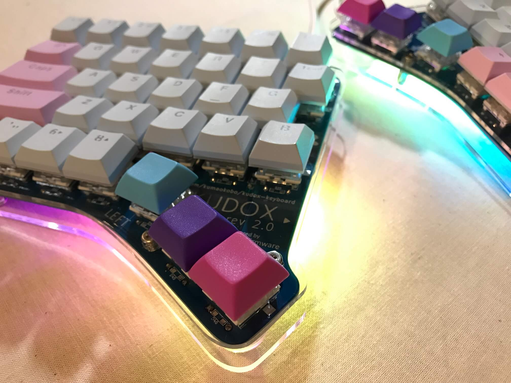
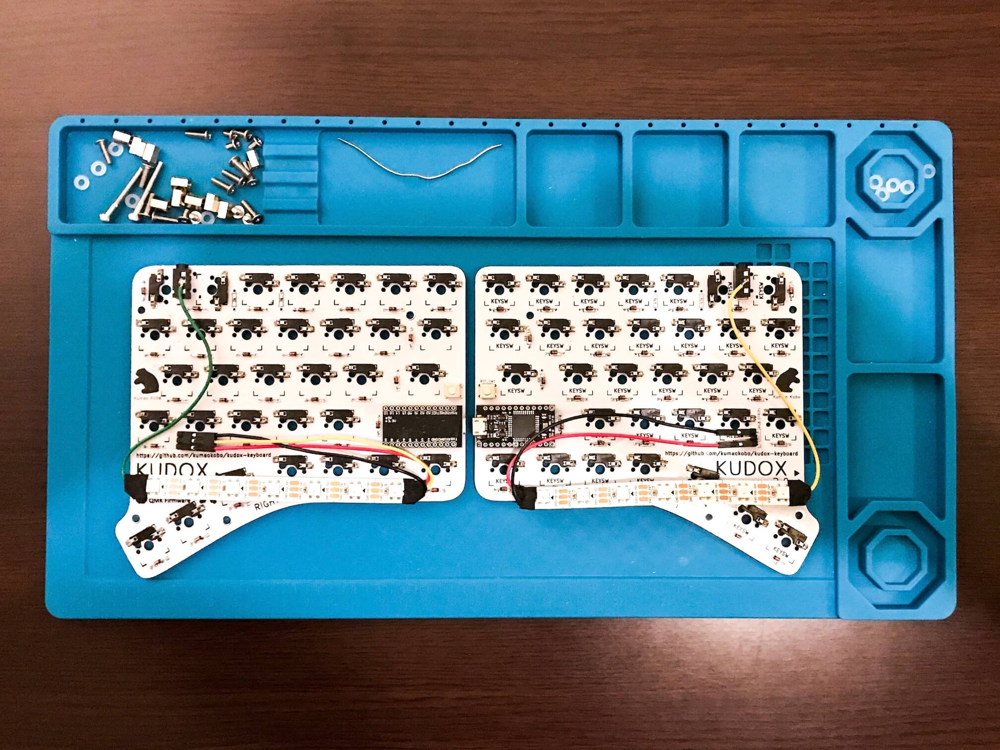

# Assembly LED strips (WS2812B)

<div>

</div>

## Parts

<div>

</div>

- WS2812B LEDs 7 x 2
- Lead Wires x 7  
*Recommend: Five lead wires attached with connector*
- Angle-3 Pin Headers x 2
- Insulation tape
- Soldered PCB


## 1. Solder LED strips lead wires.

<div></div>

Solder each `5V` , `DIN` , `GND` on 1st LED lead wires.  
Solder `DO` on opposit side of 1st LED a lead wire.  
<br/>
Solder `DIN` on 2nd LED a lead wire.  
Solder each `5V` , `GND` on opposit side of 2nd LED lead wires.  

> Please consider using soldering flux. Often it is difficult to solder LED strip.

*LED is vulnerable to heat, so they may break if exposed to high heat for a long time.*  

## 2. Insulate LED.

<div></div>

Insulate the soldered points using tape or tube.  

## 3. Solder TRRS-Jacks the lead wires.

<div>&nbsp;&nbsp;</div>

Solder TRRS-Jacks the wires drawn each `DO` and `DIN` of LED strips.

- Left hand side(`RIGHT` on mounting surface): Using LED strip solderd `5V` , `DIN` , `GND` .
- Right hand side (`LEFT` on mounting surface): Using LED strip solderd `5V` , `GND` .

```
Left hand DIN -> LED -> DO -> TRRS -> Right hand TRRS -> DO -> LED
```

## 4. Solder PCBs Pin Headers.

Solder Angle-3 Pin Headers at point of `RGB` .


## 5. Connect Lead Wires to Pin Headers.

<div></div>

`RGB` Pin Header is below:

```
GND
Data-IN
VCC
```

