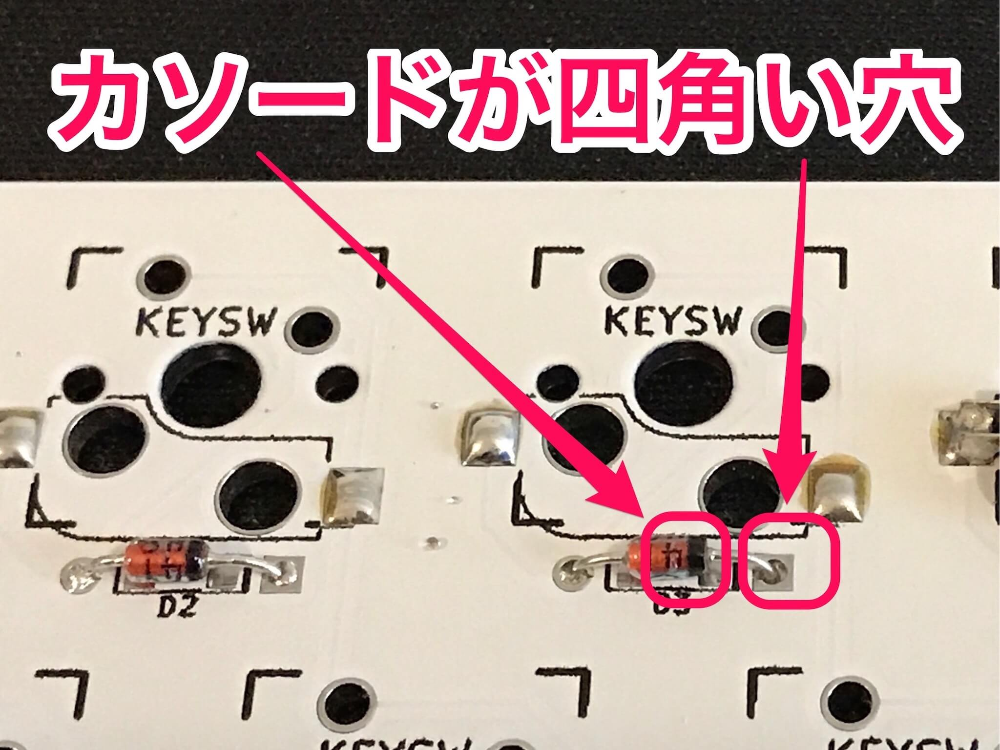
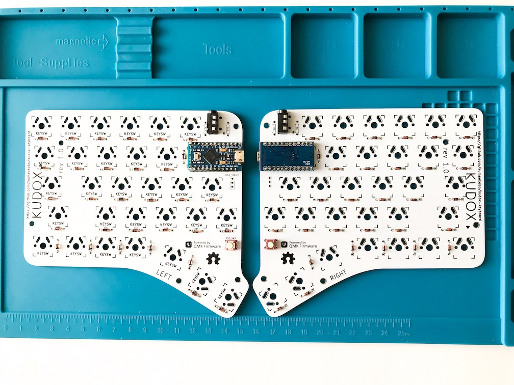

# Kudox Keyboard Rev.2

Kudox Keyboard Rev 2.0 is hot-swappable 66 key split keyboard.  
As hot-swap sockets need to be soldered, it is slightly more difficult to assemble than Rev 1.0.  
**Japanese Manual is [here](README.ja.md).**

<div style="display:block;margin:50px auto;">
<p align="center">


</p>
</div>

## Summary

  - [Bill of materials](#bill-of-materials)
  - [Assembly guide](#assembly-guide)
  - [Assembly LED strips](#assembly-led-strips)
  - [Firmware](#firmware)
    - [Basic compiling and burning command](#basic-compiling-and-burning-command)
    - [First time burning](#first-time-burning)

## Bill of materials

| Qty | Item                                          | Notes                                               |
|----:|-----------------------------------------------|-----------------------------------------------------|
|   2 | Kudox Rev2.0 PCBs                             |                                                     |
|  66 | 1N4148 diodes                                 | SMD diodes can also be used                         |
|   2 | PJ-320A 4 poles 3.5 mm TRRS connectors        |                                                     |
|   2 | 4.7 kΩ resistors                              | Need to be soldered on one half only                |
|   2 | Through hole momentary switch                 | Dimensions 6mm x 6mm x 4.3mm                        |
|   2 | Arduino Pro Micro microcontrollers            | ATMega32U4                                          |
|   1 | TRRS cable                                    |                                                     |
|   1 | USB micro cable                               |                                                     |
|   2 | Cases                                         |                                                     |
|  10 | Screws M3 x 10mm                              | M3                                                  |
|  10 | Screws M3 x  5mm                              | M3                                                  |
|  10 | Spacers                                       | M3 x 7mm                                            |
|  10 | Washers                                       | M3                                                  |
|  66 | [Kailh PCB Scoket](https://www.kailhswitch.com/mechanical-keyboard-switches/box-switches/mechanical-keyboard-switches-kailh-pcb-socket.html) | Cherry MX compatible type                           |
|  66 | Cherry MX compatible switches                 |                                                     |
|  66 | Cherry MX compatible keycaps                  | 4x 1.25u keycaps, 2x 1.75u keycaps, 2x 2.25u keycaps, 48x 1u keycaps  |
|  14 | LED Tape WS2812B                              | Optional. 7 LEDs x 2  |
|   7 | 24 AWG (or smaller) stranded wire             | Optional. Only in case of using LEDs. |


[Kudox rev2 Basic](https://kumaokobo.booth.pm/items/1703779) is on sale at [BOOTH](https://kumaokobo.booth.pm/) (**NOT** including switches and keycaps).  


## Assembly guide

<p align="center">

</p>

### Installation steps:

- Solder components:
  1. Solder 1N4148 diodes. Keep the diode legs for the right hand controller installation.<br/><div></div>
  2. Solder PJ-320A connectors.
  3. Solder momentary switches.
  4. Solder 4.7 kΩ resistors **on one half only**.
  5. Solder PCB hot-swap sockets.<br/>In case of using a soldering iron:<div></div>
  6. Solder the Pro Micro header pins.  
  *We recommend to adjust the positions of Pin Headers using Pro Micro when soldering.*  
  *Specially, it is easy to collide the tips of Black Pro Micro - compatible with conthrough and hotswap socket.*
  7. Current state:<div></div>
- Cuts legs of parts.  
  *Specially, pin-headers of Pro Micro needs to be cut as short as possible.*<div></div>
- Not to interfere the hot-swap socket and Pro Micro on `RIGHT` side PCB, put insulating tape on the hot-swap socket, because `RIGHT` side PCB is soldered Pro Micro face down.<div>
  <span>&nbsp;</span>
  <span>&nbsp;</span>
  </div>
- Solder Pro Micros to the header pins following the PCB labelling.
  - `LEFT` side: Solder Pro Micro face up.
  - `RIGHT` side: Solder Pro Micro face down.<br/><div></div>
- Install upper cases to PCBs.  
  M3x10 screws → upper case → M3 nuts → PCB → spacers.<br/><div>
  <span>&nbsp;</span>
  <span></div>
- Install lower cases.
- Fit switches to the upper cases.<div><span>&nbsp;&nbsp;</span></div>

### Video guides

- [Inken ch](https://www.youtube.com/channel/UCXJZdip7JmW74HQHCtfYzFw) (japanese only)

<p align="center">
<a href="https://www.youtube.com/watch?v=6zZAXjMQ80E"></a>
<a href="https://www.youtube.com/watch?v=HCa4KX-FlOU"></a>
</p>

## Assembly LED strips

▶ The guide is [here](LED.md).

## Firmware

<p align="center">

</p>

Kudox keyboard uses [QMK Firmware](https://github.com/qmk/qmk_firmware) for its firmware.  
Follow the QMK installation instructions [here](https://docs.qmk.fm/#/newbs_getting_started), then compile and burn the firmware as follows:  

### Basic compiling and burning command

```sh
$ cd path/to/qmk_firmware
$ make kudox/rev2:default:flash
```

### First time burning

You need to burn the firmware both left hand and right hand.


#### 1. Left hand side

Edit [kudox/config.h](https://github.com/qmk/qmk_firmware/blob/master/keyboards/kudox/config.h) and activate `MASTER_LEFT` .

```cpp
/* Select hand configuration */
#define MASTER_LEFT
// #define MASTER_RIGHT
// #define EE_HANDS
```

Save the file, then connect Pro Micro(**left hand**) and your PC by USB cable.  
Compile and burn the firmware by running [Basic compiling and burning command](#basic-compiling-and-burning-command) as follows:  

```sh
$ cd path/to/qmk_firmware
$ make kudox/rev2:default:flash
```

#### 2. Right hand side

Edit [kudox/config.h](https://github.com/qmk/qmk_firmware/blob/master/keyboards/kudox/config.h) and activate `MASTER_RIGHT` .  

```cpp
/* Select hand configuration */
// #define MASTER_LEFT
#define MASTER_RIGHT
// #define EE_HANDS
```

Save the file, then connect Pro Micro(**right hand**) and your PC by USB cable.  
Compile and burn the firmware by running [Basic compiling and burning command](#basic-compiling-and-burning-command).  

#### 3. Confirmation

Pull out the USB cable, then connect left hand and right hand by TRRS cable.  
Plug in the Pro Micro (Master) the USB cable.  

## Layout

<p align="center">

</p>
<p align="center">
<em><a href="http://www.keyboard-layout-editor.com/">http://www.keyboard-layout-editor.com/</a></em>
</p>

- [KLE Layout permalink](http://www.keyboard-layout-editor.com/##@@=Esc&_f2:2%3B&=1%0AF1%0A!&=2%0AF2%0A%2F@&=3%0AF3%0A%23&=4%0AF4%0A$&=5%0AF5%0A%25&=%60&_x:3%3B&=6%0AF6%0A%5E&=7%0AF7%0A%2F&&=8%0AF8%0A*&=9%0AF9%0A(&=0%0AF10%0A)&_f2:2%3B&=-%0AF11%0A%2F_&_f2:2%3B&=%E2%86%90%0AF12%0Aback%3B&@_w:1.25%3B&=Tab&_f:3%3B&=Q%0A%22%0A%0A7&_f:3%3B&=W%0A'%0A%0A8&_f:3%3B&=E%0A%60%0A%0A9&_f:3%3B&=R%0A*&_f:3%3B&=T%0A+&_fa@:2%3B%3B&=LANG2%0A%2F=&_x:2.5&f:3%3B&=Y%0A(&_f:3%3B&=U%0A)&_f:3%3B&=I%0A%7C&_f:3%3B&=O%0A*&_f:3%3B&=P%0A~&_f:3%3B&=%2F%2F%0A%5E%0A%3F&_f:3&w:1.25%3B&=%5C%0A%C2%A5%0A%7C%3B&@_f:3&w:1.75%3B&=Ctrl&_f:3%3B&=A%0A%2F@%0A%0A4&_f:3%3B&=S%0A%2F:%0A%0A5&_f:3%3B&=D%0A%60%0A%0A6&_f:3%3B&=F%0A%0A%0A0&_f:3%3B&=G%0A-&_x:3.5&f:3%3B&=H%0A%5B&_f:3%3B&=J%0A%5D&_f:3%3B&=K%0A.&_f:3%3B&=L%0A%2F%2F&_f:3%3B&=%2F%3B%0A-%0A%2F:&_f:3&w:1.75%3B&=Enter%3B&@_f:3&w:2.25%3B&=Shift&_f:3%3B&=Z%0A%0A%0A1&_f:3%3B&=X%0A%0A%0A2&_f:3%3B&=C%0A%0A%0A3&_f:3%3B&=V%0A.&_f:3%3B&=B%0A%2F%2F&_x:2.5&f:3%3B&=LANG1&_f:3%3B&=N%0A%7B&_f:3%3B&=M%0A%7D&_f:3%3B&=,%0A.%0A%3C&_f:3%3B&=.%0A%2F%2F%0A%3E&_f:3&w:2.25%3B&=Shift%3B&@_f:3&w:1.25%3B&=Alt%0A%0A%0AEsc&_f:3%3B&='%0A%0A%22&_f:3%3B&=-%0A%0A%2F_%0A%C2%A5&_f:3%3B&=%2F=%0A%0A+%0A0&_x:8.5&f:3%3B&=%E2%86%90%0A%3C&_f:3%3B&=%E2%86%93%0A%2F_&_f:3%3B&=%E2%86%91%0A%5E&_f:3&w:1.25%3B&=%E2%86%92%0A%3E%3B&@_r:15&rx:5&y:4&x:0.75&f:3&w:1.25%3B&=Enter&_f:3%3B&=GUI&_a:7%3B&=%3B&@_r:-15&rx:12&y:4&x:-4&a:4&f2:1%3B&=GUI%0AEnter&=Del&_w:1.25%3B&=layer)
