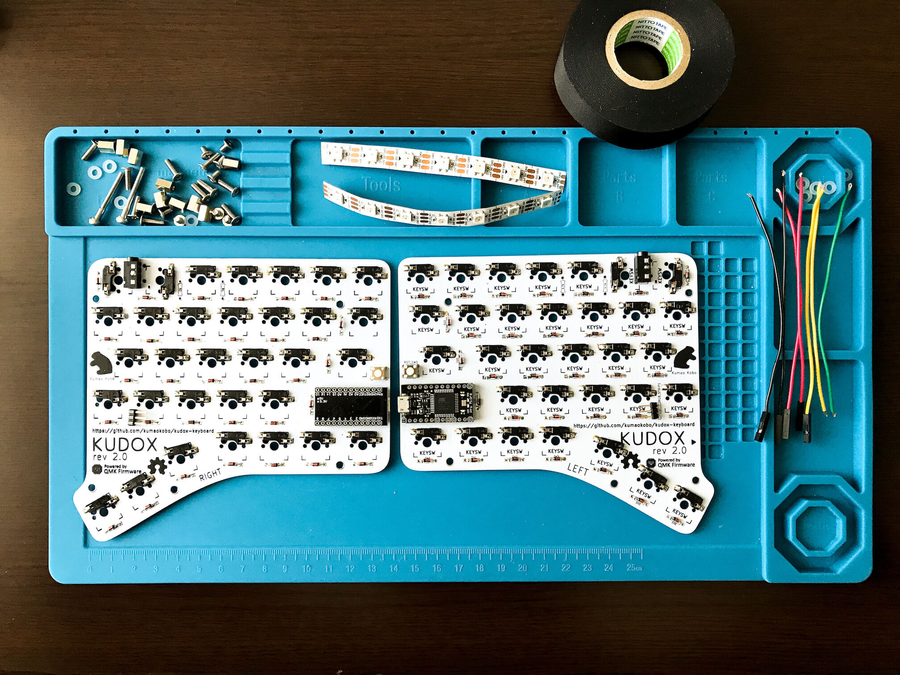

# LEDテープ (WS2812B) の取り付けガイド

**English Guide is [here](LED.md).**

<div>

</div>

## 使用部品

<div>

</div>

- WS2812B LED 7玉 x 2本
- リード線 7本 (*内5本は先がコネクタになっているとベターです*)
- L型3ピンヘッダ x2
- 絶縁テープ
- はんだ付け済みPCB


このガイドでは下記のようにリード線を色分けして使っています.
```
VCC: 赤
GND: 黒
DIN: 黄
DO : 緑
```

**※ LEDテープを使う場合はKudox PCBに取り付けた抵抗をお外しください.**

<div class="page"/>

## 1. LEDテープにリード線をはんだ付けします.

<div></div>

1本目の LED の `5V` , `DIN` , `GND` に コネクタ付きリード線3本をはんだ付けします.  
1本目の LED の 逆サイドの `DO` に リード線1本をはんだ付けします.  
<br/>
2本目の LED の `DIN` に リード線1本をはんだ付けします.  
2本目の LED の 逆サイドの `5V` , `GND` にコネクタ付きリード線2本をはんだ付けします.  

> LEDテープのメッキ部分ははんだがのりにくいことが多いので, フラックスなどを使用するとはんだ付けが少し楽になります.

*LEDは熱に弱いため長時間高熱に晒すと壊れる場合があります.*  


## 2. はんだ付けした箇所を絶縁します.

<div></div>

絶縁テープ(ビニールテープ)や熱収縮チューブなどではんだ付けした部分を絶縁します.  

<div class="page"/>

## 3. TRRSコネクタにリード線をはんだ付けします.

<div>&nbsp;&nbsp;</div>

各LEDテープの `DO` , `DIN` にはんだ付けしたリード線の反対側ををTRRSコネクタの中央のパッドにはんだ付けします.

- 左手用: `5V` , `DIN` , `GND` に 3本のリード線をはんだ付けしたLEDテープを使います
- 右手用: `5V` , `GND` に 2本のリード線をはんだ付けしたLEDテープを使います

下記のような信号の流れになります.  
```
左手 DIN -> LED -> DO -> TRRS -> 右手 TRRS -> DO -> LED
```

## 4. PCBにピンヘッダをはんだ付けします.

<div></div>

L型3ピンヘッダ をPCBの `RGB` の箇所にはんだ付けします.  

<div class="page"/>

## 5. ピンヘッダにリード線を接続します.
<div></div>

`RGB` ピンヘッダは、上から下記のように並んでいます.  
*(PCBにシルクで記載しています)*

```
VCC
Data-IN
GND
```

対応するリード線を接続してください.

---

これで完成ですが、 LEDテープが途中で断線していたりするとキー入力もできなくなります.  
ケースを組み立てる前に動作確認をすることをおすすめ致します.


