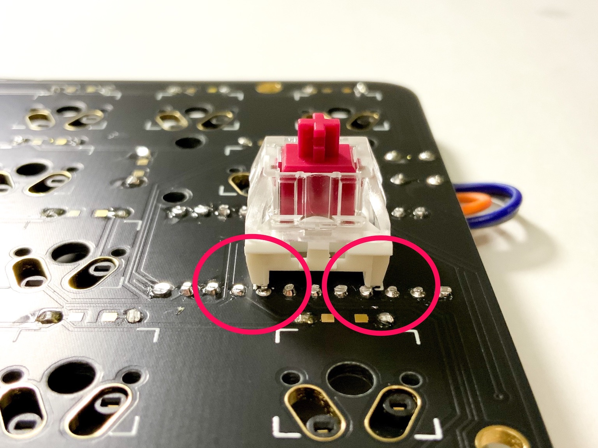

# Kudox Keyboard Rev.3

Kudox Rev3.0 は Row-Staggered配列のスイッチ・ホットスワップ対応左右分離キーボードです.  
Rev 3.0 から `ホットスワップ・ソケット` / `スイッチ直付け` の両方に対応したフットプリントを採用しました. また 右手用と左手用で基板設計を分け, キーのずれ方を *Normal-Staggerrd* に寄せました.  

**English Manual is [here](README.md).**

<div style="display:block;margin:50px auto;">
<p align="center">


</p>
</div>


## Summary

  - [必要な部品](#必要な部品)
  - [組み立てガイド](#組み立てガイド)
  - [LEDテープの取り付け](#LEDテープの取り付け)
  - [ファームウェア](#ファームウェア)
    - [基本書き込みコマンド](#基本書き込みコマンド)
    - [初回書き込み時](#初回書き込み時)
    - [JIS配列を書き込む場合](#JIS配列を書き込む場合)
    - [VIAを使ったキーマップ変更](#VIAを使ったキーマップ変更)

## 必要な部品

| 数量 | 項目                                          | 備考                                                |
|----:|------------------------------------------------|-----------------------------------------------------|
|   2 | Kudox Rev3.0 PCB                               |                                                     |
|  66 | 1N4148 ダイオード                              | SMD ダイオードでも可.                               |
|   2 | PJ-320A 4極 3.5mm TRRS コネクタ                |                                                     |
|   2 | 4.7 kΩ 抵抗                                    | 片側のPCBのみにはんだ付けします.                    |
|   2 | タクトスイッチ                                 | 6mm x 6mm x 4.3mm サイズのもの.                     |
|   2 | Arduino Pro Micro                              | マイコン: ATMega32U4                                |
|   1 | TRRS ケーブル                                  | 4極のもの. (4極じゃないと正常動作しません)          |
|   1 | USB micro ケーブル                             | 家に落ちているもので可.                             |
|   2 | ケース                                         |                                                     |
|  10 | ネジ M3 x 10mm                                 | M3                                                  |
|  10 | ネジ M3 x  5mm                                 | M3                                                  |
|  10 | スペーサー                                     | M3 x 7mm                                            |
|  10 | ナット or ワッシャー                           | M3<br />*スイッチ直付け時:ナット<br />ホットスワップ・ソケット使用時:ワッシャー* |
|  66 | Cherry MX 互換 スイッチ                        | お好みで...💕                                       |
|  66 | Cherry MX 互換 キーキャップ                    | 2x 1.25u, 2x 1.5u, 2x 1.75u, 2x 2.25u, 58x 1u       |
|  66 | [Kailh PCB Scoket](https://www.kailhswitch.com/mechanical-keyboard-switches/box-switches/mechanical-keyboard-switches-kailh-pcb-socket.html)    | ※ オプションです. Cherry MX 互換タイプの方         |
|  2 | MXスイッチ スタビライザー                       | ※ オプションです. PCBマウントタイプ                      |
|  14 | LED Underglow WS2812B                          | ※ オプションです. 7 LEDs x 2                       |
|   7 | ビニール線                                     | ※ オプションです. LED を取り付ける場合に使います.  |
|   2 | L型3ピンヘッダ                                 | ※ オプションです. LED を取り付ける場合に使います.  |

キーキャップとスイッチ以外の全てを含む基本セットを [BOOTH](https://kumaokobo.booth.pm/) にて販売しています.
- [Kudox rev3 基本セット(白)](https://kumaokobo.booth.pm/items/1931134)
- [Kudox rev3 基本セット(黒xゴールド)](https://kumaokobo.booth.pm/items/1931140)


## 組み立てガイド

<p align="center">

</p>


- PCB の `Mounting Surface` と記載のある面に下記をはんだ付けします:
  1. 1N4148ダイオード (向きがあります. カソードが四角型の穴側にくるように差します)<br/><div></div>
  *ダイオードのカソードには線などのマークが入っています*
  2. PJ-320Aコネクタ
  3. タクトスイッチ
  4. 4.7 kΩ 抵抗 (LED Underglow を取り付ける場合, 不要です)
  5. ホットスワップ・ソケット (*オプションです)<br/>はんだごてではんだ付けする場合:<div></div>下記の動画で取り付け方を詳しく紹介しています: <br/><div><a href="https://www.youtube.com/watch?v=uHqkW0cQ80I"></a></div>[[YouTube] インケンch: ホットスワップソケットの付け方](https://www.youtube.com/watch?v=uHqkW0cQ80I)<br/>*クリームはんだでリフローして頂いてももちろん大丈夫です*
  6. Pro Micro の ピン・ヘッダ (**Pro Micro 自身のはんだ付けはまだしません**)  
  *Pro Micro のピン・ヘッダをはんだ付けする際には, Pro Microを使って位置合わせをすることをおすすめしております.*  
  7. こんな感じになります:<div><span style="font-size:70%;">ホットスワップ</span>&nbsp;<span style="font-size:70%;">直付け</span></div>
- パーツの足をカットします.  
  *※Pro Microのピン・ヘッダはスイッチに干渉しやすいので, できるだけ短くカットしてください*<div></div>
- Pro Micro を ピン・ヘッダにはんだ付けします.  
  左右とも **表向き(チップが見えるように)** にはんだ付けします.<div></div>
- **スタビライザーを使用する場合:**  
  2.25uのスイッチにはPCBマウントのスタビライザーを取り付けることができます.  
  スタビライザーを使用する場合は, この時点で取り付けを行ってください.
- PCB に上部ケースを取り付けます.  
  M3ネジ(10mm) → 上部ケース → ナット(or ワッシャー) → PCB → スペーサー の順番に取り付けます.<br/><div></div>
- **スイッチを直付する場合のみ**: スイッチをケースに嵌め, PCBにはんだ付けします.
- 下部ケースをスペーサーにネジ止めします.
- **ホットスワップ・ソケットの場合のみ**: スイッチをホットスワップ・ソケットに差し込みます.<div>
  <span>&nbsp;&nbsp;</span></div>
- 完成です.

## LEDテープの取り付け

▶ [こちら](LED.ja.md)をご覧ください.

## ファームウェア

<p align="center">

</p>

Kudox Keyboard は [QMK Firmware](https://github.com/qmk/qmk_firmware) を利用しています.  
**QMK Firmware のインストールは [こちら](https://docs.qmk.fm/#/newbs_getting_started)** をご覧ください.  

### 基本書き込みコマンド

```sh
$ cd path/to/qmk_firmware
$ make kudox/rev3:default:flash
```

### 初回書き込み時

初回書き込み時には, 左手・右手 両方の Pro Micro にファームを書く必要があります.  

#### 1. 左手側

[qmk_firmware/keyboards/kudox/config.h](https://github.com/qmk/qmk_firmware/blob/master/keyboards/kudox/config.h) を編集して `MASTER_LEFT` を有効にします.

```cpp
/* Select hand configuration */
#define MASTER_LEFT
// #define MASTER_RIGHT
// #define EE_HANDS
```

保存したら, **左手側** の Pro Micro と PC をUSBケーブルで接続し, [基本書き込みコマンド](#基本書き込みコマンド) を実行します.

```sh
$ cd path/to/qmk_firmware
$ make kudox/rev3:default:flash
```

#### 2. 右手側

[qmk_firmware/keyboards/kudox/config.h](https://github.com/qmk/qmk_firmware/blob/master/keyboards/kudox/config.h) を編集して `MASTER_RIGHT` を有効にします.

```cpp
/* Select hand configuration */
// #define MASTER_LEFT
#define MASTER_RIGHT
// #define EE_HANDS
```

保存したら, **右手側** の Pro Micro と PC をUSBケーブルで接続し, [基本書き込みコマンド](#基本書き込みコマンド) を実行します.

```sh
$ cd path/to/qmk_firmware
$ make kudox/rev3:default:flash
```

#### 3. 動作確認

一度USBケーブルを外してから, TRRSケーブルで左右をつなぎます.  
マスター側の Pro Micro にUSBケーブルをつなぎ, 左右ともに文字入力可能なことを確認します.  

以降, キー配列を変更した場合など再びファームを書く場合は, TRRSケーブルをつないだままマスター側の Pro Micro に書き込みを行うことで, 左右に設定が反映されるようになります.  


### JIS配列を書き込む場合

[qmk_firmware/keyboards/kudox/rev3/keymaps/jis](https://github.com/qmk/qmk_firmware/blob/master/keyboards/kudox/rev3/keymaps/jis/keymap.c) に JIS-like配列を置いていますが, [Qmk Firmware](https://github.com/qmk/qmk_firmware) の [keycodes](https://github.com/qmk/qmk_firmware/blob/master/docs/keycodes.md) を参考にご自身の使いやすいレイアウトに変更してお使いになられると良いかもしれません.  

```sh
$ cd path/to/qmk_firmware
$ make kudox/rev3:jis:flash
```

### オンラインGUIのファームウェア生成ツール

[Qmk Firmware](https://github.com/qmk/qmk_firmware) はオンラインでQMKのファームウェアを生成することができる [QMK Configurator](https://config.qmk.fm/) というツールを公開しています.  

<p align="center">

</p>

*QMK Configuratorの詳細な使い方はいろいろなサイトで詳しく解説されているので, そちらをご参照くださいませ.*  
*残念ながらJIS配列の生成はできないようです.*  


### VIAを使ったキーマップ変更

<p align="center">
</br>
<a href="https://caniusevia.com/">the-via: https://caniusevia.com/</a>
</p>

#### 1. VIA 対応ファームの書き込み

VIA に対応したファームウェアを書き込みます.

```sh
$ cd path/to/qmk_firmware
$ make kudox/rev3:via:flash
```

#### 2. VIA のインストール

下記からVIAをダウンロードしてインストールします.
- [https://www.github.com/the-via/releases/releases/latest](https://www.github.com/the-via/releases/releases/latest)


#### 3. キーボード設定ファイルの読み込み

キーボードを PC 接続した状態で, VIA の `File` -> `Import Keymap` から 下記のjsonを読み込みます.
- [kudox_rev3.json](https://github.com/kumaokobo/kudox-keyboard/blob/master/kudox/rev3/kudox_rev3.json)


#### 4. キーマップの変更

VIA上でキーマップを変更します.

<p align="center">

</p>

> VIA上でキーを選択したりLED設定を変えたりすると即座に変更が反映されます. 保存して反映, という手順は必要ありません.


## レイアウト

### デフォルト

<p align="center">

</p>
<p align="center">
<em><a href="http://www.keyboard-layout-editor.com/">http://www.keyboard-layout-editor.com/</a></em>
</p>

- [KLE Layout permalink](http://www.keyboard-layout-editor.com/##@_name=Kudox%20Keyboard%20Rev%203.0&author=Kumao%20Kobo%3Ckumaokobo%2F@gmail.com%3E%3B&@_fa@:0&:0&:2%3B%3B&=%60%0A%0A~&_f2:2%3B&=1%0AF1%0A!&=2%0AF2%0A%2F@&=3%0AF3%0A%23&=4%0AF4%0A$&=5%0AF5%0A%25&=6%0AF6%0A%5E&_x:3%3B&=7%0AF7%0A%2F&&=8%0AF8%0A%2F&&=9%0AF9%0A(&=0%0AF10%0A)&=-%0AF11%0A%2F_&=%2F=%0AF12%0A+&=%E2%86%90%0ADel%0Aback%3B&@_w:1.5%3B&=Tab&_f:3%3B&=Q%0A%22&_f:3%3B&=W%0A'&_f:3%3B&=E%0A%60&_f:3%3B&=R%0A*&_f:3%3B&=T%0A+&_fa@:2&:0%3B%3B&=ESC%0A%2F=&_x:2&f2=undefined%3B&=Y%0A(&=U%0A)&=I%0A%7C&=O%0A*&=P%0A~&='%0A%5E%0A%22&_w:1.5%3B&=%5C%0A%C2%A5%0A%7C%3B&@_w:1.75%3B&=Ctrl&=A%0A%2F@&=S%0A%2F:&=D%0A%60&=F&=G%0A-&_x:3%3B&=H%0A%5B&=J%0A%5D&=K%0A.&=L%0A%2F%2F&=%2F%3B%0A-%0A%2F:&_w:2.25%3B&=Enter%3B&@_w:2.25%3B&=Shift&=Z&=X&=C&=V&_f:3%3B&=B%0A%2F%2F&_x:3%3B&=N%0A%7B&=M%0A%7D&_fa@:0&:0&=undefined%3B%3B&=,%0A%22%0A%3C&=.%0A'%0A%3E&_f2:0%3B&=%2F%2F%0A%0A%3F&_w:1.75%3B&=Shift%3B&@_fa@:0&:0&:0&:2%3B&w:1.25%3B&=Alt%0A%0A%0AEsc&=%5B%0A%0A%7B&=%5D%0A%0A%7D&_fa@:2%3B%3B&=LANG2&_x:8.5&f2=undefined%3B&=%E2%86%90%0A%3C&=%E2%86%93%0A%2F_&=%E2%86%91%0A%5E&_w:1.25%3B&=%E2%86%92%0A%3E%3B&@_r:15&rx:5&y:4&x:0.75&w:1.25%3B&=Enter&=GUI&_a:7%3B&=%3B&@_r:-15&rx:12&y:4&x:-4%3B&=&_a:4&fa@:0&:0&:0&:2%3B%3B&=GUI%0A%0A%0AEnter&_fa@:2&:0&:0&:2%3B&w:1.25%3B&=LANG1%0A%0A%0ALayer)

### JIS-like 配列

<p align="center">

</p>
<p align="center">
<em><a href="http://www.keyboard-layout-editor.com/">http://www.keyboard-layout-editor.com/</a></em>
</p>

- [KLE Layout permalink](http://www.keyboard-layout-editor.com/##@_name=Kudox%20Keyboard%20Rev3.0%20JIS&author=Kumao%20Kobo%3Ckumaokobo%2F@gmail.com%3E%3B&@_f2:2%3B&=%E5%85%A8%E5%8D%8A%E8%A7%92%0AEsc&=1%0AF1%0A!&=2%0AF2%0A%22&=3%0AF3%0A%23&=4%0AF4%0A$&=5%0AF5%0A%25&=6%0AF6%0A%2F&&_x:3%3B&=7%0AF7%0A'&=8%0AF8%0A(&=9%0AF9%0A)&=0%0AF10&=-%0AF11%0A%2F=&=%5E%0AF12%0A~&=%E2%86%90%0ADel%0Aback%3B&@_w:1.5%3B&=Tab&_f:3%3B&=Q%0A%22&_f:3%3B&=W%0A'&_f:3%3B&=E%0A%60&_f:3%3B&=R%0A*&_f:3%3B&=T%0A+&_fa@:2%3B%3B&=ESC%0A%2F=&_x:2&f:3%3B&=Y%0A(&_f:3%3B&=U%0A)&_f:3%3B&=I%0A%7C&_f:3%3B&=O%0A*&_f:3%3B&=P%0A~&_f:3%3B&=%2F@%0A%5E%0A%60&_f:3&w:1.5%3B&=%2F%2F%0A%C2%A5%0A%3F%3B&@_f:3&w:1.75%3B&=Ctrl&_f:3%3B&=A%0A%2F@&_f:3%3B&=S%0A%2F:&_f:3%3B&=D%0A%60&_f:3%3B&=F&_f:3%3B&=G%0A-&_x:3&f:3%3B&=H%0A%5B&_f:3%3B&=J%0A%5D&_f:3%3B&=K%0A.&_f:3%3B&=L%0A%2F%2F&_f:3%3B&=%2F%3B%0A%2F:%0A+&_f:3&w:2.25%3B&=Enter%3B&@_f:3&w:2.25%3B&=Shift&_f:3%3B&=Z%0A%7B&_f:3%3B&=X%0A%7D&_f:3%3B&=C&_f:3%3B&=V%0A%2F_&_f:3%3B&=B%0A%2F%2F&_x:3&f:3%3B&=N%0A%7B&_f:3%3B&=M%0A%7D&_f:3%3B&=,%0A%2F=%0A%3C&_f:3%3B&=.%0A-%0A%3E&_f2:2%3B&=%E2%86%91%0A%2F_&_w:1.75%3B&=Shift%3B&@_w:1.25%3B&=Alt%0A%0A%0AEsc&_f:3%3B&=%C2%A5%0A%0A%7C&_f:3%3B&=%2F:%0A%0A*&_fa@:2%3B%3B&=LANG2&_x:8.5%3B&=LANG1&_fa@:2&:2%3B%3B&=%E2%86%90%0A%5B&=%E2%86%93%0A%2F_&_w:1.25%3B&=%E2%86%92%0A%5D%3B&@_r:15&rx:5&y:4&x:0.75&w:1.25%3B&=Enter&=GUI&_a:7%3B&=%3B&@_r:-15&rx:12&y:4&x:-4%3B&=&_a:4&fa@:2&:2&:0&:2%3B%3B&=GUI%0A%0A%0AEnter&_w:1.25%3B&=Layer)
