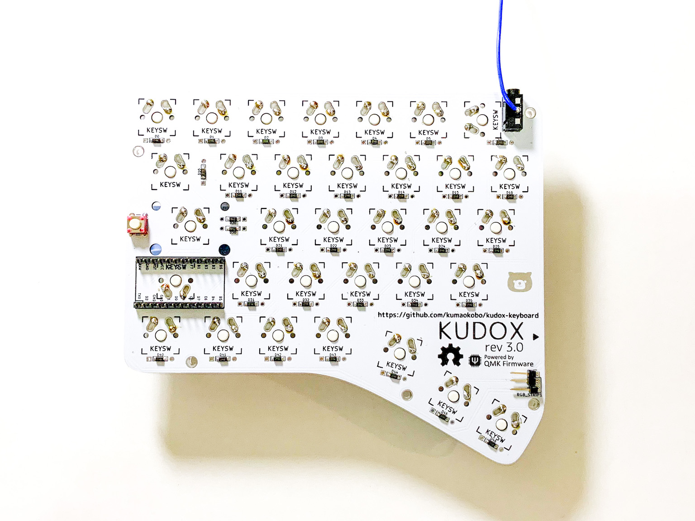
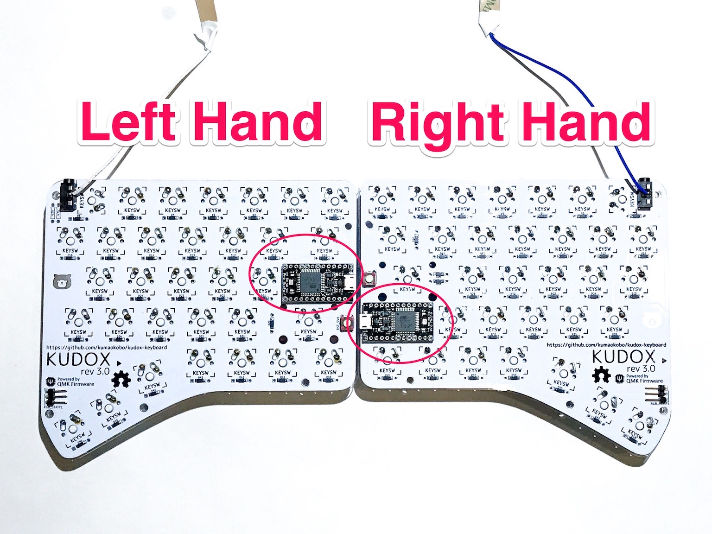
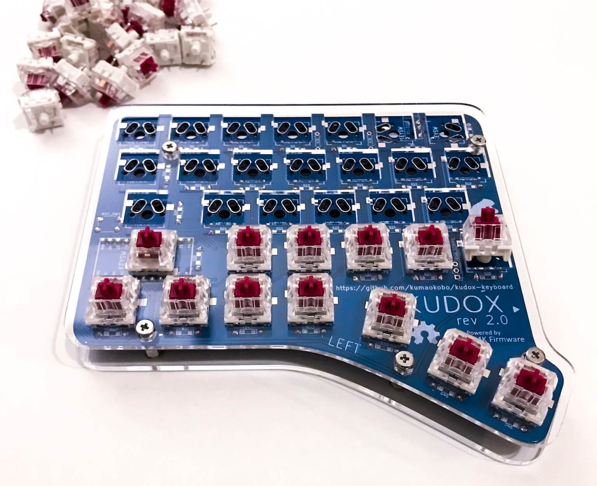
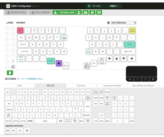

# Kudox Keyboard Rev.3

Kudox Rev 3.0 is a row-staggered switch hot swappable split keyboard.  
Rev 3.0 supports both hot swap sockets and direct switch mounting.  
Also, we divided the board design for right hand and left hand.  
For this reason, the key columns become more normal row-staggered.  

**Japanese Manual is [here](README.ja.md).**

<div style="display:block;margin:50px auto;">
<p align="center">


</p>
</div>

## Summary

  - [Bill of materials](#bill-of-materials)
  - [Assembly guide](#assembly-guide)
  - [Assembly LED strips](#assembly-led-strips)
  - [Firmware](#firmware)
    - [Basic compiling and burning command](#basic-compiling-and-burning-command)
    - [First time burning](#first-time-burning)
    - [VIA Support](#via-support)

## Bill of materials

| Qty | Item                                          | Notes                                               |
|----:|-----------------------------------------------|-----------------------------------------------------|
|   2 | Kudox Rev3.0 PCBs                             |                                                     |
|  66 | 1N4148 diodes                                 | SMD diodes can also be used                         |
|   2 | PJ-320A 4 poles 3.5 mm TRRS connectors        |                                                     |
|   2 | 4.7 kΩ resistors                              | Need to be soldered on one half only                |
|   2 | Through hole momentary switch                 | Dimensions 6mm x 6mm x 4.3mm                        |
|   2 | Arduino Pro Micro microcontrollers            | ATMega32U4                                          |
|   1 | TRRS cable                                    |                                                     |
|   1 | USB micro cable                               |                                                     |
|   2 | Cases                                         |                                                     |
|  10 | Screws M3 x 10mm                              | M3                                                  |
|  10 | Screws M3 x  5mm                              | M3                                                  |
|  10 | Spacers                                       | M3 x 7mm                                            |
|  10 | Nuts or Washers                               | M3<br />*When soldering switches direct: Nuts<br />When soldering hot-swap sockets: Washers* |
|  66 | Cherry MX compatible switches                 |                                                     |
|  66 | Cherry MX compatible keycaps                  | 2x 1.25u, 2x 1.5u, 2x 1.75u, 2x 2.25u, 58x 1u       |
|  66 | [Kailh PCB Scoket](https://www.kailhswitch.com/mechanical-keyboard-switches/box-switches/mechanical-keyboard-switches-kailh-pcb-socket.html)   | Optional. Cherry MX compatible type                 |
|   2 | Stabilizer for Cherry MX                      | Optional. Type of PCB mount                         |
|  14 | LED Tape WS2812B                              | Optional. 7 LEDs x 2                                |
|   7 | 24 AWG (or smaller) stranded wire             | Optional. Only in case of using LEDs.               |
|   2 | Right angle 3 pin headers                     | Optional. Only in case of using LEDs.               |


- [Kudox rev3 Basic White](https://kumaokobo.booth.pm/items/1931134)
- [Kudox rev3 Basic Black x Gold](https://kumaokobo.booth.pm/items/1931140)

are on sale at [BOOTH](https://kumaokobo.booth.pm/) (**NOT** including switches and keycaps).


## Assembly guide

<p align="center">

</p>

### Installation steps:

- Solder components on the side of `Mounting Surface`:
  1. Solder 1N4148 diodes. Put the cathode in the square hole.<br/><div></div>
  *Cathode side is marked like a line.*
  2. Solder PJ-320A connectors.
  3. Solder momentary switches.
  4. Solder 4.7 kΩ resistors (**unnecessary in case of using LED**).
  5. Solder PCB hot-swap sockets (**Optional**).<br/>In case of using a soldering iron:<div></div>How to solder hot-swap sockets: <br/><div><a href="https://www.youtube.com/watch?v=uHqkW0cQ80I"></a></div>[YouTube:Inken ch:How to solder hot-swap sockets](https://www.youtube.com/watch?v=uHqkW0cQ80I)
  6. Solder the Pro Micro header pins (**do not solder the Pro Micro controllers yet**).  
  *We recommend to adjust the positions of Pin Headers using Pro Micro when soldering.*  
  7. Current state:<div><span style="font-size:70%;">hot-swap</span>&nbsp;<span style="font-size:70%;">direct</span></div>
- Cuts legs of parts.  
  *Specially, pin-headers of Pro Micro needs to be cut as short as possible.*<div></div>
- Solder Pro Micros controllers to the header pins.  
  Pro Micro **face up** on both of sides.<div></div>
- **In case of using stabilizer:**  
  We can install PCB mount stabilizers for MX on the place of 2.25u.  
  If you would like to use stabilizers, install them now.
- Install upper cases to PCBs.  
  M3x10 screws → upper case → M3 nuts(or washers) → PCB → spacers.<br/><div></div>
- Install lower cases.
- Fit switches to the upper cases.<div><span>&nbsp;&nbsp;</span></div>

## Assembly LED strips

▶ The guide is [here](LED.md).

## Firmware

<p align="center">

</p>


Kudox keyboard uses [QMK Firmware](https://github.com/qmk/qmk_firmware) for its firmware.  
Follow the QMK installation instructions [here](https://docs.qmk.fm/#/newbs_getting_started), then compile and burn the firmware as follows:  

### Basic compiling and burning command

```sh
$ cd path/to/qmk_firmware
$ make kudox/rev3:default:flash
```

### First time burning

You need to burn the firmware both left hand and right hand.


#### 1. Left hand side

Edit [kudox/config.h](https://github.com/qmk/qmk_firmware/blob/master/keyboards/kudox/config.h) and activate `MASTER_LEFT` .

```cpp
/* Select hand configuration */
#define MASTER_LEFT
// #define MASTER_RIGHT
// #define EE_HANDS
```

Save the file, then connect Pro Micro(**left hand**) and your PC by USB cable.  
Compile and burn the firmware by running [Basic compiling and burning command](#basic-compiling-and-burning-command) as follows:  

```sh
$ cd path/to/qmk_firmware
$ make kudox/rev3:default:flash
```

#### 2. Right hand side

Edit [kudox/config.h](https://github.com/qmk/qmk_firmware/blob/master/keyboards/kudox/config.h) and activate `MASTER_RIGHT` .  

```cpp
/* Select hand configuration */
// #define MASTER_LEFT
#define MASTER_RIGHT
// #define EE_HANDS
```

Save the file, then connect Pro Micro(**right hand**) and your PC by USB cable.  
Compile and burn the firmware by running [Basic compiling and burning command](#basic-compiling-and-burning-command).  

```sh
$ cd path/to/qmk_firmware
$ make kudox/rev3:default:flash
```

#### 3. Confirmation

Pull out the USB cable, then connect left hand and right hand by TRRS cable.  
Plug in the Pro Micro (Master) the USB cable.  


### VIA Support

<p align="center">
</br>
<a href="https://caniusevia.com/">the-via: https://caniusevia.com/</a>
</p>

#### 1. Burn VIA compatible firmware

Burn the firmware compatible with [VIA](https://caniusevia.com/).

```sh
$ cd path/to/qmk_firmware
$ make kudox/rev3:via:flash
```

#### 2. Install VIA

Get VIA and install it.
- [https://www.github.com/the-via/releases/releases/latest](https://www.github.com/the-via/releases/releases/latest)

#### 3. Load keyboard specific json

Plug the keyboard in your PC, select `File` -> `Import Keymap` on VIA and load the json below:
- [kudox_rev3.json](https://github.com/kumaokobo/kudox-keyboard/blob/master/kudox/rev3/kudox_rev3.json)

#### 4. Change keymap on VIA

Change keymap by VIA.

<p align="center">

</p>


### Online GUI

The [QMK Configurator](https://config.qmk.fm/) is an online graphical user interface that generates QMK Firmware hex files.

<p align="center">

</p>


## Layout

<p align="center">

</p>
<p align="center">
<em><a href="http://www.keyboard-layout-editor.com/">http://www.keyboard-layout-editor.com/</a></em>
</p>

- [KLE Layout permalink](http://www.keyboard-layout-editor.com/##@_name=Kudox%20Keyboard%20Rev%203.0&author=Kumao%20Kobo%3Ckumaokobo%2F@gmail.com%3E%3B&@_fa@:0&:0&:2%3B%3B&=%60%0A%0A~&_f2:2%3B&=1%0AF1%0A!&=2%0AF2%0A%2F@&=3%0AF3%0A%23&=4%0AF4%0A$&=5%0AF5%0A%25&=6%0AF6%0A%5E&_x:3%3B&=7%0AF7%0A%2F&&=8%0AF8%0A%2F&&=9%0AF9%0A(&=0%0AF10%0A)&=-%0AF11%0A%2F_&=%2F=%0AF12%0A+&=%E2%86%90%0ADel%0Aback%3B&@_w:1.5%3B&=Tab&_f:3%3B&=Q%0A%22&_f:3%3B&=W%0A'&_f:3%3B&=E%0A%60&_f:3%3B&=R%0A*&_f:3%3B&=T%0A+&_fa@:2&:0%3B%3B&=ESC%0A%2F=&_x:2&f2=undefined%3B&=Y%0A(&=U%0A)&=I%0A%7C&=O%0A*&=P%0A~&='%0A%5E%0A%22&_w:1.5%3B&=%5C%0A%C2%A5%0A%7C%3B&@_w:1.75%3B&=Ctrl&=A%0A%2F@&=S%0A%2F:&=D%0A%60&=F&=G%0A-&_x:3%3B&=H%0A%5B&=J%0A%5D&=K%0A.&=L%0A%2F%2F&=%2F%3B%0A-%0A%2F:&_w:2.25%3B&=Enter%3B&@_w:2.25%3B&=Shift&=Z&=X&=C&=V&_f:3%3B&=B%0A%2F%2F&_x:3%3B&=N%0A%7B&=M%0A%7D&_fa@:0&:0&=undefined%3B%3B&=,%0A%22%0A%3C&=.%0A'%0A%3E&_f2:0%3B&=%2F%2F%0A%0A%3F&_w:1.75%3B&=Shift%3B&@_fa@:0&:0&:0&:2%3B&w:1.25%3B&=Alt%0A%0A%0AEsc&=%5B%0A%0A%7B&=%5D%0A%0A%7D&_fa@:2%3B%3B&=LANG2&_x:8.5&f2=undefined%3B&=%E2%86%90%0A%3C&=%E2%86%93%0A%2F_&=%E2%86%91%0A%5E&_w:1.25%3B&=%E2%86%92%0A%3E%3B&@_r:15&rx:5&y:4&x:0.75&w:1.25%3B&=Enter&=GUI&_a:7%3B&=%3B&@_r:-15&rx:12&y:4&x:-4%3B&=&_a:4&fa@:0&:0&:0&:2%3B%3B&=GUI%0A%0A%0AEnter&_fa@:2&:0&:0&:2%3B&w:1.25%3B&=LANG1%0A%0A%0ALayer)
